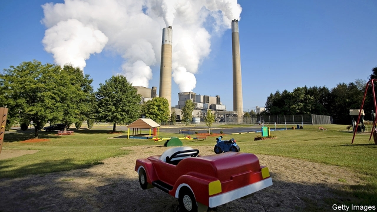

###### The mercurial EPA

# The federal government backtracks on mercury-emissions rules 

##### Not even the operators of power stations seem to want the EPA’s latest edict 

 

> Jan 3rd 2019 

 

CHILDREN FEAR lumps of coal during Christmas. The adults at the Environmental Protection Agency (EPA) had no such reservations. On December 27th, despite general merriment and a government shutdown, the agency issued its finding that Obama-era regulations on mercury emissions from coal-fired power plants were no longer “appropriate and necessary”. It is the latest in a long series of deregulatory actions taken by the Trump administration in an effort to resuscitate the limping coal industry. 

In this case the timing was off. Since Barack Obama’s EPA implemented the rule in 2011, coal plants have already spent billions in compliance costs. Mercury emissions have since fallen by nearly 90%. The money cannot be unspent—and many utility operators have written to the EPA asking for the rules to be left in place. Removing the mercury rule is, however, an idée fixe of Bob Murray, a coal baron with the president’s ear for whom Andrew Wheeler, the acting administrator of the EPA, once worked as both a lawyer and lobbyist. 

The battle is being waged over regulatory maths. The costs of mercury pollution are hard to price, because it is difficult to put a figure on the cognitive impairment of children and fetuses due to mercury contamination. Conservative estimates put them at just $6m per year. The compliance costs for industry, however, run into the billions. So how did Obama-era EPA justify its regulation? It noted that cutting mercury emissions would also reduce power-plant emissions of fine particulate matter by 18% across the country. This stuff, which can become lodged in the lungs, causes respiratory disease and premature death. These so-called “co-benefits” were several times larger than the costs, preventing up to 11,000 premature deaths each year. 

The Obama-era rule also affects emissions of 80-odd acid gases and heavy metals. Mr Wheeler’s EPA does not deny the benefits of reducing these. It simply maintains that they should not be considered when costing the rule. “It’s like we pretend they’re not there. But how we can pretend that arsenic, beryllium and cancer-causing chromium doesn’t exist is beyond me,” says Ann Weeks, senior counsel at the Clean Air Task Force, an environmental group. 

More recent scientific estimates suggest that even the direct effect of mercury pollution is much greater than reported in the EPA’s original analysis—perhaps as high as $4.8bn per year. This is based on better evidence of the effects of low-level mercury toxicity on intelligence and earnings. Despite the new estimates, the agency is sticking to the older, much smaller number. Mr Wheeler’s reasoning could be vulnerable to an inevitable court challenge, which would span years. For his former law-firm colleagues, all those billable hours could prove a fine Christmas present. 

