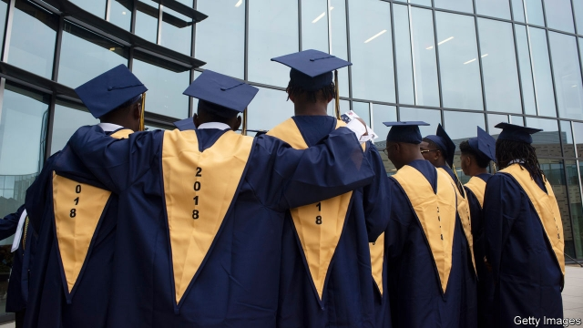
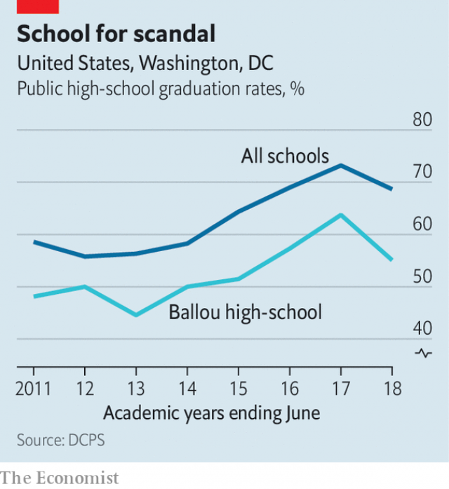

###### Grad inflation

# The rise in American high-school graduation rates looks puffed-up 

##### Online credit-recovery classes have been implicated in many school scandals 

 

> Jan 3rd 2019 

 

THE PUBLIC high schools in Washington, DC, were once looked on with wonder. Overcoming deep-seated poverty (three in four pupils are classified as poor) and racial segregation, the district dramatically increased its graduation rate. In 2012 only 56% of high-school students graduated. By 2017 that rate had climbed to 73%. Arne Duncan, Barack Obama’s education secretary, touted the district’s results as an example of “what can happen when schools embrace innovative reforms.” 

Then the truth emerged. It began with media reports on shenanigans at Ballou High School, an all-minority and entirely poor high school in the southeastern corner of the nation’s capital. Graduation rates had gone from 50% in 2012 to 64% in 2017. When auditors examined the district’s records, they found that 34% of all diplomas in 2017 year were improperly awarded. Many went to students who seldom showed up at school. Graduation rates at Ballou have since sunk back to Earth. 

Nationally, high-school graduation rates have increased at a steady clip even while other measures of learning and achievement—international exams, state-mandated standardised tests, college-admissions test scores—have been flat or even slightly negative. That could be because children are doing better, or because schools are lowering standards. 

There are some pockets of real success—high-performing charters in cities have helped many poor, minority students most at risk of dropping out if left in traditional public schools. But for the rest of the country the warning lights are starting to flash. The state of Alabama—which posted a remarkable 17 percentage-point increase in graduation rates between 2011 and 2015—has since admitted that its numbers were inflated. From Charlotte, North Carolina, and Atlanta, Georgia, to New York City and Los Angeles, credible accusations of graduation-rate inflation have emerged. 

 

An ever-present element in these stories is the reliance on online credit-recovery classes. These are remedial courses delivered via computer that students can take if they fail a class, rather than attending summer school or being forced to repeat a grade. Jeremy Noonan, a former science teacher in Douglas County, Georgia, was assigned to supervise a credit-recovery course in 2016. Mr Noonan says a colleague told him that his responsibility was to manage the course so that students received an average grade of 80 or higher, which would enable them to graduate even if they failed the end-of-term exams. 

The computer programme doing the teaching allowed students to retake exams they failed, with many of the same questions. “I realised right away it was all about manipulating the system,” he says. “Most teachers just gave the students the answers without bothering to explain the course content,” says Ayde Davis, a former public-school teacher in Del Rio, Texas, who reported violations to the state education agency. “Students could finish their courses at accelerated rates, the administration was happy, and credit-recovery teachers who co-operated were feted.” 

Students completed exams at unreasonably fast speeds—one finished a physics exam in four minutes and earned an 80% score, according to records she saved. In the 2015-16 school year, 144 credits were given for recovery courses completed in less than ten hours, Ms Davis’s documents show. According to the makers of credit-recovery software, each course has between 60 and 75 hours of instruction. 

It is not possible to know how many credit-recovery programmes are being used as diploma mills. But these courses are now widespread. The Fordham Institute, an education think-tank, estimates that 69% of all high schools in America use them. Some high schools have more than half of their students enrolled in credit-recovery programmes. They are especially popular in urban high schools attended by poor and minority students—in other words, precisely the places where graduation rates have risen fastest. 

