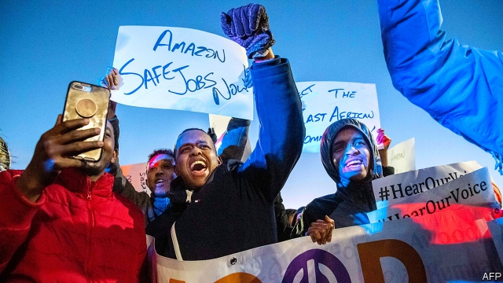

###### Warehouses work

# Will Amazon’s workers unionise? 

##### The behemoth faces rumblings from labour organisers 

 

> Jan 3rd 2019 

 

INSIDE THE Amazon fulfilment centre in Monee, Illinois, the temperature is pleasant and the whirr of machines bearable. “Stowers” take items from yellow containers and place them on shelves after scanning their location. “Pickers” follow instruction on screens, grab items from shelves, scan them and put them in containers, which then move on via conveyor belt to the packers. Packers scan them again and put them into cardboard boxes they quickly seal before sending them off to get their address tag. Shifts are ten hours four days a week, with two breaks every day. About 125,000 people work in 100 fulfilment centres across the country. (During the holiday season Amazon hired another 120,000 seasonal workers.) 

As online retail grows ever bigger, warehouses have become the workplace of choice for many without a college degree. In the past they would have worked for a bricks-and-mortar retailer such as Sears (in bankruptcy) or Toys R Us (also bankrupt). Whereas traditional retail has its own union, the Retail Wholesale and Department Store Union (RWDSU), which had its heyday in the 1930s, hardly any warehouse workers are union members. 

This could be changing. Workers in Amazon warehouses in Minnesota, Staten Island and New Jersey mobilised before Christmas. In Amazon’s new state-of-the-art warehouse in Staten Island, workers launched a campaign to unionise. Their main grievances are safety, pay and 12-hour shifts with insufficient breaks as well as punishing hourly quotas. Amazon says it pays its workers in Staten Island $17-23 an hour, which is more than other local warehouses, as well as providing health care, offering workers further education and up to 20 weeks of parental leave. In New Jersey activists pushed state government to enforce a code of conduct at big retailers which includes the right to unionise.  

Will workers’ activism lead to unionisation at the country’s second-biggest private employer? If past experiences at Walmart, the world’s largest retailer that is America’s biggest private employer, is anything to go by, the answer is no. Walmart fought attempts by workers to form a union. As soon as top management heard rumblings about unionisation through a hotline that local managers were directed to call, the retail behemoth sent a “labour team” from its headquarters in Bentonville, Arkansas, to the uppity shop, writes Rick Wartzman, a former head of the Drucker Institute, a researcher of corporate management. The team took over the shop’s management and showed workers a steady stream of strident anti-union videos and other propaganda. If these efforts failed, it simply closed the shop. 

Amazon learned from Walmart (as did many other big firms) and is likely to be as effective as the Bentonville behemoth in influencing its workers’ thinking. Even so, warehouse workers have a lot of latent power, argues Brishen Rogers of Temple University. Thousands of them work together at one giant site where they can easily communicate compared with, say, janitors who work in isolation. Warehouses are at the centre of Amazon’s operation and they are hugely expensive to build, so management cannot simply shut down a warehouse. It takes weeks to train top-notch warehouse workers to operate the technology they use, so staff cannot be replaced from one day to another. 

Unionisation typically succeeds when a company does a poor job in addressing grievances of workers, argues Paul Osterman at MIT. Amazon reacted quickly after Bernie Sanders, a senator from Vermont, introduced the “Stop BEZOS Act”, which would have required Amazon and Walmart to pay the government for food stamps, Medicaid, public housing and other federal assistance received by their workers. A few weeks later Amazon announced it would increase the minimum wage for all its workers in America to $15 an hour. 

Amazon cares about its reputation as a progressive company based in liberal Seattle. This is a vulnerability but also a strength. The company is likely to listen more to its workers than big retailers did in the past, discouraging anaemic unions to take on the Goliath of the industry. 

