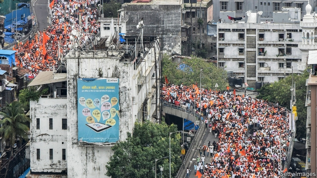

###### Quotas for all

# Almost all Indians will soon qualify for affirmative action in India 

##### All but the richest will have access to job reservations 

 

> Jan 10th 2019 

 

AFFIRMATIVE ACTION, as Americans confusingly call it, has been a defining feature of modern India. The constitution allows the government to make “special provision for the advancement of any socially and educationally backward classes of citizens”. Since it came into force in 1950, “reservations” (quotas) have often been demanded and doled out. By setting aside government jobs and places at universities for members of communities that had been oppressed for hundreds if not thousands of years, the thinking ran, the country would soon rid itself of the iniquities of caste, and with it the need for reservations. 

Instead, Indians have been mired in a zero-sum competition for official favour ever since. The first beneficiaries were “scheduled castes and tribes”, in particular untouchables (now known as Dalits)—those at the bottom of the social order. Inevitably, the considerably less disadvantaged “other backward classes” (OBCs) soon began to clamour for quotas of their own. Political parties sprang up to demand new or bigger reservations for different castes. It was only in 1992 that the Supreme Court appeared to put a stop to the scramble by ruling that no more than 50% of jobs or university spaces could be reserved under caste-based quotas. But on January 7th, with general elections due in just three months, the ruling Bharatiya Janata Party (BJP) came up with a new way to expand reservations: to set aside a further 10% of jobs and university places for relatively impoverished Indians, of whatever caste or religion. A motion to change the constitution to that end cleared both houses of parliament in just two days, a record, with almost no dissent. 

The scheme’s details remain hazy, but reports suggest that any family earning less than 800,000 rupees ($11,375) a year would be eligible. That is a generous sum in a country where the average income per person was $1,976 in 2017. Indeed, 800,000 rupees is the level of income that defines the “creamy layer”—families wealthy enough that the courts have barred them from any sort of reservation, whatever their caste or tribe. All but the richest, in other words, will now be eligible for a reservation. 

The BJP used to oppose excessive reservations, since it derived much of its support from higher castes who felt that their opportunities were being diminished by their lower-caste neighbours, some of whom were no needier than they were. In 2006 much of India erupted into protests against reservations. More recently, instead of calling for the abolition or reduction of reservations, relatively prosperous castes have agitated for inclusion in the quotas. The BJP’s new policy looks like a sop to such important “vote banks” as the Patidars of Gujarat or the Rajputs of Rajasthan, who are too well-to-do, by and large, to be considered backward, but poor enough to resent that. 

These groups are also numerous enough to be central to the efforts of Narendra Modi, the prime minister, to win a second term. And they are agitated about lack of opportunity. The Centre for Monitoring the Indian Economy, a think-tank in Mumbai, reckons that the number of people in work fell during the past fiscal year, even as the working-age population swelled. 

To be fair, the BJP is not alone in its bribery. The state of Tamil Nadu reserves fully 69% of university places and government jobs for disadvantaged castes—an apparent breach of the Supreme Court’s ruling that has been the subject of long litigation. Other states have created reservations for women, the disabled, religious minorities, former soldiers and so on. Congress, the main opposition party, proposed something similar to the new scheme years ago. The leader of another opposition party says that now that the 50% ceiling has been breached, the reservation devoted to OBCs, for whom his party claims to speak, should be doubled to 54%, in proportion with their share of the population. 

The irony is that quotas will not help much. In November the national railways received 19m applications for 63,000 lowly posts. That meant plenty of disappointment to be shared among every caste. 

