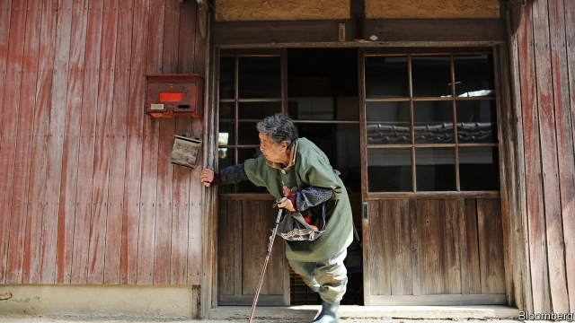
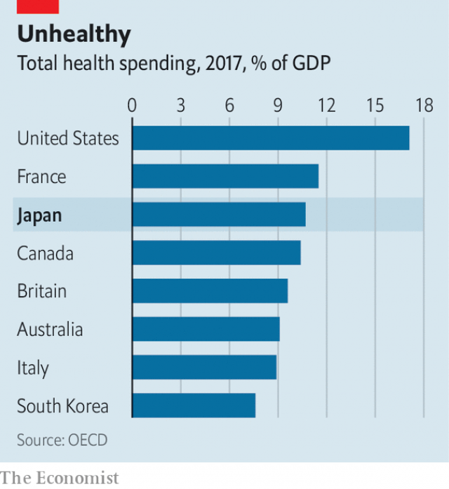

###### Home help

# Japan tries to keep the elderly out of hospital 

##### A greying society searches for ways to curb health-care costs 

 

> Jan 10th 2019 

 

IN A SUNNY room in a small apartment in the Tokyo satellite town of Kunitachi lies Yasuyuki Ibaraki, eyes closed and breathing laboured. Yukio Miyazaki, his doctor, who visits fortnightly from a local clinic, suspects that he does not have much time left: he has brain damage from a cerebral infarction, a tumour in his digestive system and is unable to swallow or talk. Reiko, his wife, feeds him through a tube to his stomach and clears phlegm from his throat. “He is from a close-knit family and is a quiet man, so I think it is better for him to be here rather than in a hospital,” she says, over green tea and grapes. 

Life expectancy in Japan is the highest in the world, at 84. This is good news for its people, but means that an ever-higher share of the population is elderly. Fully 28% of Japanese are older than 65, compared with 15% of Americans and 21% of Germans. More old people, in turn, means higher health-care costs. Last year the government budgeted ¥15trn ($138bn, or 15% of its total expenditure) for health care and nursing, excluding the charges it levies for the public health-insurance scheme. With public debt at 250% of GDP, and debt service consuming a further 24% of spending, the government is looking desperately for ways to cut costs. It reckons caring for people at home is one of its best options. 

All Japanese pay a monthly premium to the public insurance scheme, either through their employer or the local municipality. In return they are entitled to treatment and drugs from public and private doctors and hospitals, although they must also pay a portion of the cost of treatment (a co-payment, in American parlance), subject to a cap. In 2000 Japan introduced an additional public insurance scheme for long-term care for those over 65, into which people must pay from the age of 40. It works the same way. The premiums and co-payments cover around 60% of the cost of the services provided; the government pays for the rest. And it is the old who cost the most. The government reckons that the average annual cost of health care for someone over 75 is ¥942,000, compared with just ¥221,000 for everyone else. 

By the standards of ageing nations, Japan has managed to curb medical costs fairly well, says Naoki Ikegami of St Luke’s International University in Tokyo. The government sets fees for services to keep costs down (although that encourages providers to perform unnecessary procedures to make more money: Japan has more CT scanners relative to its population than any other country). It has also promoted the use of generic drugs, which are cheaper. 

Nonetheless, the country has crept up to sixth place in the OECD’s ranking of the share of GDP spent on health care, behind France and America, but ahead of Italy and South Korea—two other ageing countries (see chart). It is not just that the number of old people is increasing; spending per person is rising, too, as people live longer with diseases like Alzheimer’s and diabetes. 

 

Japan has promoted home care for many years, but it is pushing it harder now. The policy is especially beneficial given that the average hospital stay in Japan is three times longer than in the Netherlands, for instance. The health ministry reckons that 1m people will receive care at home in 2025—one-and-a-half times the current total. The number of special nursing units exclusively for home visits has risen from 7,473 in 2014 to 10,418 in 2018. 

Last year a government panel suggested raising the amount doctors are paid for home visits and making consultations conducted via video-conferencing services eligible, too. It also proposed new rules to encourage care at home. Hospitals should be obliged to talk to social services when they discharge a patient, for example. 

Some municipalities are already offering good care in the community. Onomichi, a small provincial city that is even older than the country as a whole, is one. Its medical facilities have 15-minute “care conferences” with doctors, nurses, family members and even dentists, to discuss how they will go about looking after people. “It used to be hard for hospitals to tell a patient to return home as there was no system for that; that has changed,” says Hisashi Katayama, a doctor. 

Community care for specific diseases is improving, too. Take dementia, which currently affects 5m Japanese (4% of the population), and will afflict 6-7% by 2030. Rather than provide only institutional care and medicine, some towns, such as Matsudo, north-east of Tokyo, have set up cafés to offer advice and companionship to patients and their carers. Day centres that give respite to families tending to elderly relatives are common. Much more could be done: only 13% of Japanese die at home, although most say they want to. 

But more widespread home care will not be enough to make Japan’s health care affordable. The government of Shinzo Abe wants to revamp the social-security system, which it reckons will help reduce health-care costs. Raising the retirement age, for example, will keep people active, healthier and paying tax for longer. The government also wants to try to reduce the incidence of diseases that affect older people, but have their origins in behaviour at a younger age. “We have tended to focus on the old, but we need to look at the younger to prevent disease,” says Kazumi Nishikawa of the economy ministry. He is particularly focused on giving people more information on what causes diabetes, which is on the rise in Japan, or exercises that can stem the progression of dementia. 

People are likely to have to pay more for health care, too. Co-payments for many of those over 75 are only 10%, compared with 30% for everyone else. The government should start by doubling that to 20%, says Shigefumi Kawamoto, managing director of Kenporen, the national federation of health-insurance societies. “Some elderly people don’t have resources, but many do,” he avers. The government could exclude some items from coverage, he says, such as over-the-counter drugs. 

Meanwhile, back in Kunitachi, Dr Miyazaki talks to Reiko about her husband’s condition. She is worried that her husband is getting worse, she says, and is anxious between visits. The doctor promises to come weekly from now on. 

