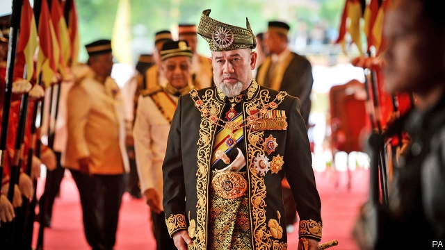

###### Monarchical merry-go-round

# Malaysia’s sultans must pick a new king 

##### The previous one abdicated after marrying a Russian beauty queen 

 

> Jan 10th 2019 

 

THE ANNOUNCEMENT was unexpected and unexplained. On January 6th Sultan Muhammad V, Malaysia’s king, stepped down from the throne. It was the first time a Malaysian king had abdicated. He had only reigned for two years. 

The king presides over one of the world’s most peculiar monarchies, established at independence in 1957. Malaysia is a federation made up of 13 states. The titular head of the government in nine of them is a sultan (democratically appointed chief ministers actually run the show). The nine sultans choose one of their own to serve a five-year term as king whenever the job becomes vacant. In practice, the nine states take it in turns. The king’s job is largely ceremonial, although he can delay legislation and refuse a prime minister’s request to dissolve parliament. 

No reason was given for the abdication, but many suspect the king’s love life had raised too many eyebrows. In 2008, when still crown prince of Kelantan, the most conservative and devoutly Islamic state in the country, he had divorced his wife, a Muslim princess from neighbouring Thailand. In 2016 he became the first king to ascend to the throne unmarried. Then, in November, he took a two-month leave of absence following medical treatment. During that period the 49-year-old snuck off to Russia and married Oksana Voevodina, a 25-year-old former Miss Moscow. 

The wedding poses an “existential question” for the monarchy, says Francis Hutchinson of ISEAS-Yusof Ishak Institute, a think-tank in Singapore. Sultans are supposed to be defenders of the culture and religion of the country’s ethnic-Malay majority. Older and rural Malays in particular hold sultans in high esteem and see them as a cultural anchor. One view holds that in a state without a sultan, society becomes nihilistic. Modern royals are thus expected to behave with a certain decorum—although many of their forebears married glamorous young foreigners. At any rate, King Muhammad’s conduct must have jarred with some. The other sultans are thought to have issued an ultimatum, forcing him to quit. 

The election of a new monarch, scheduled for January 24th, may cause a further hiccup. The next in line under the system of rotation is the sultan of Pahang, who served as king once before, 40 years ago. He is elderly and in ill health, however. His family is reported to be contemplating getting him to abdicate, to allow his son to become sultan and then king in short order. Typical: you wait 60 years for an abdication, and then two come along at once. 

