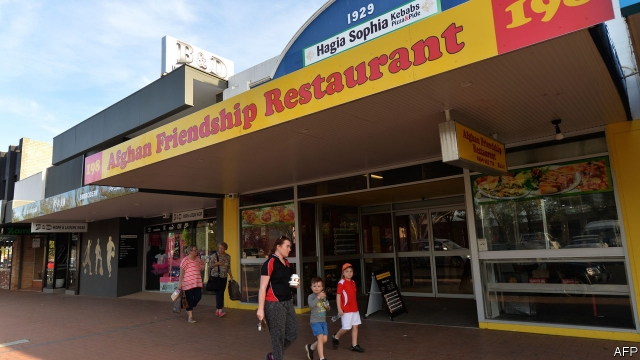
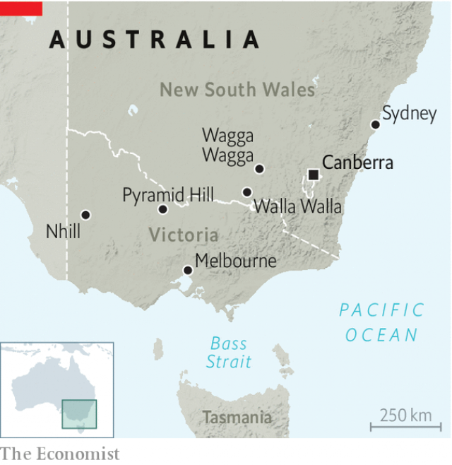

###### Immigrants in the outback

# Unlikely new residents are reviving Australian country towns 

##### Big cities want fewer new arrivals. Small ones want more 

 

> Jan 10th 2019 

 

FIRST CAME THE Burmese, then the Afghans and the Africans. Since 2016, 400-odd Yazidis have washed up in Wagga Wagga, a regional centre south-west of Sydney. Its primary school has had to hire interpreters to communicate with families (fully a fifth of its students are refugees). The local college teems with parents learning English and new trades. Doctors have had to brush up on illnesses rarely found in the area. Few locals seem fussed about the changes. And to those fresh out of war zones, “Wagga” is an idyll. “My children are safe,” says Ismail Darwesh, a Yazidi who fled Islamic State’s attempt to wipe out his people, a religious minority in Iraq and Syria. “Everything you want you can get here.” 

The refugees have been sent to Wagga Wagga under a scheme which brings beneficiaries from foreign camps to rural Australia (most settle in urban areas). The hope is that they can offset the population decline that threatens many outback settlements with extinction, as birth rates fall and youngsters head for cities. Wagga Wagga’s Multicultural Council says the population is only growing thanks to the new arrivals. Immigrants are helping to stem shrinkage in another 150 localities. 

The scheme helps big cities, too, by easing the pressure on roads, schools and hospitals there. Thousands of Iraqis and Syrians descended on Sydney’s western suburbs after extra visas were dished out to them in 2016 and 2017. Many have struggled to find work, and conservatives grumble about ghettoisation. A recent report from the Centre for Policy Development, a think-tank, found that just 17% of “humanitarian entrants” have jobs after 18 months in Australia. Yet remote towns are crying out for people to fill vacancies on farms, in abattoirs and to look after the elderly. The cost of living is lower than in Sydney or Melbourne and, for farmers like Mr Darwesh, a quiet life is appealing anyway. 

 

To stay afloat, some outback towns have taken to recruiting migrants for themselves. A piggery in Pyramid Hill, in northern Victoria, started sponsoring workers from the Philippines a decade ago. They now make up a fifth of its 500-odd population, keeping not just the business afloat, but also the local school. Another town in the same state, Nhill, lured 160 Burmese refugees from Melbourne with jobs at a food company, adding perhaps A$40m ($28m) to its economy. A group of residents in Walla Walla, a dot in New South Wales, is now scouting for refugees from Sydney. “We have jobs, we have housing and we have education,” says Andrew Kotzur, who runs the local steelworks. “We just need more people to sustain them.” 

Asylum-seekers and farm labourers make up a tiny portion of the immigrants pouring into Australia. The conservative coalition government is keen to rusticate others, too. Scott Morrison, the prime minister, has suggested that some of Australia’s 500,000 foreign students could be sent to regional universities. The population minister, Alan Tudge, added that visa restrictions and incentives could be used to push skilled migrants out of Melbourne and Sydney. Almost all the best-qualified arrivals settle in those two cities, but luring them out will not be easy. It is partly owing to migration that Sydney and Melbourne are thriving. Foreign accountants and IT geeks choose them for well-paid work and swanky suburbs. Rob them of both, and far fewer would come to Oz at all. 

