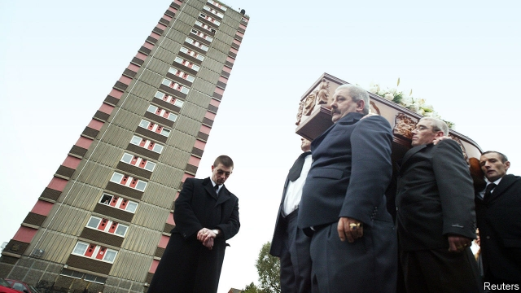

###### The price of peace

# A searing reflection on the Troubles and their aftermath 

##### “Say Nothing” evokes the worlds of both the victims and their assailants 

 

> Jan 10th 2019 

 

Say Nothing: A True Story of Murder and Memory in Northern Ireland. By Patrick Radden Keefe.Doubleday; 464 pages; $28.95. William Collins; £20.  

ON A WINTER evening in 1972, a mother of ten, still recovering from her husband’s death, received a fateful visit to her high-rise flat in Belfast’s war zone. At least eight people, most of them masked but a couple recognisable as neighbours, marched her away. She was told she was being taken to a charity home for her own safety; she asked, pathetically, if her children could join her. In fact she was executed as a supposed informer. Her body was found on a beach in 2003. 

Among the many stories told in dark detail in Patrick Radden Keefe’s new book on the Northern Irish conflict, the abduction of Jean McConville stands out. The 100-plus interviews he conducted included intense conversations with her offspring, who ended their childhoods in horrible institutions and now campaign for justice. Yet much of this masterly reportage empathetically evokes the militant republican world from which McConville’s killers came. Above all, it traces the relationships that emerged among leading republicans as the slums of Belfast slid into a many-sided war that debased everyone—relationships that soured after bombs gave way to politics in the 1990s. 

The discerning skill with which Mr Radden Keefe gets inside these characters’ minds may unsettle some readers, but it is also his book’s strength. He shows how people who in peacetime might just have been strong-willed or colourful types came to condone or perpetrate the unspeakable. 

The most memorable figure in this gallery is Dolours Price. She and her sister Marian were jailed in 1973 for planting bombs in London that injured 200 people and killed one. They went on hunger strike and secured a transfer to a Northern Irish jail. In their youth, the book notes, the sisters were popular, attractive figures around Catholic Belfast, dubbed the Crazy Prices after a discount store. They were radicalised after a civil-rights march was roughed up by thugs in 1969. 

Dolours fascinated many people, including Margaret Thatcher, who as prime minister studied the sisters’ case closely. And it was Dolours who, as she disclosed before succumbing to an overdose in 2013, drove McConville to her death. The squad waiting in the Irish Republic to fire the shots balked, so the execution had to be done by another trio: Dolours herself, who said she deliberately missed, plus two others, only one of whom she named. 

The case long troubled her, Dolours revealed. It was not that she opposed punishing people who abetted the security forces, or doubted that McConville was an informer. (Mr Radden Keefe, after hearing many views, is more sceptical.) In her youth she favoured dumping informers’ bodies on the street, not making them vanish. But later she wondered whether McConville had to be killed at all: “What warrants death?” she mused in an interview with Ed Moloney, an Irish author, of which Mr Radden Keefe was shown a transcript. From that document, he makes his own deduction about who fired the fatal shot. 

Still, there was one matter on which Dolours and some others of her passionately republican bent harboured no doubt: the peace settlement that left Northern Ireland’s future to be settled democratically was a betrayal. As the book relates, another who felt that way was Brendan Hughes, perhaps the doughtiest bomber, arms-procurer and jail-breaker to emerge from republican Belfast in the 1970s. At one point, Hughes was close to Gerry Adams: the former a frontline fighter, the latter a cool strategist. But Hughes abhorred the peace Mr Adams helped broker in the 1990s. 

People like Hughes and Dolours Price poured out their feelings in testimonials offered by veterans of the conflict that were stored at Boston College, with a promise they would remain sealed until their deaths. The Northern Irish police fought a legal battle to obtain some of those interviews, and it was on that basis that they arrested Mr Adams for several days in 2014. He was released without charge; he continues to deny that he was a member of the IRA or had anything to do with the abduction of McConville, which he condemns. 

This book’s most lasting achievement may lie not in its forensic analysis of the McConville saga but in the questions it raises about the Northern Irish settlement. As it chronicles, people were willing to endure and inflict terrible pain so long as a spirit of political maximalism prevailed: if Ireland could be united fast, the thinking went, all horrors could be redeemed. But Mr Adams saw that maximalism must stop; instead the republican interest lay in well-timed compromise. That was devastating for those who had suffered and killed. 

Veterans like Hughes and Dolours Price were especially dismayed by the manoeuvres of Mr Adams who, as they saw it, had once endorsed their methods but now feigned absent-minded detachment. Yet Mr Adams’s sheer versatility, as a ruthless advocate of war and a tough enforcer of peace, was indispensable to the settlement. The book quotes a British government report of 2015 which spells out this unpalatable trade-off frankly. Peace had held not because paramilitary groups had faded but because they, and those with influence over them, had survived—and could finally rein in the hotheads. 

