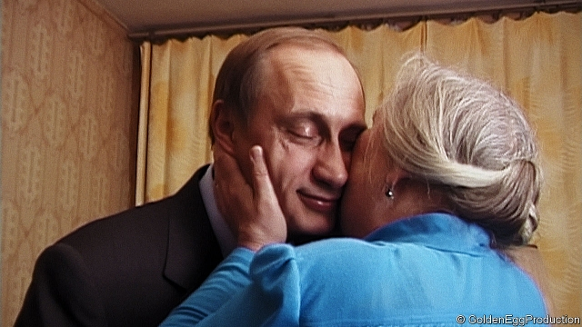
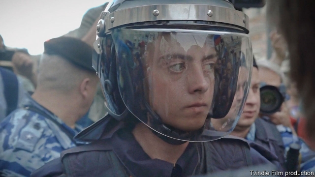

###### Prophecies and revelations

# The beginning and fraying of Vladimir Putin’s reign 

##### Two new documentaries capture what may prove to be turning points in Russia’s history 

 

> Jan 12th 2019 

 

IN ONE OF Russian literature’s most memorable passages, Pimen, an elderly chronicler in “Boris Godunov”, passes the task of recording history to a young monk: 

Pushkin wrote his drama about the “Time of Troubles” of the early 16th century in 1825, itself a turbulent moment in Russia. The succession of Nicholas I in that year was followed by the Decembrist uprising and then an age of repression. Every country experiences such pivots—at which epochs seem to begin and end, the current age retreats into history and the future seems to make itself present. In Russia as elsewhere, artists have often sensed such shifts before they are visible to the naked eye. 

Two arresting new documentaries suggest Russia may be approaching another such inflection-point. “Putin’s Witnesses”, directed by Vitaly Mansky, captures the moment Vladimir Putin came to power; “Electing Russia” by Alexander Rastorguev examines the current phase of the Putin era. Both are imbued with a sense of history—and the lives of both directors have been twisted by it. Mr Mansky went into voluntary exile in Latvia after the annexation of Crimea. Rastorguev was murdered in murky circumstances last July while making a film about Russian mercenaries in the Central African Republic. Real art, he remarked shortly before his death, is made when artists “meet the energy of history—unclear, incomprehensible”. 

“Putin’s Witnesses” begins on the eve of the new millennium, in Mr Mansky’s home. History intrudes in the form of Boris Yeltsin’s televised announcement that he is resigning his office and appointing Mr Putin as acting president. (Televisions make several appearances in the film, as both oracles and transmitters of falsehoods.) Mr Mansky’s wife is unnerved both by the camera and by the news. “I feel like bursting into tears,” she says like a latter-day Cassandra. “The ‘firm hand’ that people are so fond of has arrived.” 

Her husband is more than a common witness. At the time he was head of documentaries for Russian state television. The Yeltsin family would enlist him to present a soft, human image of Mr Putin as he campaigned for the presidency in the subsequent election (see above). Much of the resulting footage was broadcast soon afterwards; but, illuminated by later events and Mr Mansky’s narration, even the familiar material acquires new resonance. 

Mr Putin emerges as if from the wings, a supporting character cast in the role of president by the Yeltsins. “We will order you about a little, with your permission,” Mr Mansky says as Mr Putin enters his new Kremlin office. “Look at me kindly—as kindly as you can,” a photographer instructs him. It is hard to imagine such words being spoken to Mr Putin a few years later, or indeed being addressed to Yeltsin, a formidable figure even in his decline. 

The outgoing president first appears in the film on the night of the election in March 2000. As a TV relays the result, Tatyana Dyachenko, his daughter, shakes him by the arm. “Papa, are you happy?” “It is my victory!” Yeltsin replies. “He would not have appointed a bad person,” his wife, Naina, confides to Mr Mansky. “Right!” Yeltsin says. “I’ve looked at 20 people over four months and settled on this one.” 

But the triumph quickly turns to poignant bitterness. Prompted by Mr Mansky, Yeltsin reaches for a phone connected to the Kremlin and asks for “Vladimir Vladimirovich”. But Mr Putin does not pick up. “They say he has gone out. They will find him and he will call back,” Yeltsin tells his family. By the time the crew leaves, Mr Putin has not returned the call. 

Worse, as Mr Mansky intones, “the ghost of the past [began] to appear again and again, trying to make up for what was lost in the present.” That unquiet ghost finds voice in the old Soviet anthem, symbolically scrapped by Yeltsin but revived (with new lyrics) by Mr Putin. Mr Mansky is once again filming Yeltsin when the anthem is first broadcast. “Even the new lyrics don’t help?” Mr Mansky asks. Yeltsin silently shakes his head and, almost inaudibly, says: “It’s reddish!” In other words, too Soviet. He stares disconsolately ahead, as if glimpsing a future still hidden from his compatriots, even, perhaps, from Mr Putin. 

On election night, meanwhile, the camera follows Ms Dyachenko into Mr Putin’s headquarters. The TV is on again, but its sound is drowned by the celebrations. In his film, though, Mr Mansky mutes the festivities and turns up the volume on the television to hear the voice of Boris Nemtsov, a liberal politician and a former contender to succeed Yeltsin. “We voted with our hearts without knowing what would happen to us tomorrow,” Nemtsov says. As today’s viewers will know, in 2015 he was assassinated beneath the Kremlin wall. 

A few months after Mr Putin’s accession, Mr Mansky returned to film him one more time. But as he walks with the president through a dark square inside the Kremlin—where the opening scenes of “Boris Godunov” are set—Mr Putin is pondering not how he plans to rule, but how he plans to leave. Riding in a motorcade through empty Moscow avenues, he confides that the succession of power, a central theme of Russian history, has preoccupied him. “I very much hope that one day I will manage to go back to a normal life and that I will have some private future,” he says, remarks that seem otherworldly 18 years on. “I can’t say that the life of a monarch inspires me.” 

“Electing Russia” opens with a tableau of what his rule has become. It is June 12th 2017, Russia’s independence day, and the Kremlin end of Tverskaya, Moscow’s main drag, is occupied by re-enactors dressed as medieval knights, tsars, Cossacks and second-world-war soldiers waltzing to 1940s tunes. At the other end of the street a large demonstration by modern-day Muscovites swells behind police barriers, then floods over them. 

Rastorguev’s camera is in the middle, filming from below, creating the impression of a sweeping human wave. Young protesters, some born in the year Mr Putin came to power and galvanised by his main challenger, Alexei Navalny, shout their slogans: “We are the power here!” and “Down with the tsar!” Riot policemen push back (see below). The officers and protesters are roughly the same age; the camera captures a close-up of a face behind a visor, sweating and anxious, and a face on the other side, creased with anger and resistance. Seconds later, the police begin pummelling the protesters with batons, randomly dragging activists from the crowd. 

 

The sequence encapsulates Rastorguev’s method. Whereas Mr Mansky’s film focuses on Russia’s rulers, ending with a panorama of ordinary folk—the objects of power, speechless as they are at the climax of “Boris Godunov”—in Rastorguev’s work the rulers become a backdrop, while the people become the actors and drivers of history. Like a court portraitist, Mr Mansky preserves a certain distance from his subjects; by contrast, Rastorguev’s camera seems integrated with them, as though the person behind it were invisible, shrinking the distance between action and viewer. 

He honed this technique over decades. For “Clean Thursday” (2003), he filmed teenage conscripts in Chechnya as they washed, did laundry and read letters from girlfriends. In “Tender’s Heat. Wild, Wild Beach” (2006), a Black Sea resort swarms with prostitutes, pimps, drunkards and thieves. The only innocent creature is a camel, brought to the beach by a hustler for tourists to photograph; it comes to a sticky end. Yet Rastorguev never condescends to his subjects and never judges them. Unflinchingly his camera cuts through the swearing and fleshy karaoke to their individual stories. In all his work he was preoccupied with existential questions of life and death, physical or spiritual. 

As it happens, Mr Mansky served as producer on “Wild, Wild Beach”. In his view, Rastorguev may have been “the most outstanding chronicler of this mad, somewhat meaningless and cruel Russian life at the beginning of the new century”. His approach had more in common with Tolstoy than with Pushkin’s romantic notion of history. He shared Tolstoy’s vision of it not as the product of great figures but as the concatenation of ordinary people’s wills. Politics interested him not as a manifestation of ideas but as a crucible of action. 

When protests broke out in Moscow and St Petersburg in 2011, Rastorguev was in the thick of it, trying to convey the intoxicating atmosphere of freedom. The result—a film called “The Term”—upset some prominent protesters. They thought he had trivialised them, when he meant instead to honour their humanity. One figure stood out: Mr Navalny, already emerging as the leader of the anti-Putin movement. Yet his determination and political acumen repelled Rastorguev, who had an anarchist’s suspicion of power. He found Mr Navalny opaque and impenetrable. 

The suspicion was mutual. Conscious of his public image (he is a gift to future sculptors), Mr Navalny barred Rastorguev from filming behind the scenes for “Electing Russia”. This tension between artist and subject helps drive the film, Rastorguev’s last, which covers the bogus presidential election of March 2018. It recognises Mr Navalny as a central figure in Russian politics; yet as in the director’s other work, it is the everyday lives that are starkest. A young lesbian campaigns in Murmansk, in the Arctic, while fighting for her right to live as she wants. A schoolboy from a single-parent family in Vladivostok, in the far east, is punished for supporting Mr Navalny. 

“Electing Russia” was commissioned for German television, but Rastorguev intended to make a domestic version that would give even more space to these faces in the crowd—witnesses to what may prove a turning-point in Russian history, or even shapers of that history. He was killed before he could finish it. 

