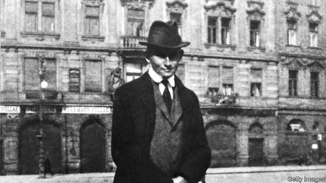

###### Tales of a suitcase

# Who owns Kafka? 

##### The long struggle over the contents of Max Brod’s valise 

 

> Jan 10th 2019 

 

Kafka’s Last Trial: The Case of a Literary Legacy. By Benjamin Balint.W.W. Norton; 288 pages; $26.95. Picador; £14.99. 

THE NEAREST that Franz Kafka (above) came to the Holy Land was the plan he hatched with his last lover, Dora Diamant, to open a restaurant in Tel Aviv. She would cook while he waited on tables. Alas, tuberculosis claimed the writer from Prague in June 1924, before Kafka’s Place could open its doors. (Speciality? Surely, grilled scapegoat.) However, in 1939 Kafka’s friend Max Brod fled Nazi-occupied Czechoslovakia for Palestine with a suitcase that held most of his idol’s manuscripts. It contained the never-completed novels “The Trial”, “The Castle” and “Amerika”, along with diaries, notebooks and correspondence. 

Decades later, the contents of that refugee’s valise prompted a clutch of hotly contested lawsuits. They climbed the judicial ladder until, in 2016, they landed in Israel’s Supreme Court. Benjamin Balint, a critic and translator, traces this saga in his absorbing book. Not only does Mr Balint ask, “Who owns Kafka?” He explores the meaning of a writer’s legacy in an age that, like Kafka’s disorienting stories, puts identity and belonging in doubt. 

Kafka published little in his lifetime. His admirers will know that much of his fiction can be read only thanks to an act of betrayal. Before he died, the German-speaking Jewish author from a Czech city—an epitome of “marginality, dislocation and estrangement”, as Mr Balint puts it—had instructed the devoted Brod to burn all his papers, “unread and to the last page”. For Brod, disobedience constituted a higher loyalty. By 1939 his stewardship of Kafka’s work had given his friend a fast-rising global renown. In Germany, it also incurred the vandalistic wrath of the Nazis. 

After 1948, in newborn Israel, Brod failed to revive his own literary career. But he flourished as the keeper of Kafka’s flame. His interventionist editing means that, as Mr Balint puts it, “the Kafka we know is a creation of Brod.” A much-loved companion named Esther Hoffe, another immigrant from Prague, helped him in his labours. At his death in 1968 Brod bequeathed his belongings, including the precious Kafka papers, to Esther. At the same time, his ambiguous will also requested that his estate enter a “public archive” at her death. 

Thus the confused stage was set for later legal quarrels. After a preliminary skirmish in 1974, they reached heights of properly Kafkaesque absurdity after Esther left the priceless stash to her daughter Eva, a retired El Al employee, in 2007. Now the National Library of Israel claimed Kafka as “a touchstone of modern Jewish cultural achievement” whose documents must rest on its shelves. Esther and Eva, though, had already dealt with the national archive of German literature in Marbach. The Germans had put in their own bid for Brod’s treasure-trove. For their part, Mr Balint suggests, they wished to occupy the high ground of “European universalism against Israeli particularism”. 

Mr Balint elegantly intercuts courtroom scenes with episodes from Kafka’s biography and cultural afterlife. He brings out every paradox of a judicial process that tried to tie down this most ambivalent of authors, the ultimate “disaffiliated pariah”, to a fixed identity. Kafka may have flirted with Zionism, but (in 1914) he also wrote: “What have I in common with the Jews? I have hardly anything in common with myself.” 

Disputes over his Jewishness, or Germanness, became the grist for a slow-grinding legal mill. It sought clarity and certainty from a mind that, in literature and life, often “vacillated on the threshold of consummation”. At length, the National Library prevailed. Eva Hoffe denounced the verdict as a violation. Mr Balint’s scrupulous and sardonic prose makes you love Kafka, and dread the law. Lali Michaeli, an Israeli poet, deserves the last word. “From my perspective,” she remarked of the writer’s otherworldly talent, “Kafka’s manuscripts should be sent to the moon.” 

