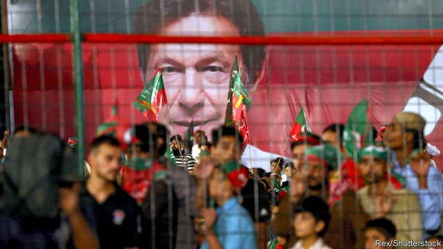
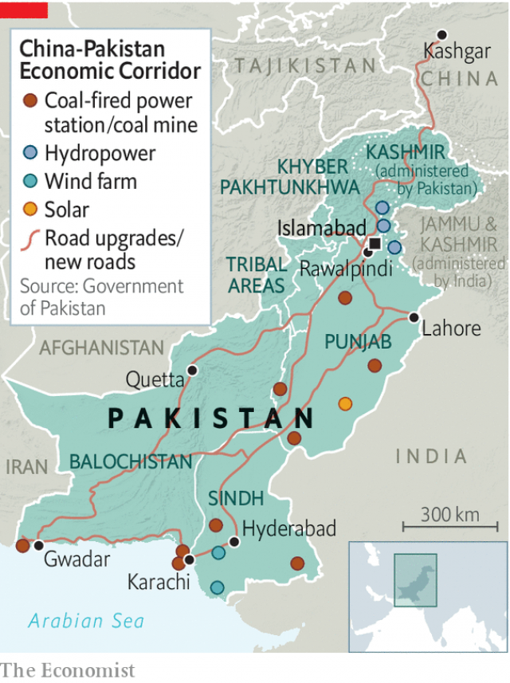
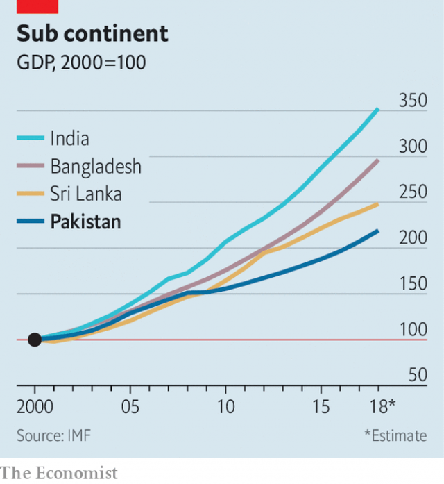

###### Tales of self-harm

# Why Imran Khan is unlikely to make life much better for Pakistanis 

##### The army sets the agenda 

 

> Jan 10th 2019 

 

HUNDREDS OF WORKERS and their families pressed through the iron gates of a factory that knocks out trainers in Rawalpindi towards the end of last year. In the alleyway behind it the factory-owner was dishing out biryani. It was the Prophet Muhammad’s birthday. Children flocked around great steaming pots, as employees replaced those emptied with full ones. In all, the owner said, he would dole out a tonne of rice and 800kg of beef. The messaging was hardly subliminal: this boss is magnanimous, god-sent. 

For workers across the country feasts such as this may be welcome. But many say they would prefer a pay rise. A squeeze on workers has been made worse by the effects of rising interest rates and a fall in the Pakistani rupee in the past year of nearly 30%. The economy, which a year ago was growing at 5.8% annually, has slowed sharply. The cost of food, electricity and clean water has shot up. Factory workers in Karachi, Pakistan’s biggest city and industrial heartland, say that, earning only 22,000 rupees ($160) a month, they can barely make ends meet. Life was always precarious. It has now grown more so. 

Afaq Hussain has worked in the same backstreet shoe workshop hammering on soles for 32 years. Last year the cobbler and his wife were struck down with dengue fever. In municipalities with tolerable administration, the disease is largely avoidable—a question of draining the pools of stagnant water in which the mosquitoes that spread the disease may breed. Karachi does not have such administration. Mr Hussain had to fork out 3,000 rupees for treatment. “People are scared all the time,” he says. “If they are sick, they think: who will pay?” 

Rarely the bosses. Few employers provide more than the stingiest health care. By their own admission, they see malingerers everywhere. Unions are weak, when they exist at all. Good jobs even for skilled labourers are hard to find. One Karachi textile boss, who employs more than 500 people, puts it bluntly. “They get a job and they don’t like to make trouble,” he says. “After all, where else are they going to get work?” 

In this context, the bosses’ virtue-signalling on the Prophet’s birthday is cheap. Yet spare a thought for businesses, too. They make money only in the face of steep odds, or with help from friends in high places. In Karachi a cotton-mill-owner employing 250 workers, a big rice exporter, the owner of a shoe factory and the head of a family-run chain of small chemist shops (drugstores) all said that rising costs of electricity and water were extreme headaches. The drugstore boss complains that, with no electricity from the grid for up to 16 hours a day, the use of diesel generators doubles his energy bills. The mill-owner says higher prices for power and water have added 2 rupees a metre to the cost of producing his cloth, wiping out his thin margins. The businessmen complain that they are losing out to competitors not just in China but in Bangladesh, India and Sri Lanka. The shoe-factory boss has just laid off half of his 70 workers. 

The damning fact is that, even when economic growth ran at a better clip for five years and a handful of new power stations at last ameliorated the country’s chronic energy shortages, the real value of exports failed to grow. Today few businessmen are confident that exports can pick up even following the currency’s devaluation. 

Asking what the government is doing to help elicits hollow laughs. In parched Karachi, there is anger that the government cannot even keep water flowing. With water mains often sucked dry by politically connected mafias, employers and consumers are forced to pay through the nose for water from tankers driven by those same gangs. As for bureaucracy and government corruption, it seems to be getting worse. Port officials frequently demand bribes from the drugstore boss for importing beauty products. The rice exporter lists 14 separate agencies that insist on receiving bribes, ranging from civil defence to health and safety. 

It is against this backdrop that Imran Khan and the party he founded, Pakistan Tehreek-e-Insaf (PTI), came to power after elections in July. The 66-year-old former playboy and cricketing superstar, who was once married to a British-Jewish socialite, has had something of a remake as a devout upholder of Islam. That has drawn rural conservatives to a movement that found its early support among urban and often secular middle classes. It sits oddly with those familiar with Mr Khan’s hedonistic proclivities, or his well-dressed crowd of hangers-on—people who, as one political observer who knows them puts it, “either want to fuck him or fuck like him.” 

Yet there is little doubting Mr Khan’s personal honesty, or the pride he evinces in the two cancer hospitals he has founded, the first in 1994. His own living has long been presumed to be underwritten by benefactors. Though hardly all homespun frugality, Mr Khan is not deep-pocketed like members of Pakistan’s usual political clans. Nor does he represent a self-perpetuating dynasty, as they do. This is part of his appeal. For years he has railed against nepotism and political corruption. He won national office at last thanks to his anti-graft message finding a wide audience among disenchanted Pakistanis. 

 

That and help, behind the scenes, from the army’s top brass. The army has always played an outsized role in public life. One of its critics, Husain Haqqani, a former Pakistani ambassador to America now at the Hudson Institute in Washington, DC, writes in his recent book, “Reimagining Pakistan”, that not only does the army set itself up as the protector of the national interest, it also “defines national interest autonomously of elected civilians” and it does not “countenance any interpretation of national interest other than the one it institutionally advances.” 

Key tenets of the state ideology the army has fostered are an Islamist religiosity; a doctrine of insecurity, tipping into paranoia, resting upon divining enemies ceaselessly at work to undermine Pakistan (none more so than nefarious India); and the army’s own praetorian role in the Pakistani state. The country’s nuclear doctrine—Pakistan has possessed nuclear weapons since 1998—flows from, and winds through, all three tenets. So does a long propensity, striking in a state with such a prickly nationalism, to play up its geopolitical importance in return for foreign aid. 

Mr Khan, for all that he paints himself as a populist outsider, has become a vocal upholder of these tenets, and in return the army backed his rise. First the generals went after the prime minister since 2013, Nawaz Sharif, and his Pakistan Muslim League-Nawaz (PML-N). They deemed him insufficiently biddable and last year encouraged what was in effect a judicial coup. The generals then strong-armed the press and television to back Mr Khan, while shutting off that oxygen for Mr Sharif. 

Nearer the election the generals helped pliant politicians with large local followings switch sides and bring their “vote banks” with them. On election night they helped rig PTI victories in a dozen or more crucial seats. The cowed media may mention none of this. Some analysts even think it an acceptable evil: at last a civilian government that does not rile the army can roll up its sleeves and get economic stuff done. 

That is certainly Mr Khan’s intention. He campaigned on a promise of what he calls “Islamic welfare”. There is little specificity to the phrase. But it is an appeal to Pakistan’s downtrodden and a welcome recognition of the price of poverty and social injustice among several tens of millions of Pakistanis at the bottom of the pile. By the UN’s measure of human development, Pakistan ranks the lowest in South Asia. Pakistan accounts for one in every 13 of the world’s unschooled, and most of them are girls. Some 21m Pakistanis have no access to clean water. 

“Social protection” is a phrase on the lips of many of the new government’s members. In the planning ministry the parliamentary secretary, Kanwal Shauzab, is a social scientist who did her fieldwork in caste- and class-based discrimination against women in the southern part of Punjab province, Pakistan’s most populous. She and Western-educated female advisers eagerly lay out what they intend to accomplish in terms of human-development goals—reducing poverty, improving education, providing sanitation and clean water. The challenges are immense, and begin with a palpable lack of zeal in the ministry’s adjacent, somnolent offices. 

Yet Mr Khan’s aspirations have careened into Pakistan’s immediate challenge: a full-blown balance-of-payments crisis. The country has an addiction to these, especially after budget-busting elections. But this crisis has a particular feature, the influence of China. The previous government under Mr Sharif came to office just as President Xi Jinping was laying out his grand plan to use China’s surplus dollars and excess capacity to create a web of globe-girdling infrastructure, now known as the Belt and Road Initiative (BRI). The China-Pakistan Economic Corridor (CPEC) is easily the biggest part of the initiative. 

 

China has strategic as well as economic reasons to want to connect its landlocked hinterlands to the Indian Ocean. Hugely ambitious plans were drawn up for power plants, roads, industrial zones and the development of Gwadar, until recently a fleapit on the Arabian Sea, into a modern port. Over $60bn in Chinese investment and loans was promised. As the projects got under way, the tide of money pumped up domestic demand, inflated a property bubble, pushed up the value of the currency and led to an unsustainable surge in imports. The current-account deficit was 1% of GDP in 2015. By 2018 it had widened to over 5% of GDP. Foreign-exchange reserves have fallen sharply, previously brisk economic growth has slowed leaving Pakistan’s to continue trailing behind its neighbours (see chart). Inflation and interest rates are rising, too. 

Mr Khan at first declared that he was damned if he was going cap-in-hand to the IMF, turning to Pakistan’s all-weather friends, Saudi Arabia and China, instead. Saudi’s rulers opened the chequebook only after an international furore over the murder of Jamal Khashoggi made them eager to improve their image. They have promised $6bn in loans and deferred payments for oil. The United Arab Emirates is offering something similar. As for China, on Mr Khan’s first trip as prime minister to Beijing in November, he had none of the firm promises of financial aid that he had hoped for. And China dashed hopes for a renegotiation of CPEC deals—which are, after all, commercial arrangements with state-owned enterprises, not with the state. 

So Mr Khan has no choice but to turn to the IMF to bail out Pakistan, as it has done a dozen times since 1988. Pakistan hopes for up to $12bn. In return the IMF is asking for action such as raising energy prices, clamping down on tax evasion and revamping the export sector. The government has not won a deal as swiftly as its members had predicted. Negotiators hope for an agreement early this year. 

Pakistan can probably dig itself out of its immediate hole, helped in part by recent falls in the oil price—it is an energy importer. The new finance minister, Asad Umar, a former businessman, says that money from Saudi Arabia and China solves his cash-flow problems for the coming year. An IMF deal would buy another couple of years beyond that for a sweeping reform programme. Mr Umar claims it is less about the final sums disbursed than about securing a new “strategic” direction that would make this bail-out Pakistan’s “last IMF programme”. 

Mr Umar gives the impression of trying to fix a vast number of things at once. But three areas are a priority, he says. The state raises a pitiful sum from taxes: only 10.5% of GDP. Meanwhile, a thriving black market in foreign exchange helps the siphoning of ill-gotten wealth abroad. So clamping down on tax evasion is a must. Much hope is placed on technology coming to the rescue. Mr Umar claims early success in using data trawls to spot tax dodgers, identifying them by spending patterns, for instance. 

The second area is helping Pakistan’s beleaguered exporters. But the task is huge: in the past four decades Pakistani exports have grown only one-fifth as fast as India’s or Bangladesh’s. Third, Mr Umar promises to overhaul the state sector, taking state-owned enterprises from the purview of ministers and bureaucrats, for whom they represent tempting targets for plunder and misrule, and into a professionally run holding company. 

Mr Umar’s aims are commendable. Yet one topic in need of urgent debate remains out of bounds: CPEC itself. As Atif Mian, an economist at Princeton University, argues, sustaining high imports, financed by external borrowing, is magical thinking. Success cannot be bought from outside without concentrating on domestic productivity growth and exports. CPEC causes the currency to become overvalued and Pakistan to become less competitive globally. It is, Mr Mian says, Pakistan’s version of “Dutch disease”. 

And the damage is significant even before posing the question of servicing dollar-denominated Chinese debt. To date, CPEC has helped increase Pakistan’s external debt by half, to $97bn (32% of GDP), while debt-service costs outstrip the budget for development. There are legitimate questions too about the nature of the deals signed with China. No doubt Pakistan needs Chinese coal-fired power plants. But the electricity tariffs Chinese investors are guaranteed for years look exceptionally high when solar power in sunny Pakistan offers a cheaper long-run alternative. 

As for the loans China has made in return for Chinese-built roads and the like, the interest rates Pakistan is charged are usually competitive and no one else would lend Pakistan the money. But without open tenders for contracts, the concern, as Mr Mian puts it, is that Chinese companies charge $100 for equipment but install poorer kit that is worth, say, $80, a trick that sharply raises the cost of capital. 

There are hints that the establishment is having second thoughts about CPEC. It might explain why the army, behind the scenes—and now perhaps Mr Khan himself—are working hard to mend fences with America. Yet openly criticising CPEC was taboo under the previous government and remains so. Mr Mian describes a “blanket ban” on any objective assessment. Misgivings about CPEC are almost entirely absent in the press. In private Pakistani journalists explain why. To question CPEC is to conspire against the national interest—which the army holds the monopoly of defining. The sanction for media outfits that cross the army is closure. 

Sensitivity over CPEC is understandable for another reason. China is Pakistan’s closest diplomatic and military friend. China helped it become a nuclear state and acts as a counterweight to India, the old foe, as well as America, with which Pakistan has troubled relations. Both sides insist that the “Sino-Pak” relationship is, in the words of an old phrase, “higher than the Himalayas, deeper than the ocean, stronger than steel and sweeter than honey”. But any questions about it would be embarrassing. The generals, with fingers in many pies, are surely keen to hide how handsomely they are making out from CPEC. 

The CPEC taboo undermines the Panglossian argument that, now a civilian government is at last aligned with the armed forces in Pakistan, much can be accomplished. As Mr Haqqani points out, an obsession with national security makes it hard to propose economic solutions to economic problems. 

The economic boom to make that investment worthwhile can transpire only with vibrant trade ties with Pakistan’s neighbours, India above all. Yet obstructing such ties is the country’s national-security priority, in the generals’ eyes. There are other ways in which the case is undermined. For all Mr Khan’s integrity, the PTI and its allies have plenty of sleazy politicians and businessmen on the make. 

A more subtle undermining concerns the case of Mr Mian, the economist from Princeton. On coming to office, Mr Khan appointed him to his economic advisory council. But then Islamist parties which the army had once fostered insisted on his dismissal on the grounds that he is an Ahmadi. The Ahmadis are a sect who revere both the Prophet Muhammad and a 19th-century messiah. They are often persecuted. Indeed, the constitution stipulates that they are not really Muslims (which they say that they are), and mandates discrimination against them. Mr Khan gave in to pressure and sought the resignation of Mr Mian, a world-class economist who only wants to improve the lot of ordinary Pakistanis. Thus, once again, does Pakistan commit self-harm. 

