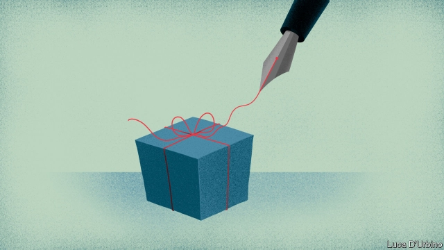

###### Undying loyalty

# Charities try new tactics to be remembered in wills 

##### Animal charities will look after your pet after you die; some will even write your will for you 

 

> Jan 10th 2019 

 

“NO ONE SAYS bequest anymore,” flinches a manager at a big charity. “Gifts in will” is the favoured phrase these days, “to get away from that old-fashioned testament feel.” Whatever the terminology, donations by the dead are on the rise. In the past three decades legacy incomes have more than doubled in real terms. They now fund six in ten of Britain’s lifeboats, two in three of its guide dogs and half its rescued cats. As the stakes rise, charities are bidding harder for the final gift. 

Rising house prices are the main reason for the growing value of bequests. But leaving money to charity has also become more common. In 1997 4.6% of wills left a donation; by 2016 6.2% did. A few big donors may have helped to popularise deathbed philanthropy. Albert Gubay, the frugal founder of Kwik Save supermarkets, gave away £700m ($895m) in his will in 2016. Donating has also become more tax efficient. In 2012 the government introduced a tax break to make “giving 10% of your legacy to charity the new norm”. Solicitors have since advertised charitable bequests as a way to reduce inheritance tax. 

Yet charities themselves have been among the most active in prising money out of people via their wills. In 2000 they launched Remember a Charity, a group of 200 organisations which tries to persuade people to leave a legacy. “It is a very popular market and there is a lot of competition,” says Stephanie Moss, legacies manager at the Charities Aid Foundation, which advises charities and donors. Cats Protection offers to care for a pet free of charge after the owner’s death, triggering the idea of leaving behind some pocket money for Tiddles. Some charities even offer free will-writing services, in the hope that they might get a mention. 

Smaller charities are best at playing the legacies game. Indeed, they seem to be taking business away from bigger organisations: bequests make up a quarter of the income of Britain’s ten largest charities, whereas in 2006 they made up a third. Animal charities are particularly popular. The four charities most likely to be remembered by supporters in their will are Cats Protection, Battersea Dogs & Cats Home, the Dogs Trust and the Royal Society for the Prevention of Cruelty to Animals, according to Fastmap, a market research agency. The Devon Donkey Sanctuary received £23.3m in legacy income in 2017, more than the Royal British Legion and Save the Children. 

This is not without problems. Bequests to animals often irk the human relatives of the deceased. According to the tax office, the number of hearings related to wills has increased by a third since 2012. Several cases involve children trying to prise donations out of charities’ hands—or, in some cases, paws. 

