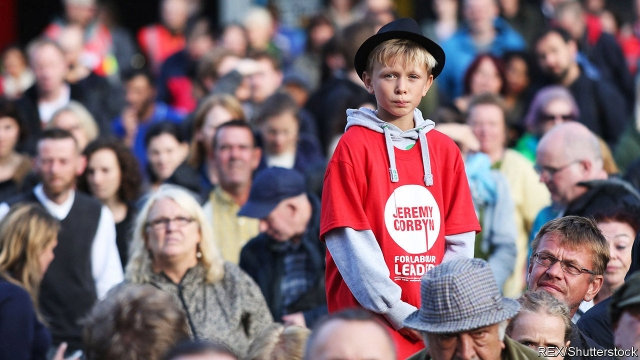

###### A Brexit balancing act

# How long can Labour’s Eurosceptic leader keep Europhile members happy? 

##### Jeremy Corbyn is under growing pressure to back a second referendum 

 

> Jan 10th 2019 

 

T-SHIRTS SAY a lot about Jeremy Corbyn’s Labour Party. During his campaign for the leadership in 2015, young supporters wore shirts featuring the ageing socialist Photoshopped to look like Che Guevara. Another popular design emblazoned Mr Corbyn’s name on the logo of Run-DMC, a New York hip-hop group—an unlikely choice for a 69-year-old manhole-cover enthusiast. Now, at Labour rallies his fans sport a T-shirt with an equally surprising message: “Love Corbyn, Hate Brexit”. 

Mr Corbyn is a lifelong Eurosceptic who voted for Britain to leave the European Community in 1975, opposed its main treaty revisions and campaigned only grudgingly for Britain to remain in 2016. By contrast, Labour’s half-a-million members, who have strongly backed Mr Corbyn in two leadership elections, are full-throated in their desire for Britain to stay in the EU. Some 72% of Labour members want a second referendum, an idea that Mr Corbyn and his allies are reluctant to endorse. Yet in spite of this, 65% of Labour members still say they back their leader. 

So far Mr Corbyn has stuck to a line that just about satisfies them. In a speech delivered as we went to press on January 10th he restated Labour’s plan. The party will vote against the government’s Brexit deal on January 15th. If the deal is defeated, as expected, Labour will call for an election. If this fails, as also looks likely, it will consider options including but not limited to a second referendum. 

This carefully confected fudge provides something for everyone. Eurosceptics, who include a large minority of Labour voters and the boss of the Unite union, Labour’s biggest donor, can insist that booting the Tories out is the priority. Remainers, who include most members as well as some unions disturbed by the prospect of Brexit-induced job losses, can hang on to the hope of a second referendum. Nearly half of members say Labour has the right policy on Brexit, with just over a quarter opposed, according to polling sponsored by the Economic and Social Research Council’s Party Members Project. 

Mr Corbyn’s critics argue that his policy is a cynical ploy to avoid committing the party to any firm course of action before Brexit day on March 29th. Some suspect that he does not much care whether Britain stays or goes, and that he only wants to make sure that Labour does not get the blame in the process. His supporters insist that he is simply waiting for the right moment to show his hand. 

Labour strategists see a second referendum as a fire escape that should be used only if the building is close to collapse. They see three risks in using it any earlier. The first is democratic: asking people to vote again could undermine faith in politics and boost the far right, inflaming the culture war that Brexit has kicked off. The second is political: a second referendum would hurt Labour, particularly in the Midlands and the north, where its base has been hollowed out. Marching into a new referendum as the party of Remain could provoke desertion by Leave voters. The third objection is personal. Some view the “People’s Vote” referendum campaign as a bid to undermine Mr Corbyn. It is led by ex-Labour and Liberal Democrat staffers who have derided Mr Corbyn in the past. “They have escalated a tactic into a principle,” huffs one senior Labour apparatchik. 

Labour MPs are divided. Seventy-two of the 257 have publicly backed a second vote, according to LabourList, a news site. Others would like to have such a vote, but not yet. They worry that rushing into a snap referendum may backfire, resulting in a victory for the government’s deal—or, worse, for no deal at all, if such an option were on the ballot. Their priority is to avoid crashing out on those terms. Others think that Britain’s best bet is to leave with a deal and then, in time, apply to rejoin. 

But pressure on Mr Corbyn to shuffle towards backing a referendum is growing. People’s Vote insists that the electoral arithmetic makes sense for Labour. “If Labour believe that they will lose millions of votes—by maintaining [the current] position that their voters do not want—it will shift,” says one who works there. Six out of ten Labour voters backed Remain in 2016. Polling commissioned by People’s Vote suggests an exodus of Labour support if the party is seen to back Brexit too heartily. Yet this thesis has already failed a real-world test. In the general election of 2017, Remainers flocked to Labour despite its commitment to carry out Brexit, on the basis that Labour’s approach looked a bit softer than the hardline Tory version. 

Other sources of pressure may be more effective. An increasing number on the left, including many of Mr Corbyn’s ideological allies, are lobbying the Labour leader to reconsider. Manuel Cortes, the firebrand head of the TSSA transport workers’ union, has called for Brexit to be stopped, in the language of the left (“Brexit? No pasarán!” he wrote last year). Radical economists such as Ann Pettifor, who is close to the shadow chancellor, John McDonnell, are pressing for a vote, arguing that Brexit is a right-wing movement to roll back regulation and workers’ rights. Another Europe is Possible, a left-wing campaign group, is making the case that a Labour government could help to steer the EU in a more social-democratic direction, if Britain stays in. 

Members may also become impatient. Mr Corbyn was elected leader in 2015, and again in 2016, with their support, partly on a pledge to involve the rank and file more closely in policymaking, as part of a “democratisation” of the party. If Labour is seen to ignore the wishes of its members on a fundamental issue, the backlash could be ugly. “Hell hath no fury like a party member scorned,” says Tim Bale of Queen Mary University of London, who points out that Tony Blair was idolised by members before they turned strongly against him. 

The result is a glorious irony. Some of those on the Eurosceptic left, who have long called for Labour to empower its party members, are now doing their best to sidestep them. At the same time centrist Remainer types, who during the Blair years were happy for the awkwardly radical membership to be overlooked, are calling for the grassroots to be heard. “It is through the looking glass,” says one Labour MP. “Inside is outside, black is white.” A design for the next T-shirt, perhaps. 

