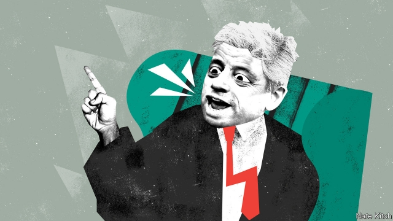

###### Bagehot

# John Bercow, speaker of the asylum 

##### The speaker of the House of Commons will be at the centre of the political storm for weeks to come 

 

> Jan 10th 2019 

 

IN BRITAIN THE line that divides ceremony and substance is seldom clear. Sometimes ceremonial figures have no real power. Sometimes they have lots of it. And sometimes they can shift quickly from the first column to the second. 

The speaker of the House of Commons is a case in point. The British speaker is a very different figure from the one in the House of Representatives. Whereas the American speaker is the head of the majority party in Congress, the British speaker, an MP chosen by their peers, is supposed to be above politics. They sit on an elevated chair under an elaborate wooden canopy, with three clerks in front of them and a padded footstool, and devote much of their time to ceremony. Yet the speaker is far from being just a tourist attraction. Even in normal times they wield a great deal of subtle power. In abnormal times they can become the centre of a political storm, as happened this week. 

John Bercow, who currently occupies the chair, provoked the fury of Brexiteers by accepting an amendment tabled by Dominic Grieve, a Tory backbencher, that demands that the government outline a Plan B within three days if, as expected, its Brexit plan is defeated on January 15th. Brexiteers argued that Mr Bercow erred by accepting a backbench amendment to a government business motion. They accused him of being a biased referee (who has been spotted with a “Bollocks to Brexit” sticker on his car—though he says it is his wife’s). They claimed that he is prejudiced against the Tories in general, and against this government in particular. 

What are we to make of this storm? There is little doubt that Mr Bercow’s personal views are pro-Remain. He started life on the nationalist right of the Tory party. But he moved towards Labour, particularly after meeting his Labour-supporting wife, Sally. There is no doubt that he has feet of clay. He has been accused of bullying, and of presiding over a culture of it. Despite the claims he not only clung on to his job but also continued to sit on a committee that adjudicates over questions of behaviour in the Commons. 

But there are also important things to be said in his favour. The biggest is that he has been a doughty champion of the rights of Parliament against the government. For 30 years the balance of power has shifted from the legislature to the executive. Mr Bercow has done everything he can to stand up for Parliament as an institution, as well as for small parties and individual MPs. It is easy to be annoyed by his style—he sometimes acts like a circus barker and uses unnecessarily rotund language (“chuntering from a sedentary position” is one of his favourites). But he has always been a champion of MPs having their say. 

Second, he is no patsy. Mr Bercow pushed back against accusations of pro-Remain bias by pointing out that he has made time for MPs with all sorts of political positions. He was backed by Sir Christopher Chope, a maverick Tory, who noted that Mr Bercow once accepted an amendment that, by a circuitous route, prepared the way for the referendum in 2016. His greatest bias is not against Labour or the Conservatives but against party grandees. Before becoming speaker he infuriated David Cameron by ridiculing his Eton education and membership of the all-male White’s club. He has enjoyed holding Theresa May and her ministers accountable to the House. Mr Bercow’s enthusiasm for taking on the powers-that-be goes back to his childhood. As the undersized, Jewish son of a downwardly mobile small businessman turned taxi driver, he was picked on. But he took on the bullies in the playground and mocked them in class as they stumbled over their lessons. 

This week’s row saw the powers-that-be getting their own back. Andrea Leadsom, the leader of the House, made a point of asking Mr Bercow to publish the advice from his clerk on whether to allow the Grieve amendment, given that Mr Bercow had made so much fuss about forcing the government to publish its advice on various Brexit matters. Many Conservatives also tried to get their revenge for Mr Bercow’s presumed willingness to betray his original party in order to get support from Labour. 

The last point in Mr Bercow’s defence is that his job is an extraordinarily difficult one. Britain is seeing what happens when powerful emotions collide with a convoluted and ambiguous parliamentary tradition. The speaker is not simply in the business of reading a rulebook. He must make subtle choices between lots of different rulebooks that have been produced over the centuries. Mr Bercow repeatedly pointed out that, if his critics didn’t like the amendment he had chosen, they were free to vote against it—and must have taken some comfort from the fact that it eventually passed by 308 votes to 297. 

It is likely that this procedural row will be the first of many. As British politics is consumed by chaos and acrimony, the speaker will have to make many more difficult decisions. In normal circumstances the speaker has to decide on the balance of power between the government and the Commons, and deal with four fairly cohesive parties. But all this is breaking down. The government is losing control of events. And the parties are beginning to fragment. On January 7th Remainers on both the Labour and the Conservative side marched through the lobby to vote against the government to try to stop it from taking Britain out of the EU without a deal. The speaker will have to make far more complicated and delicate decisions than he has ever made before. 

This gives Mr Bercow great powers: to select this or that MP to speak, to choose this or that amendment, or even to cast a tie-breaking vote. But it also brings risks. If the speaker leans too far in one direction, he risks damaging not just himself but the House of Commons. The most powerful argument in favour of Brexit is that it was an attempt to bring back control to Parliament. It will be a disaster if, in the process of bringing back control, Brexit also does irreparable damage to that same institution. 

