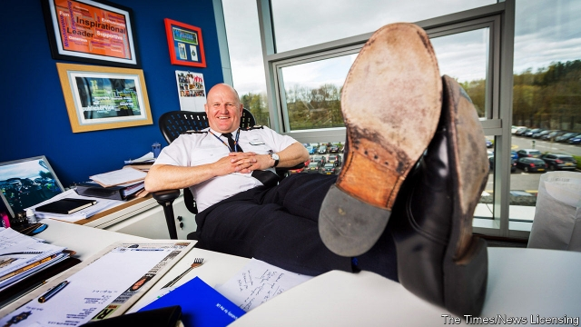

###### Good cop, mad cop

# Mike Barton runs England’s best police force. What sets him apart? 

##### The chief constable burps and swears his way through meetings. But he keeps winning awards 

 

> Jan 10th 2019 

IF YOU ASK his cops, they tell you Mike Barton is forthright, daring and a little domineering. Mostly, though, they think “The Chief” is crazy. The bulky, bald Lancastrian whom one admirer likens to Colonel Kurtz, the Marlon Brando character in “Apocalypse Now”, rules Durham Constabulary in idiosyncratic style. He burps and swears—a lot—in meetings. Once, he set his annual plan to music. After someone poured a bucket of water over his head during a charity challenge outside the force’s headquarters a few years back, he jumped into its pond in uniform. “He’s a nutter,” one officer says. “But he’s our nutter.” 

Between 2010 and 2016, only four of the 42 police forces in England and Wales suffered greater funding cuts than Durham. Mr Barton now has 1,140 officers, down by 25% since the peak in 2010. Yet the police watchdog has graded Durham “outstanding”, the highest of four ratings, at effectiveness and efficiency for the past three years. It was the only force to get that thumbs-up in 2018 (though forces are not perfectly comparable because of their different sizes and concentrations of poverty). Its crime-detection rates are the highest in the country and academics lavish Mr Barton, who has been chief constable since 2012, with gongs. 

The 61-year-old says cuts forced him to reshape the force and chop unmotivated cops. “Austerity has been the best thing that’s happened to Durham Constabulary in its 179-year history,” he says. Amid chatter that he will soon retire, The Economist spent two days with Mr Barton and his bobbies to understand his approach. 

Three paradoxes explain him. First, he is a liberal who is tough on “villains”. Soon after he was appointed, he wrote a column calling for drugs to be legalised. “Outright prohibition just hands revenue streams to villains,” he wrote. The health service could supply addicts, he suggests. Liberals who applaud this stance are less thrilled that the force does not delete body-camera footage of offenders who are stopped and searched. Instead, it keeps it on a database so cops can study their mannerisms. He sends handwritten birthday cards to intimidate organised criminals on his patch. “That’s not soft,” he has said. “That’s not liberal.” 

The approach is not as contradictory as it first appears. Police can best deter people from committing crime by making them afraid of being caught, explains Mr Barton, but they need to be “soft” enough to persuade those who have already offended to change their future behaviour. 

The second paradox is that he is a tech innovator in the body of an old-school cop. Staff type up his handwritten replies to emails, but he boasts that his is the only force to design its own software from scratch. He hired some 20 developers from local universities to work with police who ensure the system fits their needs. “Who’s your best burglary cop? Get him to design that bit.” If a problem emerges, it can be fixed in-house. The force worked with criminologists at Cambridge University to design probably the world’s first AI-based software to predict whether a suspect will cause further harm and thus whether or not they should be bailed. 

Third, he is a hands-off boss who often micromanages things. He subscribes to what he calls the bungee-jump theory of management: plunge down into minutiae then spring back up to strategy. He picks up litter to set an example and is, says one of his staff, a “bugger for punctuation”. (He keeps the “Oxford English Dictionary” on his desk, as well as books on problem-solving policing.) Last month he arrested a shoplifter he saw hiding booze down her top when he was shopping in a supermarket. Mostly, he lets his staff get on with it. He trains frontline cops in problem-solving before encouraging them to innovate. 

Most forces cut community-support officers when their budgets were slashed but Mr Barton kept most of his, believing they would be best at implementing grassroots ideas. On his own initiative, one such officer persuaded others to do all their paperwork in a patrol car outside a drug dealer’s house. The criminal soon moved. 

In Peterlee, a former pit town named after a miner, another neighbourhood cop raised funds to open a garden. Prisoners grow the seeds, kids plant them and they donate the produce to a food bank. This costs police nothing but time. When it was vandalised the officer in charge, Michelle Burr, took the vandals out of school to pick up litter and showed them a picture of disabled children using the garden. “They put their heads down and said they were really sorry,” she says. A couple of weeks later, one of them gave her a bird box he made at school for the garden. She organised for him to help rebuild the leisure centre a day a week, for which he will receive a qualification in construction. 

Policing has changed a lot since Mr Barton gave up the family farm to go on the beat, like his aunt, in 1980. New recruits would be foolish to emulate his mannerisms. At times, he is unprofessional to a degree that would not be tolerated in a younger or less able man. He swears all the time, asks (male) cops about their sex lives and wrestles with a “super-fiendish” sudoku while on a call with the Home Office. 

But they could learn from his love of all human interactions, whether with villains or the cleaners (whom he greets by name). Earlier this week he phoned a constable who had broken his wrist during an arrest. “You tosser, ’ow did that happen?” he asked, before reminding the officer, “You know I think a lot of you.” And they might study how lightly he wears a deep intellectual curiosity. “He plays his Columbo quite well,” one cop says. “But he’s a flipping genius.” 

