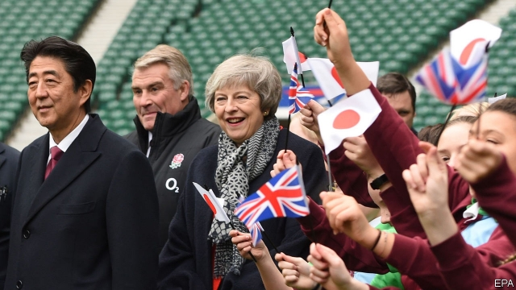

###### Charm defensive

# Shinzo Abe visits Britain to firm up security ties 

##### Anglo-Japanese links strengthen as Britain seeks to cement friendships beyond Europe 

 

> Jan 10th 2019 

 

TWICKENHAM STADIUM in south-west London, home to the sport of rugby union, is not usually a hub of diplomatic activity. But as we went to press on January 10th Theresa May was due to host her Japanese counterpart, Shinzo Abe, for a security briefing at the stadium. Britain’s security minister, its top police officer and its cyber-security chief were to advise Mr Abe on how to prepare for this year’s Rugby World Cup and next year’s Olympic and Paralympic games, which Japan will host. 

Mr Abe was probably too tactful to raise the issue of drones, which tormented Gatwick airport in December and briefly halted flights at Heathrow on January 8th. But he will have been grateful for the tips on batting away terrorist and cyber attacks. The event reflects a deepening Anglo-Japanese partnership on security and defence, with Japan eager to pull Britain into an increasingly turbulent Asia and Britain keen to firm up its international friendships after Brexit. 

Mr Abe came bearing gifts. He was expected to offer Mrs May political succour by backing her beleaguered Brexit deal, mindful of the more than 1,000 Japanese companies in Britain that stand to lose out if no deal is agreed. He lifted a ban on British beef and lamb that had been in place since the spread in Britain of BSE, or mad-cow disease, over 20 years ago. That should reap £120m ($153m) for British farmers over five years. The two countries are also working more closely together on what Mrs May calls “grand challenges”: artificial intelligence, ageing societies and clean growth. 

But it is military co-operation that has truly blossomed. Britain and Japan both project themselves as outward-looking island nations committed to a rules-based international system. Mrs May endorsed Japan’s concept of a “free and open Indo-Pacific”, a term that alludes to concerns over China’s troublesome behaviour in the region. Since 2015 Britain has hailed Japan as its closest security partner in Asia, sent Typhoon fighter jets to carry out exercises with Japan’s air force and become the first country other than America to drill with Japan’s army.  HMS Montrose, a frigate, will shortly head to Japan, becoming the fourth Royal Navy vessel to do so in under a year. These warships have co-operated with Japan’s in increasingly sensitive techniques, including anti-submarine warfare and amphibious landings. 

In December Japan upped its order of F-35 fighter jets; it is now due to operate more than Britain, which on the day of Mr Abe’s arrival announced that it had nine of the aircraft ready to deploy. Having a principal warplane in common will make it easier to swap data and tactics. Joint work on a new air-to-air missile is also moving ahead. And conversations are beginning over collaboration on navigation satellites and a next-generation fighter aircraft, both areas where Britain has peeled away from European partners and is keen to demonstrate that it has other suitors. There is also much for British and Japanese spy chiefs to discuss. British officials have been sounding the alarm over the involvement of the Chinese firm Huawei in 5G mobile networks; Japan barred Huawei from official contracts in December. 

These strengthening ties could one day turn into a formal military alliance, says one British official. Another observes that the defence relationship has not been this close since the Anglo-Japanese alliance of 1902. That pact ended 80 years of splendid isolation for Britain. Mrs May must hope that Mr Abe might at least ease her own. 

Correction (January 10th 2019): HMS Montrose is a frigate, not a destroyer as we originally suggested. 

