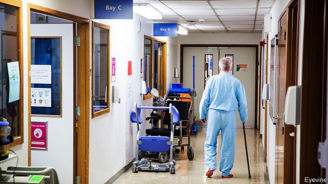

###### No hospital for old men

# The NHS falls out of love with the market 

##### Competition is being rolled back in favour of co-operation, in a plan to cope with an ageing society 

 

> Jan 10th 2019 

 

EVERY WEDNESDAY morning a motley group of health and social-care professionals, ranging from a geriatrician to a district nurse to a social worker, get together for a virtual ward meeting in Alderney hospital. The goal is to get to the bottom of the problems facing the ward’s patients, who, were it not for the new system, would be in an actual, physical ward, but are instead being treated at home. Does the 85-year-old with a urinary-tract infection just need some antibiotics? Or does he also need someone to come round to fix his heating and check on his wife with dementia? Angie Terry, a community matron, jokes that at times the detective-style hunt for causes becomes like the American crime drama, CSI—only here the goal is to keep people out of a state institution. 

Alderney, in Dorset, provides a glimpse of what officials hope the National Health Service will look like in ten years’ time. On January 7th Theresa May and Simon Stevens, the head of NHS England, set out a plan for the next decade. This followed Mrs May’s promise last summer that the health service would receive £20.5bn ($26bn) more per year by 2023-24—a welcome rise but still less than economists think the service needs to get back to pre-austerity standards. Having already been promised the cash, NHS England was told to work out how to spend it. 

Its plans include headline-grabbing measures like expanding child mental-health provision, doing more consultations by video-link and catching more cancers early. But the priority is dealing with an ageing society. The aim is to save money by preventing illness and keeping people out of hospital. To do this, spending will focus on primary and community services, creating new multidisciplinary teams of doctors and social services. Success, the plan suggests, will come only if the NHS is radically reshaped. 

The idea at the heart of the plan is to roll back competition in favour of co-operation. Since the early 1990s the parts of the NHS that pay for services (typically GPs, or family doctors) have been separated from those that provide them (hospitals, for example), in the hope that an “internal market” will drive up standards. Reforms by the Tory-Lib Dem coalition in 2012 sought to expand this system. But experiments in recent years have seen the NHS move in the opposite direction. As Nigel Edwards of the Nuffield Trust, a think-tank, notes, the long-term plan represents a new stage in the “political falling out of love with the use of market-based mechanisms”. 

By 2021 England will be divided into what are known as integrated care systems (ICSs). Already introduced in 14 parts of the country, which range in size from 530,000 to 2.7m people, these bring together payers and providers to collectively plan services and manage resources. In time they will be given more control over spending and held to account for the overall health of their population. The hope is that this will encourage collaboration between different parts of the NHS, and between the NHS and local government. 

What this means in practice varies according to an area’s needs. “A lot of it is about putting people in the same room and letting them work it out for themselves,” explains Tim Goodson, head of Dorset’s ICS. In Poole a new team has begun work not just on keeping people out of hospital, but on getting them out once they are in. Having got to know many repeat visitors, they offer advice to accident and emergency wards on whether admission is really necessary. After a person has been in hospital for a few days the team begins to assess whether hospitalisation is in the patient’s interest. Often it is not. 

Bringing about this re-organisation of the health service without any new legislation can be tricky. Local NHS officials have had to fight against existing payment mechanisms and legal frameworks to make the ICSs work. Mr Stevens thus hopes Parliament will pass legislation to change the rules to fit the system he is already introducing. Indeed, the NHS’s long-term plan ends, ever so humbly, with a “provisional list of potential legislative changes for Parliament’s consideration” that would, among other things, loosen current procurement rules. 

Even with those legal changes, success is far from guaranteed. There is evidence that integrating services can cut costs and improve outcomes. Some worry, however, that ICSs may turn into local monopolies, responding to the central diktats rather than the needs of local populations. NHS officials argue, in effect, that the efficiencies enabled by integration should outweigh those lost by reduced competition, and that competition will be strengthened in areas where it shows most success, like in patients choosing where to have elective surgery. But Andrew Haldenby of Reform, a think-tank, says that progress in most existing ICSs has been slow. Change is rarely brought about by “bureaucratic exhortation”, he notes. 

The reforms face strong headwinds. One is staff shortages. The NHS has 100,000 vacancies. As Richard Murray of the King’s Fund, another think-tank, points out, having more money is no good if there are no staff to spend it on. Another is the mess in social care. Age Concern, a charity, estimates that 1.4m people do not get the care they need, and the health service often has to deal with the consequences. The NHS is the largest employer in Europe and an enormously complex organisation. Reform is difficult at the best of times. And these are hardly the best of times. 

