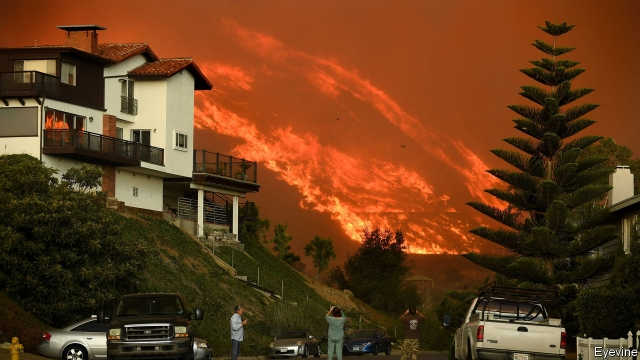

###### Feeling the heat

# California’s biggest utility is in deep trouble 

##### PG&E’s role in starting wildfires could mean a break-up or even bankruptcy 

 

> Jan 10th 2019 

 

CALIFORNIA’S largest utility is accustomed to disaster. In 2001 PG&E declared bankruptcy after the state mismanaged deregulation of the electricity market. In 2010 one of PG&E’S gas pipelines exploded. Its travails are even the stuff of Hollywood. “Erin Brockovich”, starring Julia Roberts, told the story of how the company let toxic wastewater run into groundwater supplies and had to settle a class-action lawsuit in 1996 for hundreds of millions of dollars. Nevertheless, PG&E’Scurrent turmoil marks the start of something new. 

On January 7th the firm’s share price plunged by more than 20% on reports that it might declare bankruptcy. PG&Efaces billions of dollars of liabilities over its possible role in starting the wildfires that have ravaged California. Damages, legal fees and other costs from fires over the past two years may reach $29bn, estimates Goldman Sachs, a bank. That sum, which far exceeds the company’s $17bn in operating revenue in 2017, would be hard enough for PG&E to bear if it were an aberration. In fact, wildfire costs look set to become the norm. 

The firm’s predicament is the result of several factors, some beyond its control and some self-inflicted. Hotter, dryer conditions and lax building standards have made California vulnerable to ravenous blazes. A utility’s operations would have to be near-perfect to keep power cables and other equipment from inadvertently sparking a fire, argues Michael Wara, an expert on energy and environmental policy at Stanford University. “What climate change does is make the consequences of small errors much greater,” he says, “greater to the point where they threaten the financial viability of the utility.” 

PG&E’S record includes alleged errors that are large: last month California’s utility regulator charged it with falsifying safety data for its pipelines for five years, from 2012 to 2017. But the company’s deadliest problems seem to have stemmed from its basic electricity equipment. Last year the state’s fire investigators reported that PG&E’S poles and power lines were responsible for sparking deadly blazes in northern California in 2017—in most instances, trees fell on power lines. They are still investigating whether PG&E caused the two most deadly fires in California’s history: one in Sonoma and Napa counties in 2017 and the other which killed 86 people in November. 

Under California law the company must cover insurance claims and damages if its equipment contributed to the outbreak of a wildfire, even if it is found to have obeyed all safety rules. If PG&E operated recklessly, it could face other charges, too. These include not just criminal negligence but manslaughter and murder, according to California’s attorney-general. 

PG&E also faces the spectre of being unable to find insurance or borrow money. Bankruptcy is one option but not necessarily the most likely. In December California’s utility regulator said it would explore “a broad range of alternatives to current management and operational structures”, including replacing the board and breaking up the firm. In the meantime PG&E may seek to take advantage of a new law, passed by California last year to help it deal with mounting costs. PG&E, after regulators’ approval, may issue new bonds to pay for some wildfire costs; such securities would be backed by customers’ monthly payments, and would result in higher rates. 

Regardless of whether PG&E issues those bonds, electricity charges seem certain to rise. In December PG&E asked regulators to authorise an increase of 12% next year. That would help cover its insurance expenses and the cost of changes to its electricity system to reduce the risk of fire. It would not cover legal costs. 

