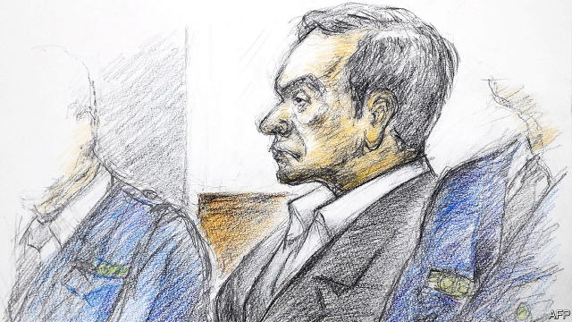

###### Wheels of justice

# Carlos Ghosn gets a chance to plead his innocence 

##### But the giant of the car industry may remain in prison for months 

 

> Jan 10th 2019 

 

SEVEN WEEKS in a Japanese prison have taken a toll on Carlos Ghosn. A diet based on rice and vegetables has left the former chairman of Nissan’s cheeks thinner. His black hair is flecked with grey. But the physical effects have not made him less feisty. He used a court appearance on January 8th, the first time he has been seen in public since his arrest, to fight back against accusations of financial misconduct. 

Mr Ghosn’s troubles began in November when he was detained by prosecutors at Tokyo’s Haneda airport. Nissan’s boss, Hiroto Saikawa, then revealed that an internal investigation had uncovered evidence that Mr Ghosn had underreported his pay between 2010 and 2015 and failed to declare the use of properties owned by Nissan. A day before his 23rd day in detention, the limit in Japan, he was rearrested and kept in jail while allegations of underreporting pay for a later time period were investigated. Meanwhile relations between members of the Renault-Nissan-Mitsubishi alliance, which he built into the world’s biggest carmaker, are in the deep freeze. 

During his court appearance Mr Ghosn was permitted to address the allegations. These centre on his reporting of his pay and a new accusation of a “breach of trust” whereby he is accused of shifting potential trading losses from personal foreign-exchange derivatives contracts to Nissan during the financial crisis of 2008-09. 

Insisting on his “genuine love…for Nissan”, he proclaimed his innocence, saying he had never sought undisclosed pay and that the board had approved his activities in the case of the derivatives contracts. In 2008-09 banks had demanded large amounts of collateral for foreign-exchange contracts to hedge Mr Ghosn’s yen salary, and since he could not provide this, Nissan temporarily paid the collateral—and suffered no loss on the contracts, he said. Mr Ghosn also defended his high pay, noting that during his time as boss he had turned down attractive offers to run four big carmakers, including from Bill Ford, and from Steve Rattner when he was Barack Obama’s “car tsar” running General Motors. 

Yet the judge did not grant bail, on the grounds that Mr Ghosn might flee or conceal evidence. On January 11th, when his latest spell in jail expires, he can ask for bail again. But if, as is likely, he is charged with breach of trust, he will probably face more time in prison awaiting trial. 

His incarceration has focused the world’s attention on Japan’s flawed justice system. The length of detention, re-arrests and an emphasis on long, stressful interrogations without lawyers present puts pressure on defendants to make confessions, on which the judicial process is heavily dependent. For his part, Mr Ghosn has refused to confess. His supporters claim that he has been set up to prevent his imminent pursuit of a full merger between Nissan and Renault in which the French firm would have had the upper hand. 

The legal hiatus is mirrored in the alliance. Relations, often tense, are now icy. Nissan has extended its internal probe and a management shake-up that has seen Jose Muñoz, its chief performance officer and a Ghosn ally, taking leave of absence. While Nissan and Mitsubishi have removed Mr Ghosn as chairman, Renault has kept him as its chairman and CEO, appointing an interim boss. Mutual suspicions thus leave uncertain the future of an alliance in which Renault owns a controlling 43.4% of Nissan, while Nissan has a non-voting 15% stake in Renault. Mr Ghosn had wanted to make it “irreversible” through a full merger. That now looks impossible. And using Nissan’s cash to buy Renault shares, to rebalance the alliance in favour of Nissan, would be seen as deeply hostile in France, even after the legal dust settles. 

