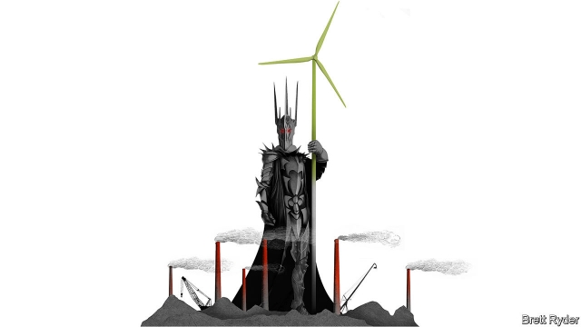

###### Schumpeter: Europe’s carbon crunch

# For industry, climate policy is a delicate balancing act 

##### A report from the edge of Mordor 

 

> Jan 12th 2019 

 

“DOES ANYONE here speak English and want to talk to a journalist” yells Ulrich Kindermann, as he wheels his bicycle through the 12,000-year-old Hambach Forest in north-west Germany. He appears to be shouting up to the treetops. Strangely, they answer back. “Maybe”, comes a cry from Maximilian in his tree house 20 metres up an oak tree. He rappels down, looking, with his curly hair and bright eyes, for all the world like Frodo Baggins. Another member of the fellowship squats by a stove at the foot of a tree. “It’s a strange picture. From up there, you can see life all around you,” she says, pointing at the tree house. “On the other side is Mordor.” 

What she calls Mordor is, in fact, the biggest brown-coal, or lignite, mine run by RWE, Germany’s largest power generator and the biggest direct producer of carbon-dioxide emissions in Europe. Lignite is a cheap source of electricity, but one of the dirtiest of fuels. Germany is the world’s biggest lignite burner, making an embarrassment of its attempts to lead the world in clean energy. The hobbits aim to stop the Hambach mine digging farther into the forest. A court recently supported their efforts. 

RWE would dispute the comparison with Middle-earth. It says that lignite and its other forms of power generation offer customers secure, round-the-clock electricity, and support lots of jobs. But gazing down from a spot overlooking the mine that RWE calls “terra nova”, your columnist was appalled; it has left a gash in the earth almost as big as skyscraper-filled Manhattan. Nonetheless, it gave an opportunity to reflect on how well Europe’s heaviest polluters are attempting to help mitigate global warming. They are not cutting emissions nearly fast enough. Yet it is not all bad news. 

This year two climate-related shake-ups are going ahead that in the past would have outraged Europe’s big emitters—utilities, steel producers, paper and chemical firms. First is a reform to the European Union’s Emissions Trading System (ETS), a cap-and-trade system once ridiculed for the low price of its carbon allowances. The second is the phasing out of coal owing to a growing conviction in north-western Europe—including Britain, Belgium and France—that it should become history. Within a few weeks, a commission in Germany is expected to announce plans for a gradual phase-out of coal. Both measures are likely to raise power prices in Europe because, absent a meaningful carbon price, coal has been dirt cheap. Yet industrial firms, massive energy consumers, seem to be viewing the changes with resignation, not revolt. 

Start with the ETS. It works by setting a steadily falling cap on emissions and providing tradable allowances up to that limit. But it has been plagued by a huge surplus of permits, exacerbated by the 2008-09 financial crisis, making prices so low as to be meaningless. Reforms introduced this month (that remove almost a quarter of the oversupply each year until 2024) made carbon one of Europe’s hottest markets in 2018. The price of permits tripled from €8 ($9.60) per tonne to €25, as hedge funds piled in. 

Carbon prices could go up as dramatically as when the Arab embargo drove up the price of oil in 1973, reckons Per Lekander of Lansdowne Partners, an asset manager in London. That may be wishful thinking (carbon prices have tumbled this year), but even if prices stay where they are, the impact on heavy emitters will be severe. These firms say that compensation schemes are insufficient. Still they insist the ETS is the most market-friendly way of curbing emissions, and is better than ad hoc regulation. 

A second sign of acceptance is that although representatives of steel and other firms reckon a German coal phase-out would push up power prices, they are not battling for the black stuff. Their big concern is “carbon leakage”—the risk that, for instance, steel produced in countries with less stringent climate rules, such as China, gain a competitive advantage. This is a legitimate worry. Policymakers should work harder to establish a global carbon price. Yet heavy emitters elsewhere should not sleep soundly. When it comes to the climate, where Europe leads, others follow. 

Fighting global warming requires a much faster shift towards clean energy by all. However, European firms have come a long way in modernising their views on emissions, partly influenced by the ETS. The first to be hit hard by the new reality have been the region’s utilities. A flood of renewables, especially after the acceleration of Germany’s energiewende (energy transition) in 2011, clobbered power prices and caused utilities such as Germany’s E.ON and RWE to suffer years of losses. Some have since dumped their old fossil-fuel assets and embraced wind and solar, enabling them to benefit from higher carbon prices. 

Europe’s oil-and-gas companies are also changing their attitude, led by firms such as Royal Dutch Shell. What was once “greenwashing” now appears to be ways to explore “optionality”; ie, investing in zero-carbon technologies to gain experience in how to move away from oil. Increasingly, their investors are encouraging the switch, to hedge the risk that they are pouring money into soon-to-be-redundant oil wells. Steel, cement and other heavy industries are also collaborating on technologies such as hydrogen to reduce their carbon footprints (though Eurofer, Europe’s steel chamber, says that with high carbon prices they will struggle to find the investment to scale these up). 

Still, climate policy remains a delicate dance for big industrial and energy companies. Consider RWE. This year it hopes to complete a deal with E.ON that will give it a big new renewables portfolio. Yet it also faces the wrath of environmentalists for digging in over lignite. To some its actions feel like crass hypocrisy. But for investors, it could be clever gamesmanship, ensuring it gets the biggest possible payout if the German government decides to expropriate its coal mines. The Dark Lord Sauron would be smiling, even if the hobbits of Hambach Forest are not. 

