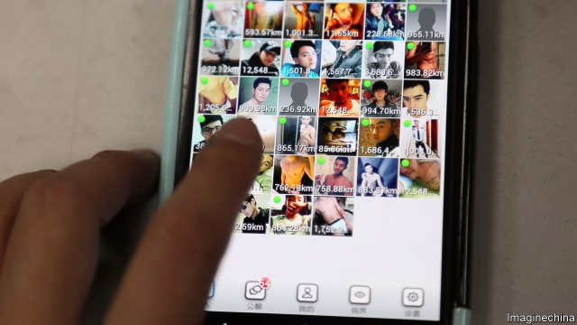
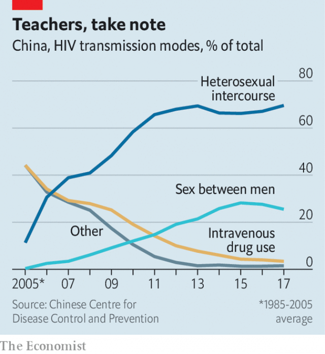

###### Testing times

# Reported cases of HIV in China are rising rapidly 

##### That is mainly because getting tested is so much easier, and less intimidating 

 

> Jan 10th 2019 

 

WANG XIAOSHUAI, a gay man in the central city of Hefei, used to believe that only people who injected drugs could contract HIV. But then a man he had sex with revealed that he had tested HIV-positive. Mr Wang visited a local NGO and took a pinprick test to determine whether he, too, was infected. Happily, he was not. But the experience was terrifying. “It never occurred to me that someone around me could actually get HIV,” he says. 

Many others are less fortunate. In November China’s Centre for Disease Control said that 850,000 people were known to be HIV-positive, 12% more than a year earlier and almost three times the number in 2010. An official study found that new cases of HIV among students aged between 15 and 24 rose by more than one-third every year in 2011-15, mostly as a result of gay sex. 

The virus may not be spreading as fast as these figures suggest. The rapid increase is largely the result of better detection. Over the past decade the number of health facilities offering HIV tests has quadrupled. In 2016 China launched a five-year plan to combat HIV and AIDS. It increased funding to NGOs providing free self-testing kits to high-risk groups, such as gay men and sex workers. It also gave NGOS money to provide HIV-positive people with free medicine. In 2015 nearly 70% of those diagnosed with HIV were receiving antiretroviral drugs. In 2017 just over 80% were. 

 

Most people in China are infected through heterosexual activity. Sex between men has also become a big contributor, resulting in about one-quarter of transmissions (see chart). The proportion of sexually active gay men infected with HIV is now much higher than that of female sex workers. Social media have made it easier for gay men to find casual partners. The country has the world’s largest gay social-networking app, Blued. On January 6th the service said it was suspending registrations for one week after a Chinese magazine reported that boys under 18 had contracted HIV through encounters facilitated by the app (Blued says it will step up enforcement of measures to prevent minors from joining). 

But social media can also spread awareness of HIV. Blued has added a red ribbon icon to its platform, clicking on which offers information about HIV services. NGOs also use WeChat, a messaging app, to urge people, gay and straight, to get tested. Such tactics may be helping: 200m tests were performed in 2017, up 38% from 2015. 

Encouraging people to come forward is still difficult, however. The government reckons that 400,000 people may have the virus but not know it, ie, less than 70% of cases appear to have been detected. UNAIDS believes that less than half of gay men carrying HIV in China are aware of it. Discrimination may be deterring some from being screened. A survey of 2,000 people with HIV found that 12% had been refused medical treatment and 15% had been denied work, presumably because of prejudice. 

Officials’ efforts to make free testing available outside the public health system suggest they are aware of the problem. Those tested at state hospitals typically have to pay 60-100 yuan ($9-15). Zheng Huang, who manages an HIV-related NGO in Shanghai, says gay people like to use its testing services not only because they are free, but because most of the staff are gay. 

HIV prevalence is low in China compared with the West. The proportion of people believed to have the virus is only 0.09%. In Britain it is 0.15% and in America 0.34%. But the leading role of sex as a mode of transmission is common both to China and the West. Preventing infection rates from climbing in China will require shattering taboos and teaching young people about how to have safe sex. 

