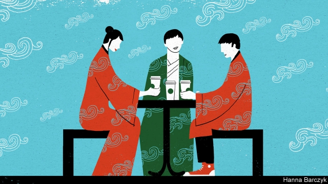

###### Chaguan

# Why young Chinese are sporting 1,800-year-old fashions 

##### Thoughts on the craze for ethnic robes 

 

> Jan 10th 2019 

 

LIKE TEENAGERS the world over, Chen Bolin, a Chinese university student, feels a need to belong. Unlike many of his peers, Mr Chen has found a spiritual home: China of the Wei and Jin dynasties, about 1,800 years ago. So deep is this bond that on special occasions he wears flowing, wide-sleeved robes inspired by third-century dress. One moment of connection stood out, when he wore robes to a museum in Shaoxing, the eastern city where he studies. There he found a sculpture depicting sages from the Wei and Jin era. His own clothes were “exactly like theirs”, he recalls happily. He saluted the statues and told them: “Dear ancestors, I’ve heard so much about you. It is my good fortune to see you today.” 

The teenager developed his passion at high school in Pingliang, perched in the hills of Gansu, an inland province. Though a rather small, sleepy spot, Pingliang is home to a Han culture association. Such clubs are spreading fast. They celebrate the Han ethnic group to which more than nine out of ten people in China belong. 

Enthusiasts claim that a million Chinese, mostly youngsters, regularly wear Hanfu, or robes inspired by traditional Han dress. The unplanned emergence of any social movement in China presents Communist bosses with a choice: scramble to the front of the parade and claim to lead it, or ban it. For now, the parade continues. State media hail Hanfu as a welcome complement to calls from President Xi Jinping to revive traditional culture and values. In April 2018 the Central Committee of the Communist Youth League, a recruitment channel for party members, declared a first “Traditional Chinese Garment Day”. The league urged young Chinese to don ancient finery to demonstrate “cultural confidence” to the world. There was a caveat, however. The league’s commemorative day honours what it calls Huafu, or “Chinese dress”. That encompasses not only Han traditions but those of China’s 55 official ethnic minorities, from such places as Tibet, Inner Mongolia or the restive Muslim region of Xinjiang. The league’s caution reflects wariness about overt Han chauvinism, which threatens official narratives about a unified, multi-ethnic China. 

In truth, clumsy Communist propaganda extolling national unity arguably helped create a hunger for Han traditions. At big party events, ethnic-minority delegates typically attend in brightly coloured folk costumes trimmed with silks, furs or jangling silver jewellery, even as Han delegates appear in Western suits and ties. This both patronises minorities and renders the Han an invisible nationality—representatives of a sort of generic modernity. 

As Mr Chen shares his story, the slight, bespectacled teenager is wearing robes of lilac and white, embroidered with blue clouds, an outfit he says is Jin-dynasty day-wear. All around are thousands of fellow enthusiasts attending a Hanfu cultural festival held annually in Xitang, a quaint, canal-side town near Shanghai. 

Hanfu wearers vary in their devotion to historical accuracy. Mr Chen has brought along a classmate whose look combines a black-and-white military uniform, 21st-century sneakers and an air of faint embarrassment. “I think this is Han dynasty,” the classmate mumbles, when asked. The colours are more Ming, says Mr Chen, gently correcting his friend’s dates by about 1,100 years. 

Enthusiasm counts for more than precision. On this sunny festival weekend a local Starbucks boasts baristas in toga-like robes, a warrior in chain-mail queuing for coffee, and outside, a Taoist priest in a tunic and cloak outfit he calls “a bit of messed-up fusion”. Luling Manman, an author invited to the festival as an expert on ancient etiquette, defines Hanfu as “all forms of clothes we Han people have worn over the course of 5,000 years”. Others take a narrower view, describing a tradition cut cruelly short when the last ethnic-Han dynasty, the Ming, was overthrown in 1644. In European terms, that is like wrangling over a school of fashion that supposedly began in Neolithic times and flowered in the Middle Ages, and may or may not have ended during the English civil war. 

Since the Hanfu movement emerged in the early 2000s, some members have framed it as a way to restore Han customs suppressed by ethnic Manchu warriors who conquered China from the north and ruled as emperors of the Qing dynasty from 1644 until 1911. Han nationalists scorn such “Chinese” traditions as tightfitting qipao dresses or high-collared jackets precisely because they are derived from Manchu, Qing-era fashions. 

At the Xitang festival, it should be said, brooding nationalists are outnumbered by youngsters having uncool, goofy fun. Blushing students giggle their way through a lesson in ancient dancing. Earnest, robe-wearing young men take photographs of each other playing the flute or practising archery. Children take part in a fashion show, swishing perilously along a catwalk in too-long finery. 

The festival organiser is Vincent Fang Wenshan, a Taiwanese lyricist behind some of the most famous Mandarin pop songs of recent times. A dapper 49-year-old in black embroidered robes, Mr Fang urges younger enthusiasts to eschew Han chauvinism and to be open to modernised Hanfu. He sighs that some purists will not tolerate any dress not found in ancient wall paintings, and draws a wistful comparison with Japan, where traditional customs and modern culture co-exist easily. Wearing a kimono on a Japanese bus causes no astonishment, notes Mr Fang, lamenting that a gap of several centuries separates Han traditional culture from the modern world. He would like to see Hanfu fans bridge that gap. 

Historians might quibble with some of Mr Fang’s details. Plenty of Han traditions actually survived under the Qing. The country’s sharpest break with tradition came during the first decades of Communist rule, when leftist zealotry made it safest to wear blue and green Mao suits. But that is to take the Hanfu movement too literally, perhaps. Look past the invented costumes and the dodgy history, and something simpler and more poignant appears: a whole country yearning to know where it belongs. 

