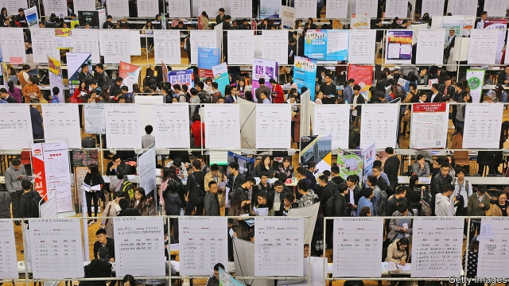
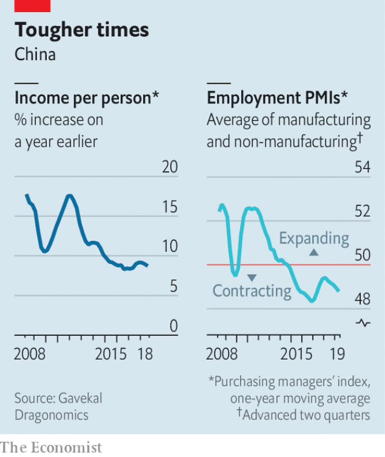

###### Oh, for an assembly-line job

# Worries about unemployment mount as China’s economy slows 

##### The services sector will cushion the blow, but not provide much security 

 

> Jan 10th 2019 

 

THE FACTORY town known as iPhone city used to pulse with life as workers got off their shifts. These days the complex that churns out roughly half of all Apple smartphones is quieter. A staff dormitory just beyond its gates is empty, its entrance sealed with barbed wire. A barbecue restaurant, a noodle shop and, fittingly, a mobile-phone outlet have all closed. At a karaoke bar where workers would croon into the wee hours on rest days, the owner was recently seen packing up his speakers. 

The giant complex on the edge of the central city of Zhengzhou is run by Foxconn, Apple’s Taiwanese manufacturing partner. It remains one of the world’s busiest factories. But it is well off its peak, when as many as 350,000 people kept production humming around the clock. Workers say they are down to eight hours a day, five days a week. That means they are not doing the overtime that accounts for much of their pay. “It feels like they’re forcing us to quit,” says a six-year veteran. 

Cao Yingying, a woman at a nearby recruitment centre, says they stopped hiring for Foxconn in late October because of Apple’s disappointing sales. They still have other electronics factories as clients, but they are all suffering. “Washing machines, fridges, vacuum cleaners. Everyone now has these, and they last longer,” she says. “So factories have fewer orders.” 

A slowing economy is putting pressure on jobs in China (though Apple’s woes may involve other factors, too—see article). The official unemployment rate is stable at around 5%, but as always this figure is a poor guide. Surveys in the manufacturing and service sectors show that companies have been cutting staff since at least September. Wage growth is tepid compared with the sizzling norm of a few years ago. In November profits at industrial firms fell for the first time in nearly three years. 

When China’s leaders met in December to map out economic policy for 2019, they said their priority would be to stabilise employment. They are anxious about social stability in a year studded with sensitive anniversaries. Among them will be the 30th of the Tiananmen protests, which involved economic grievances as well as political ones. Suppression of labour unrest has become even harsher in recent months. In one case, police detained more than 30 students and activists who had tried to help workers organise a union at a firm in the southern city of Shenzhen. 

Worries about jobs are, so far, focused on the export sector. Trade matters less to Chinese growth than it once did, but it still, directly and indirectly, supports as many as 180m jobs, nearly one-quarter of formal employment, the government estimates. The trade spat with America has plunged firms into uncertainty. Exporters cut their demand for new hires in the third quarter by 53% compared with a year earlier, say researchers at Renmin University in Beijing. In December export orders fell at their sharpest rate in more than three years. 

 

A second area of concern is the high-tech sector. As investors turn cautious, jobs are coming under threat. The starkest example is Ofo, a bike-sharing company previously feted as an innovator. Today it is battling to survive. Search engines, online travel agencies and e-commerce websites have all reportedly trimmed staff. This could be bad news for this year’s record number of university graduates (students in Zhengzhou are pictured at a job fair last year). Wang Xing, head of Meituan Dianping, a company known for its food-delivery app, captured the gloom last month with this line on his micro-blog: “2019 might be the worst year of the past decade, but it might also be the best year of the coming decade.” 

Industries undergoing cyclical slumps are a final area of concern. With the stockmarket down 30% in the past year, financial firms, especially brokerages, have cut staff. A property slowdown has led several big developers to freeze hiring. 

How would China cope with a big rise in unemployment? In 2008 when the global financial crisis struck, millions of migrants left coastal factories and returned to the countryside. They did not have to wait long for prospects to improve. Half a year later the government revved up growth with a massive stimulus programme. 

A similar exodus is less likely this time. The economy is profoundly different, in ways that should cushion workers from the slowdown. Services, from restaurants to couriers, now account for more of the economy than manufacturers, and they are more labour-intensive. But service jobs are even less secure than those in factories. Workers in China’s vast gig economy—driving cars for hire, delivering food or trucking packages between cities—rarely get overtime pay or unemployment insurance, says Geoffrey Crothall of China Labour Bulletin, an NGO. Older people struggle. On a street in Zhengzhou, a man in his late 40s glumly surveys a board plastered with job ads. “They want young lads for the courier jobs. Faster on their bikes, faster on their smartphones,” he says. 

China’s economic situation differs from the financial tsunami of 2008 in another crucial way. This time the troubles have built up gradually, giving the government time to ready its defences. It has already started to help beleaguered companies. In December the State Council announced that firms which refrain from firing staff can get 50% refunds on unemployment-insurance payments. Officials have hinted that they will offer subsidies for those buying home appliances, a boost for manufacturers. And after initially taking a hard line in its trade dispute with America, China has softened somewhat. That helped pave the way to talks between the two countries this week in Beijing that augur well for a deal, however fragile. 

The government is also boosting its own recruitment. At a labour centre in northern Zhengzhou, once used for hiring Foxconn workers, the biggest ad is for jobs in Hami, a city in Xinjiang, the north-western region where officials have incarcerated vast numbers of ethnic-Uighur Muslims for “re-education”. Hami is looking for auxiliary police. “Join us to realise your dreams”, says the poster, with a picture of officers brandishing machine guns. Applicants, who must be between 18 and 35, are promised monthly salaries of at least 6,100 yuan ($890), roughly the wages at Foxconn when the going was good. 

