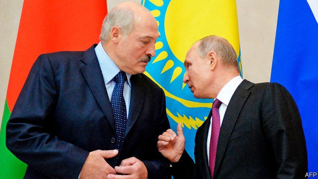

###### He had a friend in Minsk

# Belarus’s leader upsets Vladimir Putin by cosying up to the West 

##### Russia is hinting at a political takeover 

 

> Jan 10th 2019 

 

A GIANT STATUE of Lenin still stands before the forbidding House of Government in Minsk, built by Stalin in 1934 and occupied by the Gestapo a few years later. But behind this totalitarian façade now sits a government that is trying to work out how to reform Belarus’s economy while following a political trajectory set a quarter-century ago by the country’s authoritarian leader, Alexander Lukashenko. Now he must also fend off Russia’s looming threats to its independence. This is not an easy circle to square. But Mr Lukashenko is no ordinary politician. 

A former collective-farm boss, Mr Lukashenko was swept to power in a landslide in 1994, three years after the collapse of the Soviet Union. He has ruled Belarus ever since, making him Europe’s longest-serving president. Unlike his peers in other European former Soviet republics, who rejected the old system as they asserted independence, he cherished the Soviet legacy. Belarus still marks the Great October Revolution of 1917 with a public holiday. And Mr Lukashenko’s adherence to socialism goes well beyond symbols. 

Unlike his neighbours, Mr Lukashenko never embraced free markets and democracy, or privatised Belarus’s state factories. Instead, he guarantees full employment, at the cost of stifling productivity. Belarus has no oligarchs, relatively little everyday corruption and some of the lowest rates of inequality and of people who live on less than $5 a day in the former Soviet empire. Again borrowing from Lenin’s lexicon, Mr Lukashenko consolidated power by coercion, jailing rivals and journalists, disbanding protests and earning Western sanctions and a reputation as “Europe’s last dictator”. Still, he has retained broad domestic support by keeping up adequate living standards, a sense of social justice and decent public infrastructure. 

Mr Lukashenko’s authoritarian model, though, has relied on Russian subsidies. Keen to bind in an ally, Moscow has kept natural-gas prices low and supplied cut-price crude oil, which Belarus has been able to refine and sell at market prices. In exchange, Mr Lukashenko swore loyalty to Russia, and entered into military and economic alliances with it. Yet a “Union State of Russia and Belarus”, nominally formed in 1999, exists mainly on paper. In reality, Mr Lukashenko has skilfully played Moscow against the West, cashing in on his country’s geopolitical position. 

 

This ambivalence has irked Russia but has bought Belarus time to allow a real private sector to emerge. It now accounts for half of jobs and has created a middle class that values hard work and education. Minsk’s vibrant IT industry now employs some 40,000 staff developing apps and games such as Viber and World of Tanks. 

As Balazs Jarabik of the Carnegie Endowment for International Peace, a think-tank, observes, the social contract is changing. A recent poll shows that Belarusians above all want their government to create the conditions that would let them make money. Mr Lukashenko has tried to do this, appointing a former banker to run the government and promising to promote a digital economy. Alexander Turchin, the deputy prime minister, says the government is planning to rein in the security services and soften laws against economic crimes. Although Belarus still has the death penalty and harasses the opposition, Mr Lukashenko has become more tolerant of civil society, even allowing a measure of public criticism and debate. 

He is surely not a reborn liberal. His softening results largely from fear of Moscow. Russia’s war against neighbouring Ukraine in 2014 made Belarus feel vulnerable. Mr Lukashenko refused to recognise Russia’s annexation of Crimea and retains good relations with Ukraine. He has clamped down on Russian propaganda, giving suspended jail sentences to three Russian-paid bloggers who stirred anti-Belarusian sentiment, for instance by messaging that “the study of the Belarusian language can spoil children’s brains.” He has also set about mending fences with America, which withdrew its ambassador from Minsk in 2008 in protest against political repression. Last year Mr Putin ominously sent a former security-service commando as ambassador. 

Having lost Ukraine, Russia now wants to integrate Belarus more deeply, citing those dormant agreements of the 1990s. More to the point, Mr Putin reckons Belarus could help him retain power after his current and supposedly final presidential term ends in 2024. A full-blown union of Belarus and Russia, created with or without Mr Lukashenko’s agreement, could let Mr Putin dodge term limits in Russia by becoming the first president of a new entity, Russia-and-Belarus. 

In December Mr Putin twice met Mr Lukashenko, and dispatched his prime minister, Dmitry Medvedev, to Belarus. Telling reporters that “Russia is ready to go further in building a Union State”, Mr Medvedev suggested that Russia could take over the Belarus customs, central bank and courts. 

Russia has many cards to play if it wants to get tough. It is winding down its oil subsidy, which accounts for nearly 4% of Belarus’s GDP, implicitly linking it to integration. Deprived of cheap money, Belarus’s state firms, laden with bad debts, would struggle to stay afloat. As a hedge against Russia, Mr Lukashenko has turned to China, luring its investors and lenders. Minsk now boasts a vast Chinese industrial park. Yet an overt Chinese presence might provoke resentment in Russian-speaking Belarus. Russia is also Belarus’s largest single market. Blocking exports, something Moscow tried a decade ago, could fuel discontent ahead of Belarus’s presidential election in 2020. 

For his part, Mr Lukashenko has sounded defiant. He has ruled out the idea of a Russian military base in Belarus, and has hosted American generals and diplomats. On December 14th he told Russian journalists: “If someone wants to break [Belarus] into regions and force us to become a subject of Russia, that will never happen.” He cannot afford a formal rift with Russia, but he is calculating that Mr Putin’s hand will be restrained by Russians’ growing weariness of military adventures and by Mr Lukashenko’s popularity among them. “I made a joke that we are sick and tired of each other,” Mr Lukashenko said in Moscow just before Christmas. In the same bantering spirit, he brought Mr Putin a Christmas gift: fours sacks of potatoes and a slab of lard. Mr Putin did not respond, but is unlikely to feel satiated. 

