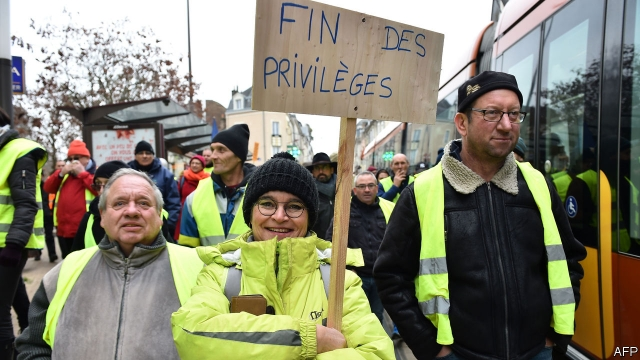
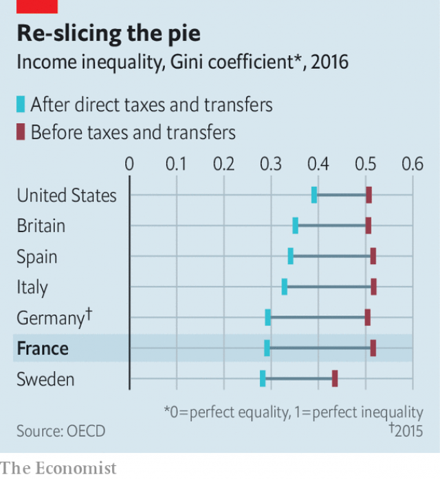

###### More égalité than you might think

# How France redistributes more from rich to poor than Sweden 

##### But protesters still denounce the “president of the rich” 

 

> Jan 10th 2019 

 

WHEN EMMANUEL MACRON launches his promised “great national debate” on January 15th, he hopes to show a willingness to listen to the popular rage behind the gilets jaunes (yellow jacket) protesters who have been occupying roundabouts and motorway toll booths in anger initially at fuel tax rises, but now with a much longer list of grievances. The French president has asked for ideas on four topics, which he wants to be discussed online and in town halls until mid-March: the environment, democracy, public services and taxes. It was the claim of unfair taxation—and a feeling among protesters that the money raised did them no good—that first mobilised the gilets jaunes. “But what do you do with all that dough?” asked one early gilet jaune in a clip that went viral. 

France has a long-standing preference for taxes and spending. Its tax take as well as its level of public spending, which accounts for 57% of GDP, are higher than in any other European Union country. Much goes on subsidising public services, whether riding in high-speed trains or studying at university, that cost users more elsewhere. As Mr Macron pointed out in his new year’s address, France has excellent infrastructure, (mostly) free education and first-rate health care that comes at little direct cost to patients. Such services are often taken for granted. If the French want lower taxes, some of that spending will have to give, too. 

The gilets jaunes, however, argue that they are unfairly squeezed by taxes to pay for all this while the rich are let off. Their tax revolt began against a rise in green taxes on diesel and petrol. But the backdrop was Mr Macron’s decision in 2017 to abolish the country’s wealth tax, in line with a manifesto promise. Although the president introduced a (more modest) mansion tax in its place, the tag “president of the rich” has stuck. No longer subject to the wealth tax on top of income tax, the richest 1% have indeed seen the single biggest increase in disposable income under Mr Macron, according to the Institut des Politiques Publiques. 

 

Still, unlike in America, the richest 1% in France collectively earn less before taxes than the poorest 50%. At least until the most recent change, the gap has remained fairly stable since 1995 in France, whereas it has risen sharply in America. And the broader redistribution picture is considerably more balanced. Thanks to high taxes and benefits, France stands out among big European economies as the country that does the most to reduce income inequality, says James Browne, an economist at the OECD (see chart). Sweden does end up with a slightly more equal overall income distribution, but the French system reduces the gap by more. A recent study by INSEE, the national statistics body, shows that the gross income of the top 10% of people is 22 times that of the bottom 10%. Yet that gap is reduced to just six times by taxes and transfers. “Let’s stop pretending that France is a country where solidarity doesn’t exist,” said Mr Macron in his address. 

So why do the gilets jaunes feel so squeezed? The answer is not stagnating average wages. Real household income in France grew by 8% from 2007 to 2017, despite the financial crisis, more than in many other European countries, as Jean Pisani-Ferry, an economist at Sciences Po (and a former adviser to Mr Macron), points out. He identifies a breakdown in social mobility, and thus in faith that the system can improve lives for the next generation, as part of the explanation. Another, according to research by the World Inequality Lab, linked to Thomas Piketty, a French economist, is that the bottom 50% are disproportionately touched by non-progressive social-security charges and indirect taxes, such as those on fuel. Include these, and the French redistribution system still works, but rather less well. 

Such matters will form part of Mr Macron’s consultation. Town halls have already opened “books of grievances”. The government has ruled out certain demands—including a return of the wealth tax—as well as subjects that fall outside the designated topics. In one early online forum, a common demand has been the abolition of gay marriage. Mr Macron’s promise of a debate, along with €10bn to boost pay packets, may have calmed some of the protesters. But he now needs to persuade people that the consultation is not just a gimmick, while not jeopardising his reform programme. 

