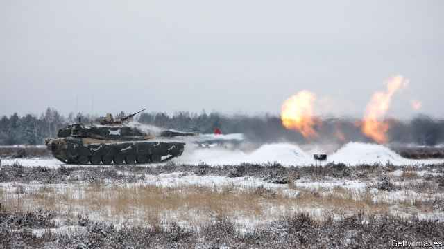
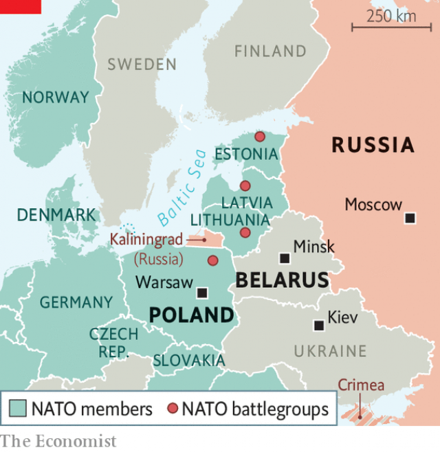

###### Poleaxed

# Poland wants a fort with Donald Trump’s name on it 

##### Critics say it could weaken NATO, or lead to Russian troops in Belarus 

 

> Jan 10th 2019 

 

POLES LIKE being reminded of the time they came to America’s defence. Meeting his counterpart in November, James Mattis, America’s now-departed defence secretary, waxed lyrical about General Tadeusz Kosciuszko, who built a string of vital forts during America’s revolutionary war. Poland’s government hopes America will return the favour with some fort-building of its own. 

Having been repeatedly carved up by bigger powers, Poland is keen to cement alliances. It rushed to join NATO in 1999, and in 2016 welcomed the headquarters of NATO’s “enhanced forward presence” scheme, which stationed 4,600 combat-ready troops in eastern Europe. Yet neither this, nor the several thousand American soldiers who rotate through Poland annually, nor the NATO missile defence system America is building on the country’s Baltic Sea coast have settled Polish nerves. 

Documents leaked last May showed Poland had asked America to deploy an armoured division (roughly 15,000 troops) permanently on its soil, to which Poland would contribute up to $2bn. The proposal was sprinkled with references to 1776 and quotes from President Donald Trump’s speech in Warsaw in July 2017. It noted that Poland is one of the few allies that meet NATO’s target of spending 2% of GDP on defence. It alluded to Poland’s contributions to American wars in Iraq and Afghanistan, and to America’s 70% favourability rating among Poles. Maps of potential locations even showed the schools that the hypothetical Americans’ offspring might attend. In September Andrzej Duda, Poland’s president, tried to close the deal: the base could be called “Fort Trump”. 

Though this struck many Poles as toe-curlingly crass, the proposal kicked off a serious debate. Supporters, including some American generals, argue that a permanent deployment would be preferable to the current rotational arrangement, because commanders would get to know their surroundings. Sceptics replied that America does not have tanks to spare and that moving existing units eastward from Germany would make them a juicy target for Russian rocket artillery. 

 

Critics also warn that Russia could respond by building up forces in Kaliningrad, its European exclave to Poland’s north, or in Belarus. Alexander Lukashenko, Belarus’ autocratic president, has beaten back Russian demands for a base for years, but American tanks next door could force his hand. That, in turn, would create a headache for Ukraine, which might have to shift forces to defend its border with Belarus. A bilateral deal, cut over NATO’s head, might compound growing unease over America’s commitment to multilateral alliances. The Baltic states “would inevitably feel marginalised”, a recent Estonian study cautioned. 

Another worry is that an American base might deepen the wedge between Poland and the EU. In 2009 Poland helped launch talks on the EU’s Permanent Structured Cooperation (PESCO), a framework for European defence co-operation. But in 2017 it was the last to sign the agreement, underlining its tilt towards America. In 2016 the government cancelled an order for 50 Airbus helicopters, offending France. Instead it is pumping much of its growing defence budget into an American Patriot air defence system worth $4.8bn. The EU also frets that an American base would convey approval for Poland’s illiberal nationalist government, hampering the bloc’s efforts to stop it from weakening the judiciary and undermining the rule of law. 

Congress has told the Pentagon to report on the feasibility of a base by March 1st. A huge garrison looks less likely than a slimmer deployment, perhaps to existing sites. American officials fear the proposed new sites lack space for tank manoeuvres. In December Mr Duda suggested that Mr Mattis’s departure would make it “easier to talk”, as he had been sceptical of the idea. But the Pentagon is in disarray, with the new leadership unlikely to rank eastern Europe high on its agenda. 

