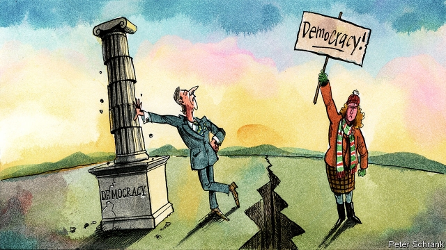

###### Charlemagne

# The notion of an east-west split in the EU is simplistic and defeatist 

##### The picture is much more nuanced 

 

> Jan 10th 2019 

 

BUDAPEST IN JANUARY ill-suits political action. A freezing wind rushes off the Hungarian plain and whips the grand 19th-century boulevards. The streets glisten with ice and slushy snow. Yet march the people did once more on January 5th. They bore Hungarian and European flags, party-political banners and the insignia of charities, trade unions and NGOs. “Orban out!” they chanted. “It’s the biggest protest yet,” enthused Andras Lederer, a veteran of successive demonstrations. 

No political dinner party in Brussels, Paris or Berlin is complete without the observation that the shroud of illiberalism is settling on central Europe. Viktor Orban, the Hungarian prime minister, has mastered the country’s mass media, courts and universities, and is now trying to force overtime on workers under legislation dubbed the “slave law”. In Poland the populist-nationalist Law and Justice (PiS) government has stacked courts and state-run companies with cronies. Corruption scandals, democratic backsliding and assaults on the press stalk other eastern members of the EU, including Romania, which took over its rotating presidency on January 1st. 

Such news stirs up old prejudices about the eastern EU states. Since the Emperor Charlemagne’s time, the continent’s political fulcrum has resided in the old Frankish empire and its great cities: Aachen, Paris, Strasbourg, Frankfurt, Brussels, Milan and more. This Europe has often looked down on the Poles, the Hungarians and the Czechs, let alone the Ukrainians or Estonians, for their supposed exoticism and backwardness. Timothy Garton Ash, a historian, calls this tradition “intra-European orientalism”. Jean-Jacques Rousseau, a philosopher, characterised ordinary Poles as noble savages. Heinrich Heine, a poet, romanticised and belittled the peoples to Germany’s east. After the fall of the Berlin Wall the talk was of their “catching up” with the west. Today that tradition lives on in coverage of illiberalism in the region and in suggestions that Europe’s future involves a permanent and exclusive integrationist vanguard, and a more sceptical outer layer. 

Reviving this tradition is wrongheaded on three counts. First, it is a wild generalisation. The abuses of the Hungarian and Polish governments are real. But they are neither a single phenomenon—Poland has a more dynamic opposition and a more ideological leadership—nor representative of the whole region. Liberal pluralism remains in better fettle in the Czech Republic. The Baltic states have exemplary civic and e-citizenship traditions (witness Latvia’s successful experiments with e-petitions). Meanwhile Marine Le Pen’s 34% vote at the last French election, the governing Freedom Party’s assaults on Austria’s institutions and Denmark’s decision to expel asylum seekers to an island once reserved for contagious animals all give the lie to western Europe’s supposed immunity to conspiracist populism. Italy, a founding member of the EU where measles cases are soaring thanks to anti-immunisation hysteria and whose populist government met with that of Poland on January 7th to discuss a new European nationalist alliance, further disproves that lazy myth. 

The east-west dichotomy also obscures dissenting voices in central Europe. Every Saturday in Paris, “yellow jacket” protesters march for a manifesto that includes abolishing gay marriage, stopping immigration and quitting the EU. On weekends in Warsaw, Prague, Bratislava and Budapest, people march for independent courts, free media and, often, rapprochement with Brussels. Zsofia Nagy, a Hungarian sociologist, describes the anger she felt at the Orban government’s implausible reaction to the Sargentini Report, an EU-backed analysis of its anti-democratic record. “It was full of lies,” she fumes. The young mother took matters into her own hands, forgoing sleep for a week to dismantle the government’s defence line-by-line. Her text was circulated widely on independent online media. 

Asked about the supposed east-west divide, Rafael Trzaskowski, Warsaw’s new mayor, replies: “bullshit”. Elected in an anti-government surge at municipal elections in October, he recalls: “I fought a pro-openness campaign and people embraced it.” One Polish opposition analyst reckons PiS’s core vote is only about 30% of the electorate, to which it has added swing voters with a welfare bonanza paid for by the last government’s economic boom. New polling by IPSOS on the government’s dispute with the EU over its rule-of-law infringements suggests that over half of Poles (and one in five PiS voters) back Brussels over Warsaw. 

Democratic institutions in post-communist states have, it is true, shallower roots than counterparts that grew up on the other side of the Iron Curtain. And the EU is right to take on Hungary and Poland for their abuses. But it is defeatist to believe that the better parts of those countries’ natures are doomed. This attitude, though, is expressed in the obsession with restarting the Franco-German motor, an inadequate engine for the expanded EU, rather than trying to bind in countries like Poland. It is also apparent in the indulgence of the European People’s Party (EPP), the mainstream centre-right family that includes Angela Merkel’s Christian Democrats, for Mr Orban and his Fidesz party. When figures like Manfred Weber, the EPP’s candidate for the European Commission presidency, coddle the Hungarian autocrat, they are implicitly acting as if Hungary’s embattled liberal tendencies do not exist. 

Europe’s leaders, east and west, face a choice. They can treat the continent as one: the product of a rough history of geographically differentiated leaps forward and lurches backward in which no nation has a monopoly on progress; one in which each is expected to apply the same standards and each is accorded the same status. Or they can accept the dichotomy of east and west and aspire, at best, to build wobbly bridges between the two. The former path offers the better way forward. The latter points to collapse. 

