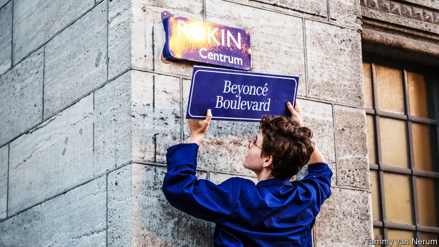

###### Maiden lanes

# The push to name more European streets after women 

##### Nearly all roads are named after men. Campaigners want to change that 

 

> Jan 10th 2019 

 

SOME CITIES are symbolised by their monuments, such as the Eiffel Tower, the Colosseum and the Brandenburg Gate. But streets can do the job, too. Many are named after national heroes—nearly all of them male. 

Dozens of streets in Hungary are named after Petofi Sandor, the national poet. A visitor to any Italian city is likely to tread on Via Dante, Mazzini, Garibaldi or Verdi. Women remain conspicuously absent, apart from a certain Middle Easterner famed for her virginity. Even so, tens of lesser-known gents come ahead of Jesus’s mother. In Paris, 31% of streets are named after men, just 2.6% after women. 

The invisibility of women in Europe’s street names is mainly a historical hangover. This summer, residents of Brussels had the chance to name 28 new streets. None are named after individual men—the new Place des Grands Hommes instead gives them collective recognition. Two streets will be named after women: a doctor, Isala van Diest, and a film director, Chantal Akerman. But the achievements of these ladies appears on a par with local fondness for delicacies like kriek (cherry beer) and speculoos (gingerbread biscuits), which will also give their name to new streets. The ingenious naming of Ceci n’est pas une rue (“This is not a street”) will pay homage to the Belgian surrealist artist René Magritte—a deserving choice, but some may rue the missed opportunity to highlight other worthy women. 

Meanwhile, vigilante sign-stickers from Paris to Tbilisi are taking matters into their own hands. A Parisian group has unofficially renamed the Pont au Change after the entertainer and resistance fighter Josephine Baker; and the Boulevard du Palais after the 18th-century philosopher Emilie du Châtelet. Beyoncé Boulevard appeared in place of Rokin Boulevard in Amsterdam in August. Some local governments have joined the cause. La-Ville-aux-Dames, a town in France, has aptly named most of its roads after women. Brussels and a town in Burgundy have officially paid respect to Jo Cox, a British MP who was murdered in 2016 by a pro-Brexit conspiracy theorist. More such recognition would surely improve cities’ street cred. 

