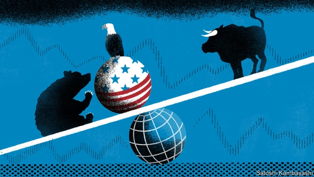
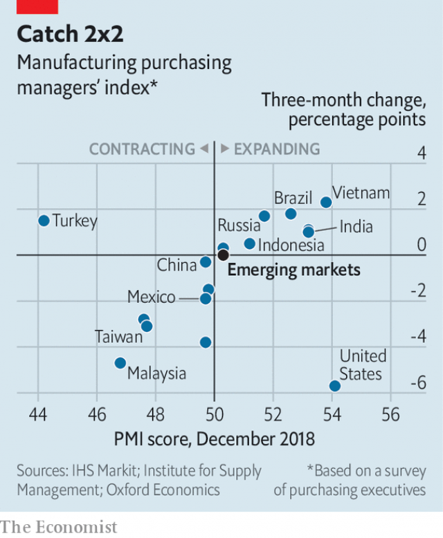

###### The bears’ clause

# For emerging markets, a more fearful Fed is a less frightful one 

##### When America’s stockmarket sneezes, Chinese policymakers catch a break 

 

> Jan 10th 2019 

 

SPARE A THOUGHT for emerging markets. When America’s economy falters, they often share the pain, because America is an indispensable market for their goods. But when America’s economy prospers, they can also suffer, because the Federal Reserve will raise interest rates, lessening demand for emerging-market assets. 

This catch-22 was vividly illustrated in 2018. America’s economy expanded robustly. But this boost to global demand was overshadowed by the Fed’s response to it: four rate increases that wreaked havoc on overvalued currencies and overstretched economies in the emerging world. An index of emerging-market equities compiled by MSCI fell by almost 17% over the year. 

Emerging markets were therefore relieved by reassurances offered by Jerome Powell, the Fed’s chairman, on January 4th. He emphasised that American inflation remained “muted”, that the Fed will be “patient”, and that it will listen “sensitively” to financial markets, which have turned skittish of late. He reminded his audience of how “nimbly” the Fed bent to the markets in 2016. It entered that year expecting to raise rates four times, but ended up waiting until December to raise them even once. A notable side-effect was that emerging-market shares ended that year 9% higher than they had begun it. 

Can emerging markets look for a similar recovery in 2019? One reason to hope for the best is that the worst has already happened. The currencies that looked most overpriced a year ago have already plummeted. The widest trade gaps have narrowed. A year ago Turkey’s lira was well above fair value (which has been estimated as 5.5 to the dollar by the Institute of International Finance, or IIF, a bankers’ think tank). It fell far below that level in August and is now back in line with it. Depressed imports and more competitive exports mean Turkey has run a current-account surplus three months in a row. 

Also encouraging are signs of progress in talks on trade between America and China. In a tweet on January 8th, President Donald Trump said they were “going very well”. The volatility in America’s stockmarket may have alerted the White House to the risks of further raising or expanding tariffs on China’s goods. When America’s stockmarket sneezes, Chinese policymakers catch a break. 

But threats still abound. One lies in overreacting to Mr Powell’s comments. For months the financial markets have been expecting the Fed to take a pause between rate increases. Now that Mr Powell seems open to the idea, the markets have jumped to the conclusion that he will stop hiking altogether, points out Robin Brooks of the IIF. Futures markets have priced in an 86% chance that the federal funds rate will end the year no higher than it is today, according to the Chicago Mercantile Exchange. 

A second danger lies in the other clause of that emerging-market catch-22. When the Fed turns hawkish, it hurts emerging markets. But when, as now, the Fed turns doveish, it is usually because growth is faltering—which also hurts emerging markets. The Institute of Supply Management’s monthly index of American manufacturing, which is based on surveys of purchasing managers, fell by 5.2 points in December. Two similar purchasing managers’ indices (PMIs) in China fell below the level of 50 that supposedly separates expansion from contraction. That has raised fears of a global economic stagnation as synchronised as the expansion of 2017. 

 

For the moment, those fears seem overblown. The PMI for the emerging world as a whole, published by J.P. Morgan and IHS Markit, suggests that manufacturing is still expanding, albeit more slowly than it was in early 2018 (see chart). And although an index below 50 is supposed to indicate a contraction, the threshold in practice seems lower. The emerging-market manufacturing PMI would have to fall below 48 before industrial production would be expected to shrink, year on year, according to Capital Economics. 

Keeping track of emerging-market growth is not easy. Many countries report quarterly GDP figures with a long lag and some do not report them at all. More timely indicators, such as PMIs, have shortcomings. Many are of recent vintage, which makes them hard to evaluate as proxies for growth. Arend Kapteyn and Pierre Lafourcade of UBS, a bank, have tried to fill in the gaps using some of the statistical techniques that also helped win the 2009 Netflix prize, an award the company offered to anyone who could help it to predict viewers’ tastes in films based only on the star ratings those viewers had given to films in the past. 

The UBS model suggests that the blockbuster growth of late 2017 and early 2018 has indeed flopped in more recent months. Emerging markets probably grew at an annual rate of less than 4% in the last quarter of 2018, compared with a pace of 5.7% in the first half of the year. The level of growth is as low as in late 2015, according to the model, and the drop in growth is comparable to the downswing in 2012. 

The two economists attribute the slowdown largely to trade, but not necessarily to the trade war. Exports and other “external” contributors to growth turned sour as early as March 2018, before America imposed punitive tariffs on China for encroaching on its intellectual property. Having grown so robustly in 2017, trade was always going to plateau. “If that’s all that’s going on…then we should start to bottom out soon,” they write. 

But that consoling thought assumes, of course, that the trade war does not flare up again. Whatever economic grievances America bears against China, a re-escalation would damage the chances of global growth stabilising at a respectable level. As Yossarian, the protagonist of “Catch-22”, points out, “it doesn’t make a damned bit of difference who wins the war to someone who’s dead.” 

