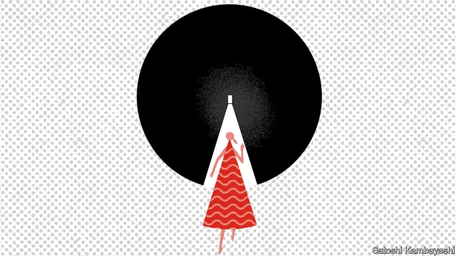

###### Study thyself

# How economics is trying to fix its gender problem 

##### An annual convocation hears evidence of sexism within the profession 

 

> Jan 10th 2019 

 

FEMALE ECONOMISTS are rare. So every year, after the meeting of the American Economic Association (AEA), a group flock together. On January 6th, before the junior women seeking mentoring arrived, their seniors were asked to keep the tone positive, and to save discussion of their worst experiences of sexism for later, in the bar. What followed included inspiration (when submitting papers, aim high) and tips on how to get published, get tenure and work out who is likely to help your career. 

The scheme is just one of a growing number aimed at raising the share of women among academic economists. Others were on display at the AEA conference, including some that drew on economists’ own intellectual toolkit. Donna Ginther of the University of Kansas, for example, presented results showing that participation in the mentoring workshop extends a woman’s network of collaborators, and that she thus publishes more. Another study cited at the conference, by Leah Boustan and Andrew Langan of Princeton University, finds that departments with more female PhD students tend to have a greater awareness of gender bias and less of the aggressive questioning in seminars for which economics is notorious. 

Kasey Buckles of the University of Notre Dame (and one of the mentors) recently reviewed the evidence on what increases the share of women in an economics department. She highlighted a randomised control trial at the University of Wisconsin-Madison which found that workshops on gender bias for faculty responsible for hiring raised the share of women among new hires by 18 percentage points. 

Other researchers are studying the obstacles to women’s promotion. Earlier work by Heather Sarsons of the University of Toronto showed that women get less credit in tenure decisions for papers written with men than men do. And Heather Antecol of Claremont McKenna College, Kelly Bedard of the University of California, Santa Barbara and Jenna Stearns of the University of California, Davis, have shown that giving parents extra time before they must prove themselves worthy of promotion disadvantages women, as fathers tend to use the time to get more research done while mothers use it for child care. 

At the AEA meeting Erin Hengel of the University of Liverpool presented results showing that papers by women in the most highly regarded journals were cited more often than those with a man among the authors. That, she concluded, suggests that women’s research is held to a higher standard when editorial boards decide what to publish. Also presented was a study by Lorenzo Ductor of Middlesex University, Sanjeev Goyal of the University of Cambridge and Anja Prummer of Queen Mary University London that found that women have smaller and more clustered networks of co-authors, which the authors think may reflect women’s aversion to risk in a relatively hostile environment. A third piece of research, by Anusha Chari of the University of North Carolina and Paul Goldsmith-Pinkham of Yale University, found that women’s under-representation at the National Bureau of Economic Research’s summer institute, an important economics conference, could be explained by their lower submission rates. 

The AEA itself is trying to gather evidence on the profession’s problems. It is running a “climate survey”, asking members questions such as whether they have felt demeaned or experienced harassment. The results are due in April. But even if they are damning, some worry that senior male economists will dismiss evidence of widespread discontent, perhaps by pointing to the potential for bias if aggrieved women are more likely than others to respond. By January 4th the response rate was just 16%. 

And if sceptics can be won round, the AEA must then decide what to do. A newish code of conduct states that economists have a “professional obligation to conduct civil and respectful discourse in all forums”, and that it aims to create a “professional environment with equal opportunity and fair treatment for all economists”. But it mandates no penalties for breaches. 

Recent revelations have raised the question of whether it should. The AEA faced calls to remove Roland Fryer of Harvard University from its executive committee after the New York Times reported on allegations against him of sexual harassment. Another case in which a pre-tenure woman accused a senior economist from a different institution of groping her raised the question of whether the AEA should be able to strip someone of membership. But the AEA has no bylaws allowing them to unelect or expel a member, and doing so could expose them to litigation. 

Hopefully, none of the women in the mentoring session will face anything so serious. Martha Bailey of the University of Michigan, who convened the workshop, felt a warm glow as the young women told her that they felt valued, a couple of them for the first time since they had become professional economists. Many at the AEA conference shared the feeling that the status quo was unacceptable. But there was hope, too—that more male economists would become aware of imperfections in the labour market closest to home. As Rohini Pande of Harvard University put it, “this cannot just be the work of women.” 

