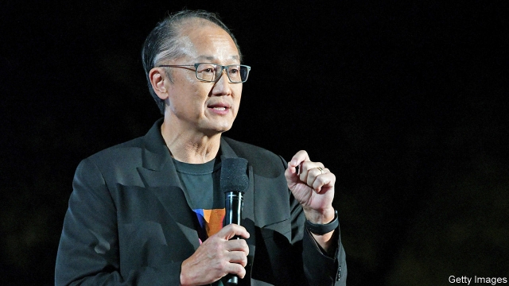

###### Jim jumps

# The World Bank’s president resigns abruptly 

##### Jim Yong Kim departs for a position at a private-equity fund 

 

> Jan 10th 2019 

 

BARACK OBAMA’S nomination of Jim Yong Kim as president of the World Bank was unexpected in Washington, DC, where the trained physician was little known. His imminent departure also comes as a surprise. Mr Kim said on January 7th that he would step down next month, three years before his second term ends, to take up a position at Global Infrastructure Partners (GIP), a private-equity firm in New York. 

In fact Mr Kim probably decided to leave months ago. He would have felt he had secured his legacy after a triumph last year, when he persuaded shareholders to agree to a paid-in capital increase of $13bn, expanding the bank’s lending capacity from $60bn to $100bn by 2030. Once he had begun talking to his next employer, he could not stay long without creating a potential conflict of interest—GIP also invests in infrastructure in poor countries. He will not be missed by everyone. A reorganisation he oversaw was loathed by staffers, and he fired several senior staff members, some of whom had only recently been given new roles. Relations improved only in 2016, when his management responsibilities were passed on to Kristalina Georgieva, a former European Union commissioner, who took the newly created role of chief executive. She will act as interim president until Mr Kim’s replacement is chosen. 

Like Mr Kim, the new chief will be caught between America, the bank’s largest shareholder, and China, its third-biggest one. Though Mr Kim’s support for China’s “Belt and Road” infrastructure initiative drew criticism from officials at America’s Treasury department, America’s suspicion of China worked to his advantage when he was negotiating the capital increase. The bank agreed to charge higher interest rates on loans to upper-middle-income countries such as China, and to prioritise lending to poorer ones, in return for more money. Some Treasury officials think lending to China is at the expense of needier recipients, though others see little harm in it, since it brings both profits and a modicum of influence. 

An understanding between America and Europe has meant that the bank’s boss is always American, while a European leads the IMF. And although it dislikes multilateral institutions, the Trump administration will probably insist this pattern continues, regarding the job as a restraint on China’s ambitions. Dina Powell, a banker at Goldman Sachs who advised Mr Trump on national security, is rumoured to be in the running. She is thought to have helped gain White House approval for the bank’s capital increase. 

Scott Morris of the Centre for Global Development, a think-tank in Washington, DC, points out that 2012, when Mr Kim won, was the first time candidates from poorer countries were in the running, and America’s relations with the rest of the world have soured since. An American nominee who is hawkish on China and opposes the bank’s green-finance projects, or is seen as a political stooge, would set off a row. Ms Powell would have the advantage of being a globalist. In any case, developing countries would need to unite behind one candidate to have any chance of overturning convention. That would be a bigger surprise for bank-watchers than any yet. 

