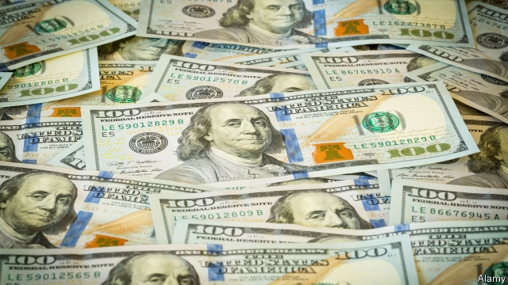
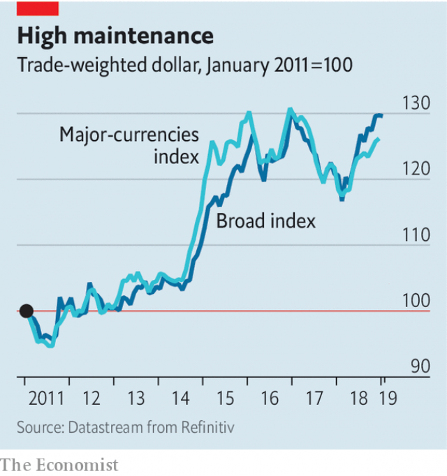

###### Buttonwood

# The fate of the dollar will shape financial markets in 2019 

##### After rising by 7% against a basket of currencies in 2018, where is it headed next? 

 

> Jan 10th 2019 

 

OVER THE holidays those who like their Christmas films free of seasonal cheer may have fixed on “The Lion in Winter”, with Peter O’Toole as Henry II and Katharine Hepburn as Eleanor, his estranged wife. Henry decides that none of his sons by Eleanor is a suitable heir and condemns them to death. Locked in a cellar as his father approaches, Richard resolves not to cower. “As if the way one falls down mattered,” mocks one of his brothers. “When the fall is all that is,” replies Richard, “it matters”. 

Back at work, investors might usefully apply this aphorism to the fate of the dollar. In a volatile period for financial markets, it rose by 7% against a broad basket of currencies in 2018 and by 4% against a narrower group of rich-country currencies (see chart). One of the more robust principles of foreign-exchange trading is that what goes up must eventually come down. The dollar is over-valued on benchmarks, such as The Economist’s Big Mac Index (see Graphic Detail). It is due a fall. When that is all that is left, the manner of its falling will matter a great deal. 

 

The bear case for the dollar is based on an expectation that GDP growth in America will slow markedly. Last year, it was boosted by tax cuts. That stimulus will fade. Interest-rate increases by the Federal Reserve will bite harder. A lower oil price is a factor. It hurts investment in America’s shale regions, but is a boon for oil-importing countries in Asia and Europe. America’s stockmarket is relatively dear. Its tech darlings no longer seem invulnerable. In short, an exceptional period for America’s economy is coming to an end. The dollar ought to lose ground, too. 

But not just yet. In November Mansoor Mohi-uddin of NatWest Markets set out three pre-conditions for a decisive turn in the dollar: a “pause” by the Fed, a deal to end America’s trade dispute with China and signs of a pickup in the euro-zone economy. The first is now less of a hurdle. The Fed’s boss, Jerome Powell, hinted on January 4th that it might postpone further interest-rate increases. Talks on trade with China have resumed. But the economic data from Europe remain weak. Interest rates in America may not rise much further, if at all, but they are nevertheless higher than in Japan or the euro zone. Owning the dollar is still rewarding. 

How might that change? Broadly, there are two scenarios. In the first, trade-war clouds begin to disperse. Tax cuts and looser monetary policy in China start to stimulate private-sector spending. That stirs other Asian economies, which in turn bucks up activity in the euro zone, which relies heavily on emerging-market demand. Bond yields rise in the expectation that interest rates will go up in Europe. They fall in America, as traders start to price in rate cuts. The dollar drifts down against the euro. A softish Brexit boosts the pound. Capital is pushed into emerging markets, in search of better returns. Stockmarkets rally, especially outside America. Everyone breathes a sigh of relief. It feels like 2017 again. 

In the second scenario, the gap between GDP growth in America and elsewhere also narrows. But in this case, it does so solely because of a slowdown in America, rather than better news elsewhere. The trade dispute escalates. The continued uncertainty means China’s tax cuts are saved, and not spent. Further weakness in China causes other emerging markets to falter. The soft spot in the euro-zone economy turns out to be not temporary, but a reflection of weak export demand. Risk assets sell off across the board. The dollar falls sharply against the yen and the Swiss franc, habitual boltholes for the panicky. The euro stays weak. A shortage of safe-harbour currencies leads to a rising price for gold. 

How closely reality conforms to one or other of these scenarios depends a lot on what happens in China. A trade deal with America would boost emerging-market currencies against the dollar, as would an effective fiscal stimulus. The path the dollar takes against rich-country currencies depends on the slowdown in America, says Kit Juckes of Société Générale, a French bank. If it is sudden, the dollar falls against the yen. If it is gradual, it falls against the euro. 

How the dollar falls will be shaped by events and in turn will shape them. Investors who are wary of selling out of risk assets are advised by strategists at J.P. Morgan to take out some insurance by buying the yen, Swiss franc and gold—the assets that are likely to go up should things get rough. If a fall is all that is left, it matters that you have something to cushion it. 

