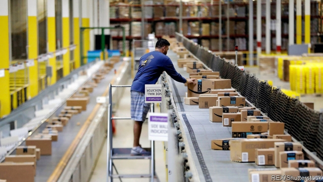
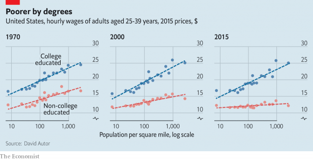

###### Free exchange

# The outlook is dim for Americans without college degrees 

##### A major economic conference hears new evidence on the rough end of the labour market 

 

> Jan 10th 2019 

AMERICA’S AGEING economic boom can still produce pleasant surprises. Companies added an astonishing 312,000 new jobs in December, the Bureau of Labour Statistics reported on January 4th, and raised pay at the fastest clip in years. For the third of working-age Americans without any college education, such spells of rapid income growth have been exceedingly rare, not only since the financial crisis but in the past half-century. But however long this expansion lasts, their economic prospects still look grim. 

The misfortunes of the left-behind were a recurring topic at this year’s meeting, in Atlanta, of the American Economic Association, one of the biggest annual convocations of economists. David Autor of the Massachusetts Institute of Technology offered the most pointed characterisation, drawing on forthcoming research co-written with Juliette Fournier, also of MIT. The earnings of workers without a college education have scarcely risen in 50 years, after adjusting for inflation; for men they have fallen. This stagnation coincided with tectonic changes in American employment. The share of jobs that require either a lot of training, or very little, has grown since 1970. Much of the production and office work that requires moderate training, which once employed vast numbers of workers without college degrees, has disappeared, either shipped abroad or offloaded on robots and computers. The resulting hardship has been implicated in a rise in mortality in parts of America and the turn toward angry nationalism that helped put Donald Trump in the White House. 

Working out what to do about those left behind by economic progress is becoming an obsession of policy wonks. Mr Autor and Ms Fournier provide important new context. In the 1950s, they show, there was almost no relationship between how densely populated a place was and the share of its residents with college degrees. That has changed utterly: the share of the working-age population with a college degree is now 20 percentage points higher in urban places than it is in rural ones. In 1970 that gap was just five percentage points. Several decades ago mid-skilled work was clustered in big cities, while low-skilled work was most prevalent in the countryside. No longer; those mid-skilled jobs that remain are more likely to be found in rural areas than in urban ones. 

As the geographical pattern of work has shifted, so has that of wages. Economists have long acknowledged the existence of an urban wage premium: workers in more densely populated places earn more, in part because of the productivity benefits of crowding together that nurture urban growth in the first place. This pay premium used to hold across the range of skills. In 1970 workers without any college education could expect to get a boost to their earnings when they moved to a big city, just as better-educated workers did (see chart). Since then the urban wage advantage for well-educated workers has become more pronounced, even as that for less-educated workers has all but disappeared. 

 

Economists seeking to explain why poorer Americans are not moving to find better opportunities should take note, Mr Autor mused in his lecture. Explanations for falling mobility in America generally focus on obstacles to migration—expensive urban housing, location-specific occupational licences, varying government benefits and so on. These no doubt matter, but may not be the whole story. Often, people may be staying where their economic prospects are best. 

That is clearest among the well-off. In the past half-century young adults tended to move from less populous to more populous places, often to attend university. Once they became middle-aged they tended to move to suburban or rural locations. That has become far less likely. Falling mobility seems to reflect, in part, the fact that people who move to big cities tend to stay there, kept by higher wages, better amenities and crime rates in cities that are lower than they used to be. 

But for workers without a college education, moving to big cities in the first place may provide no benefit. Building more affordable housing in those cities would allow them to accommodate more people. But the collapse of the urban wage premium for less-educated workers means that the extra housing would mostly attract additional college graduates. 

For now, technological progress is reinforcing these trends. When a sufficient number of people asked by Census officials to name their career respond with a previously untracked occupation (such as programmer or barista), the officials introduce a new occupational category. Analysing recent additions, Mr Autor and Anna Salomons, of Utrecht University, reckon that new types of jobs fall into three broad categories: frontier work, closely associated with new technologies; wealth work, catering to the needs of well-to-do professionals; and “last-mile jobs”, which Mr Autor characterises as those left over when most of a task has been automated. That includes delivery services, picking packages in Amazon warehouses and scouring social-media posts for offensive content. 

Most jobs in the first two of these categories are located in cities, open mainly to holders of college degrees and decently paid (frontier work is particularly lucrative). Only the last-mile jobs are occupied disproportionately by workers without a college education. They are better than nothing, but only just. Both wages and the quality of such jobs are typically low, which is just as well, since they are unlikely to avoid the creeping tide of automation for very long. 

Perhaps the past will not prove a prologue. Some futurists, including Daniel Susskind of the University of Oxford, suggest that artificial intelligence may eventually displace highly trained professionals, just as earlier innovations squeezed out others. That might not help left-behind workers but would reduce both inequality (though by levelling down, not up) and the cost of crucial services. Meanwhile, as Mr Autor said, there is no land of opportunity for workers without a college education. That is a dismal state of affairs, and one the thousands of economists in Atlanta are just starting to confront. 

Correction (January 10th 2019): This article previously stated that David Autor produced the research on last-mile jobs with Juliette Fournier. In fact, he produced it with Anna Salomons. We regret the error. 

