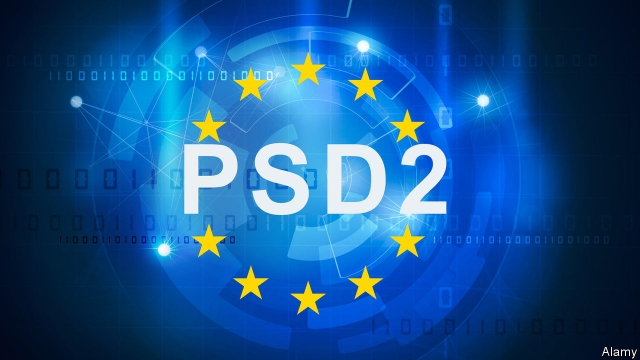

###### Open plan

# The slow-burning effects of Europe’s new data rules 

##### PSD2 and Open Banking, a year on 

 

> Jan 10th 2019 

 

FEW EXPECTED an overnight sensation. Still, January 13th 2018 was supposed to mark a big step towards exposing the European Union’s banking systems to digital competition. The EU’s revised payment services directive (PSD2) came into effect; so did a British variant, Open Banking, the fruit of an investigation by the national competition watchdog. A year on, there is little sign of a stampede to switch banks. Yet progress is quietly being made. 

In essence, the new rules seek to ensure that digital technology sharpens competition, by loosening banks’ grip on customers’ financial data, but without compromising security. They allow third parties, whether tech firms or other banks, to gather information from several accounts—with customers’ permission—in one place, so that people can manage their finances better. They also make it easier for third-party firms to pay online merchants directly from customers’ accounts. 

Open Banking is obligatory only for Britain’s nine biggest banks, although others have signed up. Not all of these were ready at the start. “For the past 200 years banks have focused on keeping customer data and not letting anyone else get at it,” says Emmet Rennick of Oliver Wyman, a consulting firm. “In the past year or two they’ve been told, ‘That’s not the game’. But they have improved their act. Some are rolling out their own aggregation apps. The average response time of banks’ APIs—the software which gives access to the permitted data—to queries from third parties was halved between July and November. 

Even so, Jaidev Janardana, chief executive of Zopa, a British online lender, says that the biggest improvement would be a slicker connection between Zopa’s smartphone app and those of would-be borrowers’ banks. (Applicants used to have to send PDFs of bank statements to confirm their incomes; now Zopa can look through banks’ APIs.) Only half the applicants who reach this stage complete it: at banks with the clunkiest apps, a mere 15-20% do. 

How banks’ APIs will function elsewhere in Europe is also a thorny question. Until that is answered, “important parts of the political and regulatory landscape will remain unclear,” says Daniel Kjellen of Tink, a Swedish account aggregator. Last year the European Banking Authority, a regulator, drew up technical standards, due to come into force in September. Banks are supposed to have APIs in place well before then, so that third parties can test them and regulators approve them. 

Financial-technology firms worry, for example, that banks will redirect customers to their own apps to authorise the use of data. This could make the process cumbersome and put people off new services. Another concern is that standards may proliferate, raising third parties’ costs and doing little to unify Europe’s banking markets. The Berlin Group, which involves dozens of banks and financial firms, has published a common framework. Some regulators are also promoting national standards. 

An open question is how much appetite Europeans have for more open banking. People are notoriously loth to abandon their banks. Yet there are signs of latent demand: Yolt, an aggregator owned by ING, a Dutch bank, already boasts more than 500,000 British users; online banks are making a splash. In 2019 banks and upstarts alike may get closer to an answer. 

