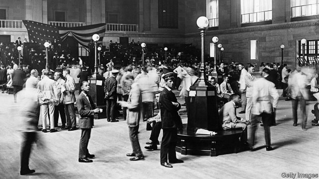

###### Crashing the party

# Wall Street firms take aim at America’s stock-exchange oligopoly 

##### Their new platform promises low costs and transparency 

 

> Jan 10th 2019 

 

ON JANUARY 7TH nine of America’s largest brokers and banks said they planned to launch a new equities exchange, dubbed the Members Exchange (MEMX). Though it has yet to gain approval from the Securities and Exchange Commission (SEC), the share prices of Intercontinental Exchange (ICE), Nasdaq and CBOE, the parent groups of America’s largest exchanges, fell by 2-3%. But MEMX is merely their latest reason to fret. 

For more than a century stock exchanges were utilities: not-for-profit, self-regulated and owned by their broker members. Starting in the 1990s most became companies, often listed on their own exchanges. The New York Stock Exchange (NYSE) became publicly traded in 2006. Around the same time the SEC created the National Market System—rules designed to foster competition. Chief among these was Rule 611, the “order-protection rule”, which requires brokers to route trades to the exchange that displays the best price. 

Together with advances in technology, the reforms enticed new entrants and created what looks like a fragmented market. America now has 13 equity exchanges and 44 off-exchange centres such as dark pools (platforms run by banks and others that match large orders privately). NYSE’s share of equity trading has shrunk from 72% to 24% in a decade; off-exchange venues account for 36%. Meanwhile listing and transaction fees have dried up as fast-growing companies delay before tapping public markets or go private. 

But incumbents have bounced back: revenues and earnings at Nasdaq and ICE (which owns NYSE) have jumped since 2014. This is partly because of diversification, says Kyle Voigt of KBW, a bank. Both have bought European peers; they now make more money from trading and clearing derivatives than equities. But it is also because the market is less competitive than it seems. ICE, Nasdaq and CBOE have swallowed up all but one equity exchange and now account for 95% of public trades. 

This re-consolidation has its origins in the reforms of 2005, which left exchanges with significant regulatory power. Eager to offer brokers some protection, the SEC capped transaction fees. But platforms have become remarkably canny at squeezing their customers in other ways. Three of their methods stand out. 

First, the three exchange families have continued to run their various exchanges separately, even though some are very small. Two of NYSE’s five have less than a 1% market share; Nasdaq’s smallest pair do not reach 3% between them. Yet complying with Rule 611 means brokers have little choice but to track prices on every platform. “Most large institutions will tell you they won’t trade with brokers who aren’t members of all 13 exchanges,” says Rich Steiner of RBC Capital Markets, a bank. Brokers must pay connection fees (among a growing range of charges) for every one. 

Secondly, as well as the (slow and shaky) public feed of their data demanded by regulations, they also offer a higher-quality, dearer private one. They charge more for higher-speed connections, even enabling customers to rent computers within the exchange, allowing them to shave milliseconds off their execution time. 

And finally, exchanges typically offer rebates to brokers based on their order volume. Such sweeteners amounted to nearly $700m at Nasdaq in 2017. They then charge fees for accessing quotes and make a profit by pocketing the difference. More important, two market participants reckon, operators use rebates to try to lure quotes to specific exchanges, so as to keep more of the total market pie in the family. Ordinary investors complain that all this informational asymmetry and artificial complexity favours high-frequency traders. 

MEMX is not the first attempt to shake up the market: IEX, an independent equity exchange that launched in 2016, vowed to be the first venue “built for fairness”. It offers no rebates and seeks to repulse high-speed traders by routing incoming orders over a “speed bump”—a coil of fibre-optic cable that slows access to the market by 350 microseconds. IEX now trades more in value daily than the London Stock Exchange, says Brad Katsuyama, its co-founder. But its market share in America is below 3%. 

Still, its arrival—and investors’ growing irritation—may have prodded the regulator into action. “It is time to put ‘exchange’ back in the Securities and Exchange Commission,” said Robert Jackson, one of its commissioners, in September. The SEC has since rejected requests to raise fees by NYSE and Nasdaq, and hosted a heated discussion with market participants about the cost of data. It has also said it will examine whether rebates make the market less efficient. Customers are once again pitted against exchanges. “It’s round two,” says John Ramsay of IEX. 

The launch of MEMX could be the start of round three. It harks back to the times when exchanges were member-owned, promising to offer low-cost data and connectivity. But MEMX will also pursue profits, says Jamil Nazarali of Citadel Securities, a founding member. That will require scale. Its founders, which rank among America’s biggest sellers of securities, may seek to attract liquidity by bringing their order books onto the exchange—though that could lead customers to worry about potential conflicts of interest. 

It is too soon to declare victory to the new contenders. Direct Edge and BATS, two low-cost challengers created by industry heavyweights a decade ago, merged in 2014 and sold out to CBOE in 2017 after rapidly gaining market share. And the latest bout of competition may be slow to start. With America’s government partially shuttered, the SEC’s approval procedures are on hold. Gridlock on Capitol Hill could delay the opening bell. 

