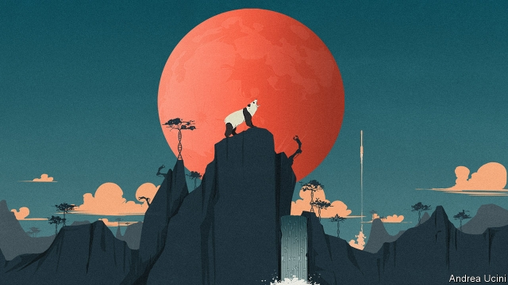

###### Red moon rising

# How China could dominate science 

##### Should the world worry? 

 

> Jan 12th 2019 

 

A HUNDRED YEARS ago a wave of student protests broke over China’s great cities. Desperate to reverse a century of decline, the leaders of the May Fourth Movement wanted to jettison Confucianism and import the dynamism of the West. The creation of a modern China would come about, they argued, by recruiting “Mr Science” and “Mr Democracy”. 

Today the country that the May Fourth students helped shape is more than ever consumed by the pursuit of national greatness. China’s landing of a spacecraft on the far side of the Moon on January 3rd, a first for any country, was a mark of its soaring ambition. But today’s leaders reject the idea that Mr Science belongs in the company of Mr Democracy. On the contrary, President Xi Jinping is counting on being able to harness leading-edge research even as the Communist Party tightens its stranglehold on politics. Amid the growing rivalry between China and America, many in the West fear that he will succeed. 

There is no doubting Mr Xi’s determination. Modern science depends on money, institutions and oodles of brainpower. Partly because its government can marshal all three, China is hurtling up the rankings of scientific achievement, as our investigations show (see article). It has spent many billions of dollars on machines to detect dark matter and neutrinos, and on institutes galore that delve into everything from genomics and quantum communications to renewable energy and advanced materials. An analysis of 17.2m papers in 2013-18, by Nikkei, a Japanese publisher, and Elsevier, a scientific publisher, found that more came from China than from any other country in 23 of the 30 busiest fields, such as sodium-ion batteries and neuron-activation analysis. The quality of American research has remained higher, but China has been catching up, accounting for 11% of the most influential papers in 2014-16. 

Such is the pressure on Chinese scientists to make breakthroughs that some put ends before means. Last year He Jiankui, an academic from Shenzhen, edited the genomes of embryos without proper regard for their post-partum welfare—or that of any children they might go on to have. Chinese artificial-intelligence (AI) researchers are thought to train their algorithms on data harvested from Chinese citizens with little oversight. In 2007 China tested a space-weapon on one of its weather satellites, littering orbits with lethal space debris. Intellectual-property theft is rampant. 

The looming prospect of a dominant, rule-breaking, high-tech China alarms Western politicians, and not just because of the new weaponry it will develop. Authoritarian governments have a history of using science to oppress their own people. China already deploys AI techniques like facial recognition to monitor its population in real time. The outside world might find a China dabbling in genetic enhancement, autonomous AIs or 

geoengineering extremely frightening. 

These fears are justified. A scientific superpower wrapped up in a one-party dictatorship is indeed intimidating. But the effects of China’s growing scientific clout do not all point one way. 

For a start, Chinese science is about much more than weapons and oppression. From better batteries and new treatments for disease to fundamental discoveries about, say, dark matter, the world has much to gain from China’s efforts. 

Moreover, it is unclear whether Mr Xi is right. If Chinese research really is to lead the field, then science may end up changing China in ways he is not expecting. 

Mr Xi talks of science and technology as a national project. However, in most scientific research, chauvinism is a handicap. Expertise, good ideas and creativity do not respect national frontiers. Research takes place in teams, which may involve dozens of scientists. Published papers get you only so far: conferences and face-to-face encounters are essential to grasp the subtleties of what everyone else is up to. There is competition, to be sure; military and commercial research must remain secret. But pure science thrives on collaboration and exchange. 

This gives Chinese scientists an incentive to observe international rules—because that is what will win its researchers access to the best conferences, laboratories and journals, and because unethical science diminishes China’s soft power. Mr He’s gene-editing may well be remembered not just for his ethical breach, but also for the furious condemnation he received from his Chinese colleagues and the threat of punishment from the authorities. The satellite destruction in 2007 caused outrage in China. It has not been repeated. 

The tantalising question is how this bears on Mr Democracy. Nothing says the best scientists have to believe in political freedom. And yet critical thinking, scepticism, empiricism and frequent contact with foreign colleagues threaten authoritarians, who survive by controlling what people say and think. Soviet Russia sought to resolve that contradiction by giving its scientists privileges, but isolating many of them in closed cities. 

China will not be able to corral its rapidly growing scientific elite in that way. Although many researchers will be satisfied with just their academic freedom, only a small number need seek broader self-expression to cause problems for the Communist Party. Think of Andrei Sakharov, who developed the Russian hydrogen bomb, and later became a chief Soviet dissident; or Fang Lizhi, an astrophysicist who inspired the students leading the Tiananmen Square protests in 1989. When the official version of reality was tired and stilted, both stood out as seekers of the truth. That gave them immense moral authority. 

Some in the West may feel threatened by China’s advances in science, and therefore aim to keep its researchers at arm’s length. That would be wise for weapons science and commercial research, where elaborate mechanisms to preserve secrecy already exist and could be strengthened. But to extend an arm’s-length approach to ordinary research would be self-defeating. Collaboration is the best way of ensuring that Chinese science is responsible and transparent. It might even foster the next Fang. 

Hard as it is to imagine, Mr Xi could end up facing a much tougher choice: to be content with lagging behind, or to give his scientists the freedom they need and risk the consequences. In that sense, he is running the biggest experiment of all. 

