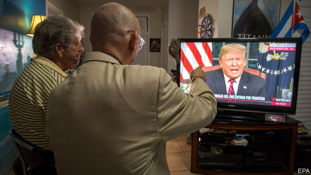

###### Trump’s cards

# How the shutdown in Washington ends 

##### America is heading for an almighty fight over presidential authority 

 

> Jan 10th 2019 

 

THE GOVERNMENT has partially shut down. Again. No other advanced democracy has government shutdowns. In America they have become almost routine. This is the third since Donald Trump became president and by far the most damaging. The others were resolved quickly; this is already the second-longest on record. It is not happening because America is in turmoil: the country is not at war, unemployment is as low as it has ever been. It is happening because that is what the president wants. 

What is playing out in Washington is the denouement of a political fight (see article). Mr Trump was elected on a promise to build a wall on the southern border, though Mexico was supposed to pay for it. The new Democratic majority in the House is reluctant to give the president a victory on his best-known policy. The Senate majority leader, who might be able to end the stand-off, is AWOL. 

House Democrats have reason on their side. Even knowledgeable immigration hawks think spending $5.7bn on a wall would be a waste of money. The number of people crossing the southern border illegally is at a 45-year low. Vastly more people fly into the country legally and then overstay their visas. If illegal immigration is the problem, Mr Trump should be focusing on that. 

Yet it is also true that $5.7bn is peanuts in budgetary terms. The federal government spends that amount every 12 hours. And, despite what Nancy Pelosi, the House Speaker, says, there is nothing inherently “immoral” about a wall. Quite a lot of wall and fencing was built on the southern border long before Mr Trump became president, and with Democratic support. 

If this were just a fight about policy, it is clear what a deal would look like. Congress would pass a bill giving citizenship to those who arrived in the country illegally as children, amounting to about 700,000 people, and fund the wall in exchange. The president gets something he wants; Democrats get something they want; America gets back its government. 

But the fight is really about Mr Trump’s authority. The president was offered just such a trade a year ago by Senate Democrats. He turned it down, saying he wanted cuts to legal immigration, too. Had he accepted it, the wall would by now be under construction, but Mr Trump is not the master dealmaker he claims to be. In December he said he would be “proud to shut down the government for border security”. Having picked a fight, he must win it or see his power diminished for the rest of his term. 

If politics blocks the obvious deal, Congress could pass a bill funding the entire government or, along the lines of a Democratic idea, all of it barring Homeland Security, and then override the president’s veto. But that would take a two-thirds majority in both houses, and so will not happen soon. 

Hence things may get worse before the shutdown ends. Nearly 1m federal employees are working without pay or have been sent home. At some point their absence will make itself felt. Federal spending on food for the poor could also run dry, which will hit programmes that pay for school lunches and milk for infants. The IRS may be unable to pay tax refunds on time. National parks and monuments will remain unstaffed, harming businesses that depend on tourism. Eventually, the pressure on Republicans in the Senate to bypass the president and cut a deal could prove irresistible. 

There is another possibility. The president could cut out Congress and award himself emergency powers, allowing him to spend money on the wall as “military construction”, even as he reopens the government. That would set off a legal dispute over the limits of his authority. Sadly, the prospect of such a raw exercise of presidential power—to say nothing of a good old fight over the law—could appeal to all Mr Trump’s worst instincts. And yet to declare an emergency where one doesn’t exist, legal or not, would open another chapter in Washington’s degradation of good government. 

