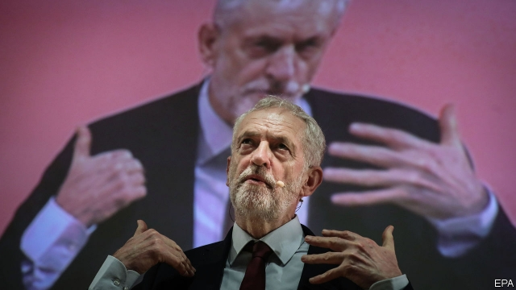

###### Still having cake

# Labour’s Brexit cop-out betrays its members 

##### Corbyn promised to empower party members. He is sidestepping them 

 

> Jan 10th 2019 

 

AS THE DEADLINE for Britain’s departure from the European Union approaches, with an exit deal still elusive, MPs are haring off in every direction. Parliament has descended into guerrilla warfare, as backbenchers attempt to wrestle the initiative from the executive (see article). Meanwhile the government organised a pretend traffic-jam of 89 lorries on the road to Dover, as part of preparations for a “no deal” exit. All it showed was that Britain is hopelessly unprepared for what happens next. 

Amid the chaos, on January 10th the leader of the opposition, Jeremy Corbyn, stepped forward to propose a way out of the mess. Yet his speech, delivered as we went to press, merely doubled down on his policy of calculated equivocation. Labour will vote against the government’s draft Brexit deal on January 15th, but has no plausible explanation of how it would get a better one, nor a convincing strategy to break the impasse in Parliament if the deal is defeated. Its abdication of responsibility makes Labour complicit in the crisis that is about to engulf Britain. And it exposes the hollowness of Mr Corbyn’s promise that, as leader, he would hand power back to the party’s members, whose growing calls for a second referendum he continues to ignore. 

Labour’s Brexit policy amounts to cake followed by more cake. Though the party sensibly rejects the option of leaving with no deal, it insists that the withdrawal terms should provide the “exact same benefits” as membership of the single market while also allowing Britain to manage migration—something the EU would never agree to. In its refusal to acknowledge Brexit’s basic trade-offs, Labour is at a stage in the argument that even the most deluded Tory Brexiteers left behind months ago. 

Its tactics in Parliament are thoroughly obscure. If the government’s deal is voted down, Labour will try to force a general election. But that is not in the party’s gift: success depends on the support of Tory and Democratic Unionist MPs, who do not want Mr Corbyn anywhere near Downing Street. The other way to break the stalemate would be another referendum. But Labour says only that such a vote should be one “option on the table”. Mr Corbyn, a convinced Eurosceptic who campaigned only half-heartedly to remain in 2016, has confused matters further by appearing to accept that any referendum should have an option to remain, but also saying that “we can’t stop” Brexit. 

There is a certain political logic in this lack of clarity. Four out of ten Labour voters and six out of ten Labour constituencies backed Brexit. Many voters see a second referendum as a plot to thwart the will of the people. It may even be in Labour’s interests to let the Tories drive Britain over the no-deal cliff. Mr Corbyn, whose main achievement during three decades in Parliament was grabbing a selfie with Hugo Chávez, would not win an election under normal circumstances. The shock doctrine of no deal might just make Britain susceptible to his disaster socialism. 

Yet Labour’s equivocation is at odds with the strongly pro-EU views of the half-million party members who elected him. Eight out of ten of them voted to remain in 2016. Now seven out of ten want a second referendum. A party “policy forum” this week heard calls from constituency associations around the country for Labour to back a second vote. Even most members of Momentum, a hard-left activist group set up to support Mr Corbyn, want the party to endorse a referendum. 

Although all party leaders sometimes have to ignore their members, for Mr Corbyn to go over the heads of the rank and file in this instance reeks of hypocrisy. When members re-elected him leader in 2016, Mr Corbyn said that Labour’s growing membership “has to be reflected much more in decision-making”. Yet, over Brexit, Labour members who swallowed his promise of “people-powered politics” have been had. Party managers have done their best to keep controversial Brexit motions off the agenda at Labour’s conferences, in feats of stage management worthy of Tony Blair, a predecessor he derides. 

More important Mr Corbyn’s refusal to listen is letting down the country at large. Britain’s democracy relies on an opposition to provide an alternative. For Labour to show that it is the “government in waiting” that it claims, it would have to put forward a better Brexit plan than the Tories. This is a dismally low bar. But the opposition has so far failed to clear it. 

