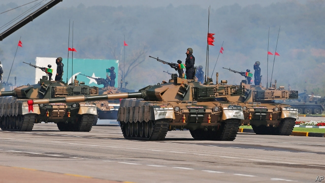

###### Praetorian penury

# Pakistan’s army is to blame for the poverty of the country’s 208m citizens 

##### It has fostered the paranoia and extremism that hold the country back 

 

> Jan 12th 2019 

 

IT HAS FOR so long been a country of such unmet potential that the scale of Pakistan’s dereliction towards its people is easily forgotten. Yet on every measure of progress, Pakistanis fare atrociously. More than 20m children are deprived of school. Less than 30% of women are employed. Exports have grown at a fifth of the rate in Bangladesh and India over the past 20 years. And now the ambitions of the new government under Imran Khan, who at least acknowledges his country’s problems (see Briefing), are thwarted by a balance-of-payments crisis. If Mr Khan gets an IMF bail-out, it will be Pakistan’s 22nd. The persistence of poverty and maladministration, and the instability they foster, is a disaster for the world’s sixth-most-populous country. Thanks to its nuclear weapons and plentiful religious zealots, it poses a danger for the world, too. 

Many, including Mr Khan, blame venal politicians for Pakistan’s problems. Others argue that Pakistan sits in a uniquely hostile part of the world, between war-torn Afghanistan and implacable India. Both these woes are used to justify the power of the armed forces. Yet the army’s pre-eminence is precisely what lies at the heart of Pakistan’s troubles. The army lords it over civilian politicians. Last year it helped cast out the previous prime minister, Nawaz Sharif, and engineer Mr Khan’s rise (as it once did Mr Sharif’s). 

Since the founding of Pakistan in 1947, the army has not just defended state ideology but defined it, in two destructive ways. The country exists to safeguard Islam, not a tolerant, prosperous citizenry. And the army, believing the country to be surrounded by enemies, promotes a doctrine of persecution and paranoia. 

The effects are dire. Religiosity has bred an extremism that at times has looked like tearing Pakistan apart. The state backed those who took up arms in the name of Islam. Although they initially waged war on Pakistan’s perceived enemies, before long they began to wreak havoc at home. Some 60,000 Pakistanis have died at the hands of militants, most of whom come under the Tehreek-e-Taliban Pakistan (TTP). The army at last moved against them following an appalling school massacre in 2014. Yet even today it shelters violent groups it finds useful. Some leaders of the Afghan Taliban reside in Quetta. The presumed instigator of a series of attacks in Mumbai in 2008, which killed 174, remains a free man. 

Melding religion and state has other costs, including the harsh suppression of local identities—hence long-running insurgencies in Baloch and Pushtun areas. Religious minorities, such as the Ahmadis, are cruelly persecuted. As for the paranoia, the army is no more the state’s glorious guardian than India is the implacable foe. Of the four wars between the two countries, all of which Pakistan lost, India launched only one, in 1971—to put an end to the genocide Pakistan was unleashing in what became Bangladesh. Even if politicking before a coming general election obscures it, development interests India more than picking fights. 

The paranoid doctrine helps the armed forces commandeer resources. More money goes to them than on development. Worse, it has bred a habit of geopolitical blackmail: help us financially or we might add to your perils in a very dangerous part of the world. This is at the root of Pakistan’s addiction to aid, despite its prickly nationalism. The latest iteration of this is China’s $60bn investment in roads, railways, power plants and ports, known as the China-Pakistan Economic Corridor (CPEC). The fantasy that, without other transformations, prosperity can be brought in from outside is underscored by CPEC’s transport links. Without an opening to India, they will never fulfil their potential. But the army blocks any rapprochement. 

Mr Khan’s government can do much to improve things. It should increase its tax take by clamping down on evasion, give independence to the monetary authority and unify the official and black-market exchange rates. Above all, it should seek to boost competitiveness and integrate Pakistan’s economy with the world’s. All that can raise growth. 

Yet the challenge is so much greater. By mid-century, Pakistan’s population will have increased by half. Only sizzling rates of economic growth can guarantee Pakistanis a decent life, and that demands profound change in how the economy works, people are taught and welfare is conceived. Failing so many, in contrast, really will be felt beyond the country’s borders. 

Transformation depends on Pakistan doing away with the state’s twin props of religion and paranoia—and with them the army’s power. Mr Khan is not obviously the catalyst for radical change. But he must recognise the problem. He has made a start by standing up to demagogues baying for the death of Asia Bibi, a Christian labourer falsely accused of blasphemy. 

However, wholesale reform is beyond the reach of any one individual, including the prime minister. Many politicians, businesspeople, intellectuals, journalists and even whisky-swilling generals would far rather a more secular Pakistan. They should speak out. Yes, for some there are risks, not least to their lives or liberty. But for most—especially if they act together—the elites have nothing to lose but their hypocrisy. 

