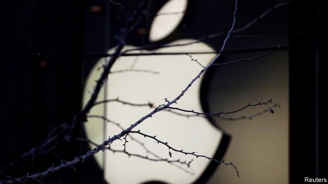
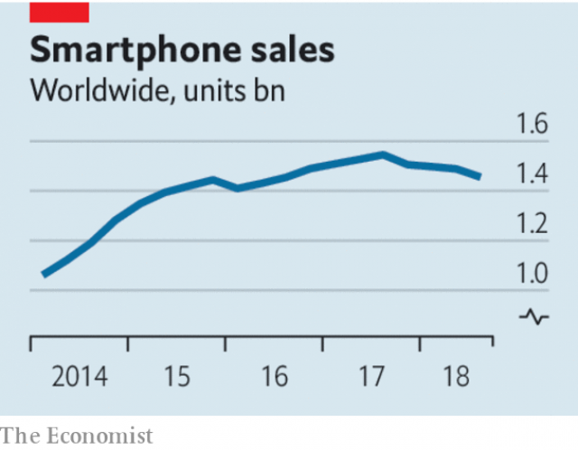

###### Peak smartphone? Good

# The maturing of the smartphone industry is cause for celebration 

##### It’s bad news for Apple shareholders, but good news for humanity 

 

> Jan 10th 2019 

 

WHEN APPLE cut its revenue estimate for the last quarter of 2018 because of unexpectedly slow sales of iPhones, markets convulsed. The company’s share price, which had been sliding for months, fell by a further 10% on January 3rd, the day after the news came out. Apple’s suppliers’ shares were also hit. This week Samsung, the world’s largest maker of smartphones by volume, which also sells components to other smartphone-makers, said its sales were weaker than expected for the quarter, too. 

Analysts reckon that the number of smartphones sold in 2018 will be slightly lower than in 2017, the industry’s first ever annual decline. All this is terrible news for investors who had banked on continued growth (see article). But step back and look at the bigger picture. That smartphone sales have peaked, and seem to be levelling off at around 1.4bn units a year, is good news for humanity. 

People have voted with their wallets to make the smartphone the most successful consumer product in history: nearly 4bn of the 5.5bn adults on the planet now have one. And no wonder. They connect billions of people to the internet’s plethora of information and services. Phones make markets more efficient, compensate for poor infrastructure in developing countries and boost growth. Yes, they can be used for wasting time and spreading disinformation. But the good far outweighs the bad. They might be the most effective tool of development in existence. 

 

The slowdown does not reflect disenchantment; quite the contrary. It is the result of market saturation. After a decade of rapid adoption, there is much less scope to sell handsets to first-time buyers as so few of them are left. That hits Apple the hardest because, despite a relatively small market share (13% of smartphone users), it captures almost all of the industry’s profits. But Apple’s pain is humanity’s gain. The fact that the benefits of these magical devices are now so widely distributed is something to be celebrated. 

What about the people who still lack a smartphone? Sales of 1.4bn units a year implies 2.8bn users who replace their handsets every two years, or 4.2bn who replace them every three years. The reality is somewhere in between, and replacement cycles are lengthening as new models offer only marginal improvements. Many phones are used for longer than three years, often refurbished or as hand-me-downs. So even with flat sales, the longer gaps between upgrades mean that overall penetration is still rising. People who already have phones benefit, too. For all but the most obsessive gadget fans, the slowing treadmill of upgrades comes as a welcome relief. 

Does that mean innovation is slowing? No. The latest phones contain amazingly clever technology, such as 3D face-scanners and cameras assisted by artificial intelligence. But as with mature technologies such as cars or washing machines, extra bells and whistles no longer make a deep impression. 

More important is that smartphones support extra innovation in other areas. Deploying apps and services on an immature platform whose prospects are uncertain is risky; on a mature one it is not. Smartphones thus provide a foundation for today’s innovations, like mobile payments and video streaming, and for future ones, such as controlling “smart” home appliances or hailing robotaxis. 

As computers become smaller, still more personal and closer to people’s bodies, many techies reckon that wearable devices, from smart watches to augmented-reality headsets, will be the next big thing. Even so, finding another product with the scope of the smartphone is a tall order. The smartphone retains its promise as the device that will make computing and communications universal. The recent slowing of smartphone sales is bad news for the industry, obviously. But for the rest of humanity it is a welcome sign that a transformative technology has become almost universal. 

