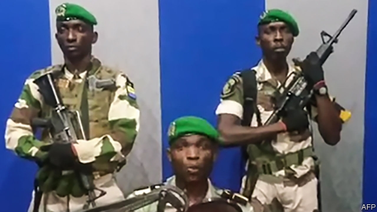

###### Till death do us part

# A failed coup in Gabon highlights the staying power of Africa’s ageing leaders 

##### Coups are growing rarer on the continent, and the average age of its presidents is rising 

 

> Jan 10th 2019 

 

IT WAS ALL over within hours. At 4.30am on January 7th a small group of junior army officers seized the national radio station in Gabon, an oil-rich country in central Africa, and declared a coup. They said they were motivated by the “pitiful sight” of Ali Bongo Ondimba, Gabon’s 59-year-old president, delivering a televised address from Morocco, where he has been convalescing since November after suffering a stroke. The attempt to unseat him was short-lived: by midday, most of the coup-plotters had been rounded up and the government was back in control. 

The drama in Gabon is a throwback to more turbulent times. Coups have become rarer across Africa—a sign that basic democratic norms are more widespread than they were. But checks and balances on presidential power are often still weak, so many African leaders have been able to cling to office far longer than is possible in more competitive polities. Five have died in office since 2010—all of natural causes. Seven of the current crop have been in power for over two decades. Mr Bongo, whose previous jobs include minister of defence and funk singer, has been in power for only ten years, but his family has run Gabon since 1967; he inherited the top job when his father died. 

Mr Bongo is not the only African president who rules from his sickbed. Muhammadu Buhari, Nigeria’s septuagenarian president, spent much of 2017 abroad recovering from an undisclosed illness. Last month he was forced to deny that he had died and been replaced by a body double. He is standing for re-election in February. Algerians often speculate about the health of Abdelaziz Bouteflika, their 81-year-old autocrat. He is rarely seen in public, but may run for a fifth term this year. 

 

In the past such frail leaders would have made easy pickings for a young upstart plotting a coup. But the most recent successful coup in Africa, in which the Zimbabwean army deposed 93-year-old Robert Mugabe in 2017, marks the exception rather than the rule. From 1980 to 2000 there were 38 successful coups in Africa. Since then there have only been 15. This is partly because presidents have grown more adept at coup-proofing their regimes. Many place relatives in key roles, keep the army weak and play factions off against each other. 

The spread of democracy in Africa has also helped stave off putsches. The African Union (AU) has adopted a policy of “zero tolerance” towards coups, though it sometimes turns a blind eye if given a semi-plausible excuse to do so. In Zimbabwe, for example, the generals detaining Mr Mugabe insisted that they were protecting rather than overthrowing him. The AU did not point out that this was an obvious fib. Mr Mugabe was not popular. 

In other cases, though, the AU’s policy has undoubtedly deterred some coups, and helped to foil others. In Burkina Faso, for instance, it played a big role in forcing soldiers to hand power back to civilians after they deposed the president in 2015. 

The decline in coups is a good thing. But political competition for the top spot is still constrained. Most African countries have presidential term limits. But since 2000 ten countries’ leaders have simply changed their constitutions to stay in power. Omar al-Bashir, Sudan’s ruler since 1989, recently said he would follow suit, even as his government tear-gassed protesters. 

As a result, the average age of Africa’s presidents has risen steadily, from 52 in 1980 to 66 today. This is not just because autocrats are living longer. In noisy democracies, too, political parties are often dominated by older figures who are reluctant to leave the limelight. Mr Buhari’s main challenger in elections next month is also over 70, and has run for president four times before. Tunisia democratically replaced a 69-year-old president with an 88-year-old in 2014. The continent’s greying leaders are in no hurry to leave, a sentiment expressed funkily by Mr Bongo in his 1977 song “I wanna stay with you”. 

