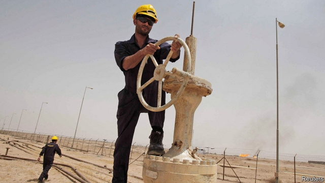

###### Crude deals over oil

# America is trying to get more out of its relationship with Iraq 

##### Donald Trump wanted to seize Iraq’s oil. He has settled for government contracts 

 

> Jan 10th 2019 

 

PRESIDENT DONALD TRUMP thinks America is being ripped off. “We have spent $7trn—trillion with a T—$7trn in the Middle East,” he told a crowd last year, exaggerating slightly. “You know what we have for it? Nothing. Nothing.” To right this perceived wrong, Mr Trump has long favoured seizing Iraq’s oil. But after he hinted at the idea with the Iraqi prime minister (who demurred), his aides admonished him. “We can’t do this and you shouldn’t talk about it,” said H.R. McMaster, the national security adviser at the time, according to reports. Still, Mr Trump may be getting what he wants from Iraq in other ways. 

When America reimposed sanctions on Iran last year it gave some countries extra time to stop buying Iranian oil before they would lose access to the American market. Most were given 90-day exemptions. In November Iraq, which shares a long border with Iran, was given half that time to cut off electricity and gas imports. As it negotiated for extensions, American companies made a push for Iraqi contracts. In December, Rick Perry, the energy secretary, led America’s largest trade delegation to Iraq in over a decade. “It was a quid pro quo,” says an oilman. “You give us priority and we’ll give you an exemption.” 

The strategy seems to be working. General Electric, an American company, has muscled in on a big contract to upgrade Iraq’s decrepit electricity grid, which had been earmarked for Siemens, a German firm. American companies have also signed deals to supply Iraq with grains and poultry, important Iranian exports. Chevron and Exxon, American oil giants, have avoided the inconvenience of a bidding process by negotiating directly with Iraq’s oil ministry for large concessions. A previous Iraqi government put off a decision on Exxon’s bid to help boost Iraq’s oil export capacity and build a desalination plant. Now it is said to be a priority. 

Iraq is more stable, secure and rich than it has been since America’s invasion in 2003. Having helped to roll back the jihadists of Islamic State (IS), Mr Trump thinks America is owed something for the country’s success. Beyond that he is not terribly engaged with Iraq. When he flew there in December, Mr Trump wished his troops happy Christmas, boasted about giving them a pay rise, then left—without seeing Iraq’s leaders. A meeting with Adel Abdul-Mahdi, the new Iraqi prime minister, fell through after Mr Trump insisted that he come to America’s base in the desert west of Baghdad. 

Mr Trump’s withdrawal from Syria has some Iraqis thinking that they could be next to see American troops go. On January 9th Mike Pompeo, America’s secretary of state, tried to reassure them. In a meeting with Mr Abdul-Mahdi (at the prime minister’s office) he discussed continuing America’s co-operation with the Iraqi security forces. He also emphasised “Iraq’s energy independence”, according to a statement. Officials in Iraq interpret such talk as an effort to get it to stop buying gas from Iran—and to start hiring American companies to develop Iraq’s gasfields. 

If America’s intention is to prise Iraq away from Iran, it will have a difficult time. The neighbours get along, for the most part, and trade a lot. Iraq depends on Iran for food and power. When Iran cut electricity to Iraq last summer, for want of payment, southern Iraq over-heated and protests brought down the government. American firms would not be able to replace the supply from Iran in the short term. Iranian forces are also helping to keep Iraq secure from IS, which is resurfacing in some areas. 

Bickering between Iraq’s big political blocs—the Iran-leaning Fatah and antiIranian Saairoun—reflects tussling between America and Iran over the composition of Mr Abdul-Mahdi’s cabinet. The positions of defence, interior and justice minister remain vacant. A return to instability would imperil America’s contracts. But Mr Trump is happy enough for now. In December he gave Iraq 90 more days to comply with America’s sanctions. 

