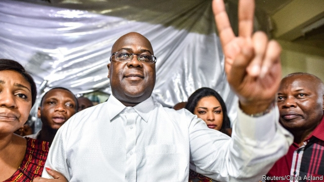

###### The Kinshasa surprise

# Congo declares Félix Tshisekedi president. Voters suspect a stitch-up 

##### The less popular of two opposition candidates is said to have won an election 

 

> Jan 10th 2019 

 

“CONGO IS FREE at last,” wailed an old woman, tears streaming down her cheeks. “We have waited years for this moment!” Two young girls behind her gyrated their hips and sang, “Bye-oh Kabila,” again and again. 

In the early hours of January 10th, days after the result was scheduled to be released, the Democratic Republic of Congo heard that it had a new president—Félix Tshisekedi, the son of a charismatic opposition leader who died two years ago. Moments after the news was announced, Mr Tshisekedi walked out of his office and prayed in front of a photograph of his father. His shrieking supporters jostled around him. He is popular in the capital, Kinshasa. 

The declaration marks the end of the ruling party’s long stay in power and means that President Joseph Kabila and his preferred successor must admit defeat. Mr Kabila, who had refused to step down when his term expired in 2016, has ruled Congo badly for nearly 18 years. The vast country has never seen a transition of power via the ballot box. All its former leaders either fled or were killed. The fact that the election went ahead at all—and that an opposition candidate was declared the winner—is astonishing. 

But many voters think they have been cheated nonetheless. Mr Tshisekedi was not the man tipped to win. A respected Catholic NGO that had deployed 40,000 observers to monitor the election on December 30th said on January 3rd that its tallies showed a clear winner. Although it did not publicly name him, it told Western diplomats that Martin Fayulu, a former oil executive, had won. He also came top, by a wide margin, in a pre-election opinion poll. 

The electoral commission’s count was rather different. It said that Mr Tshisekedi had won with 7.05m votes. Mr Fayulu was behind him on 6.37m. The unpopular ruling-party candidate, Emmanuel Ramazani Shadary, received just 4.36m. “These results have nothing to do with the truth at the ballot box,” Mr Fayulu said in an interview with Radio France International. “It’s a real electoral coup, it’s incomprehensible.” 

Critics say that Mr Kabila was desperate to keep Mr Fayulu away from the throne because he was backed by two of the president’s biggest adversaries (Moïse Katumbi, a businessman, and Jean-Pierre Bemba, a former warlord, who were both barred from standing). Mr Fayulu appeared to represent real change. He had campaigned on a promise to reduce corruption and enforce the rule of law—an obvious threat to those who have looted this giant, mineral-rich country for decades. 

Mr Tshisekedi, by contrast, is thought less likely to shake things up, or to ask awkward questions about Mr Kabila’s business empire and the dazzling wealth of his cronies. “The Kabila camp was never afraid of Félix,” says Kris Berwouts, the author of “Congo’s violent peace”. “They consider him a weak personality.” Mr Tshisekedi, for his part, said, “I pay tribute to President Joseph Kabila and today we should no longer see him as an adversary, but rather, a partner in democratic change.” 

The election result will surely be contested. France has queried it. However, the declaration of an opposition candidate as winner may give regional bodies such as the African Union enough of an excuse to call it free and fair. Congo badly needs a change. But this was not what most voters had in mind. 

