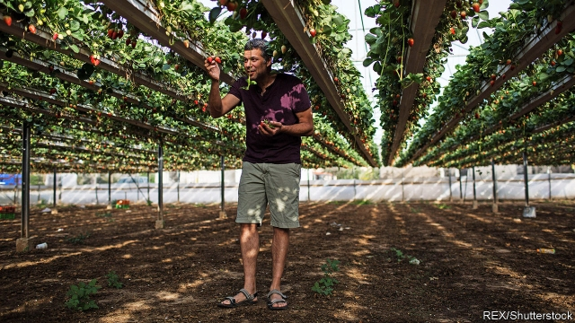

###### Agricultural technology

# How silicon makes Israel’s desert bloom 

##### Dry summers and hostile neighbours have pushed Israel to innovate 

 

> Jan 12th 2019 

 

PINK BOLLWORMS are the scourge of cotton farmers. The insect is less than an inch long, but it has a voracious appetite for the plant’s seeds. As a child living on Kibbutz Ginosar, in Israel’s north, Ofir Schlam would wake up at dawn to inspect leaves for the pest. “They were really hard to find,” he recalls. 

Spotting the enemy has become much easier. Four years ago, Mr Schlam co-founded Taranis, a company that uses high-resolution imagery from drones, planes and satellites to diagnose problems in the field—among them bollworms, diseases, dryness and nutrient deficiencies. Investors are joining the effort: in November, Taranis raised $20m. 

Faced with unfriendly neighbours and an arid climate, Israel has had to innovate to survive. Taranis is the poster child of its stunning rise in agritech. Over 500 companies operate in the field, nearly twice as many as in the better-known cyber-security sector. A third of them did not exist five years ago. Israeli agritech firms attracted $171m in equity investment in 2017, according to Start-Up Nation Central, a non-profit organisation, considerably more than those in bigger farming countries, such as Australia and Brazil. 

Other countries have bet big on agritech, but Israel is ahead of all but America, say investors. Large countries with big appetites are taking notice. When Wang Qishan, China’s vice-president, visited Israel in October, he toured agritech exhibits. “Agricultural parks” using Israeli technology have mushroomed across China. Indian and African officials have also made recent trips to Israel seeking inspiration. 

Because it trades little with its neighbours, Israel long relied on the kibbutzim and other collective farms to grow food for its rising population. That heritage is providing rich pickings today: 54% of Israel’s agritech ventures are managed by someone who grew up in a kibbutz. Conditions forced them to be creative. The southern part of the country often receives less rainfall in a year than England gets in a day. That led to an early breakthrough in water management. In the 1950s Simcha Blass and his son, Yeshayahu, greatly reduced water use by applying it directly to the roots of plants. They helped form Netafim, the world’s leading maker of drip-irrigation systems, worth nearly $1.9bn. 

Newer companies are exploiting technological advances in areas such as plant biology and artificial intelligence. Startups founded in Israel last year include Sufresca, which is developing edible coatings that extend the shelf life of fruits and vegetables; Beewise, which uses artificial intelligence to automate beehive maintenance; and Armenta, which is working on new therapies to treat sick dairy cows. Other firms are targeting trendy sectors like pharmaceutical crops and alternative proteins. 

The new firms benefit from an oversupply of produce worldwide, which has led to lower margins for farmers and greater demand for tools that increase productivity and boost profits. After an unprecedented round of mergers in 2016, farming giants have been looking to cut costs. Shareholders are also looking for new ways of doing things (six out of the ten biggest food companies have replaced their CEOs in the past three years). Many firms see external innovation as faster and cheaper than in-house research and development (R&D). 

Israel’s overall civilian R&D spending, measured as a share of GDP, is more than that of any European country. Agritech gets a chunk of this cash. The government supports universities and labs; it has also invested in venture-capital funds and directly in startups. The country is good at turning ideas into profits. The Israel Institute of Technology (known as Technion) earns over half as much licensing patents as MIT in America, despite spending much less on research. Next year, for the first time, the government plans to sponsor pilot projects that connect startups with farmers, so that technology can be tried and tested locally before being introduced to international markets. 

The state also helps in other ways. Military service is mandatory in Israel, where bright young conscripts spend years developing equipment or software that does well in unpredictable environments. Such skills have direct applications in agritech. Nadav Liebermann, the chief technology officer of CropX, a company that uses wireless sensors to measure soil moisture, served in a unit that created hardware for special forces, including devices placed underground in enemy territory to gather intelligence. His software chief, who learned to code in the army, ran a team of 50 developers at the age of 23. Two branches are particularly good at churning out tech entrepreneurs: Unit 8200, the army’s signals-intelligence arm, and Unit 9900, which specialises in gleaning intelligence from geospatial imagery. 

The next challenge for Israel’s agritech firms will be scaling up. Limited farmland means they must look for partners abroad early on. So does the need to understand distant export markets with a different climate, like Brazil or the American Midwest. Founders of startups are often quick to sell up, rather than building their ventures into big global companies. Many reinvest their riches in new startups and buyers often continue to use Israel as their base for R&D. The danger is that, without bigger home-grown firms, many less-skilled Israelis—including kibbutzniks—will be cut off from the booming tech industry. 

