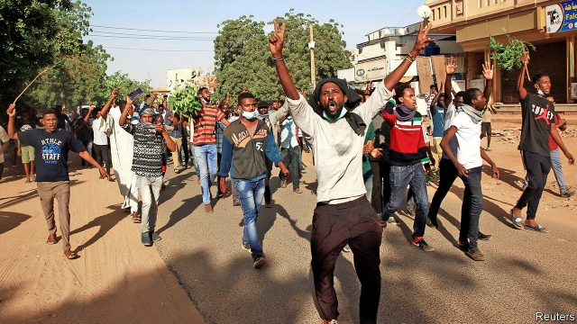

###### “We are all Darfur”

# Sudan’s genocidal regime is under siege 

##### Protests that started as bread riots now threaten the president 

 

> Jan 10th 2019 

 

A HUNDRED OR more were brought in every hour. Soon the police station in northern Khartoum, Sudan’s capital, was so full that detainees were flowing onto the lawn. Atif, an activist picked up around noon on December 31st, says he saw at least 1,000 arrested that day. Many were beaten; others had their hair shaved off. Lawyers and doctors were singled out for insults. 

Atif is one of tens of thousands of Sudanese who have taken to the streets in recent weeks. What began as a riot over the price of bread in the eastern city of Atbara on December 19th has billowed across the country. By some estimates, at least 40 people have been killed by security forces during nearly 400 protests. The government says it has detained at least 800 people (the real figure is surely far higher). Yet this has done little to muffle what is now a nationwide uprising against the rule of Omar al-Bashir and his 30-year-old kleptocracy. 

The seeds of the current crisis were sown in late 2017, when the government announced plans to end wheat subsidies. The aim was to plug a budget deficit forecast to hit almost 5% of GDP this year. When the price of bread doubled a year ago, triggering protests, the government tried to reverse course and reintroduced some of the subsidy. But the economy—already struggling following the secession of South Sudan, which took away 75% of Sudan’s oil reserves, in 2011—has nosedived. It shrank by about 2.3% in 2018. Unable to pay its bills, the government has printed money. Inflation, at around 70%, is now the second highest in the world after Venezuela. 

Ordinary Sudanese face shortages of bread, fuel and basic medicine. “You stand in line at the bank waiting for cash that will barely buy you anything,” says Abuzar Osman, a 28-year-old photographer who was arrested last month. “We now spend our lives standing in queues.” 

Calls for regime change are widespread. District offices of Mr Bashir’s National Congress Party (NCP) have been burned. On January 6th protesters marched on the presidential palace to deliver a petition for Mr Bashir to resign. The president, who came to power in a coup in 1989 and later won some dodgy elections, plans to stand for another term in 2020. At least eight parties have withdrawn from the ruling coalition. 

Can he last? Mr Bashir is no stranger to unrest. His regime has fought rebels and committed genocide against civilians in the south and in the Darfur region. It has survived many protests before. Yet the latest ones seem to have rattled the regime. Mr Bashir has promised to stop cutting subsidies and to increase state spending by 39%, partly on higher salaries for public employees. He has called the protesters “traitors, sell-outs, agents and saboteurs”. The government has accused rebels from Darfur of conspiring with Israel to destabilise the country. Since late December more than 50 Darfuri students have been rounded up and detained in unknown locations. 

His tactic of blaming Darfuri rebels has had little success. Protesters from the regime’s traditional strongholds in Khartoum and the north have chanted “We are all Darfur” while marching. And even though the police have shot and arrested people, the demonstrations have shown little sign of abating. If anything they seem to be getting better organised. The protest movement is now largely led by the Sudanese Professionals Association, a coalition of trade unions including those representing doctors, lawyers and journalists. 

Some have likened the protests to Sudan’s previous uprisings against military dictatorships, in 1964 and 1985. Then, too, middle-class folks helped turn isolated riots into a broad movement for political change. Both of Mr Bashir’s predecessors stepped aside once it was clear the army was backing the protesters. But Mr Bashir may prove harder to dislodge. “The army has been his for 29 years,” notes Alex de Waal of Tufts University. He has a knack for playing factions against each other. Senior officers may also fear prosecution for war crimes in Darfur should Mr Bashir go. And he has a formidable spy agency which, for now, remains loyal. 

Even so, he is running out of options. In recent years Sudan has moved away from Iran, an old ally, and grown closer to Saudi Arabia and the United Arab Emirates. Their financial largesse helped to mask Sudan’s economic malaise. But neither appears inclined to bail out the regime, perhaps because Mr Bashir is an unfaithful ally. (He has made overtures to their regional rivals, Turkey and Qatar.) Broke and alone, Mr Bashir faces protesters who keep returning to the streets, despite tear gas and bullets. “The people’s rage is infinite,” says Brahim Snoopy, a film-maker. “We don’t know what will happen next.” 

