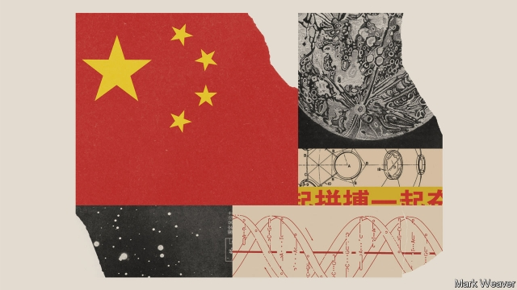
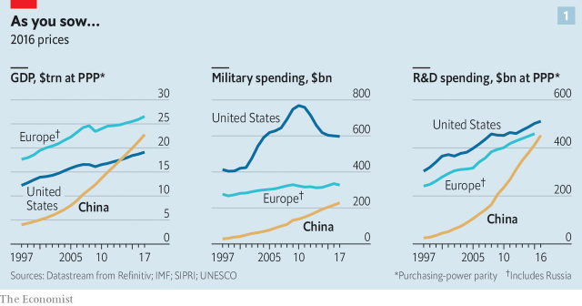
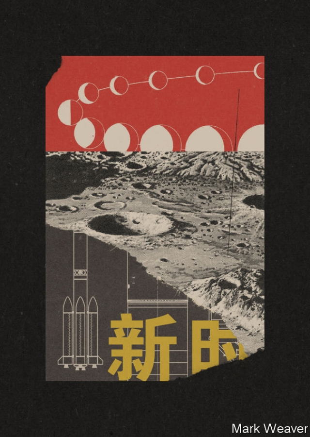
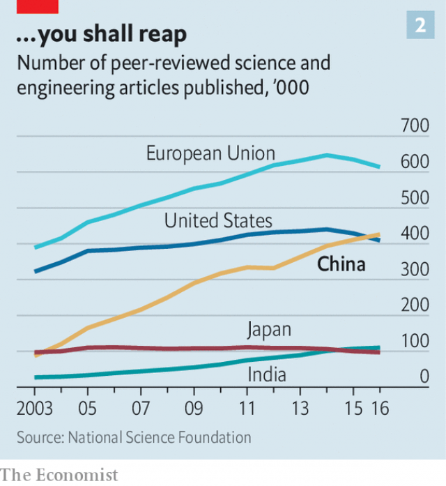
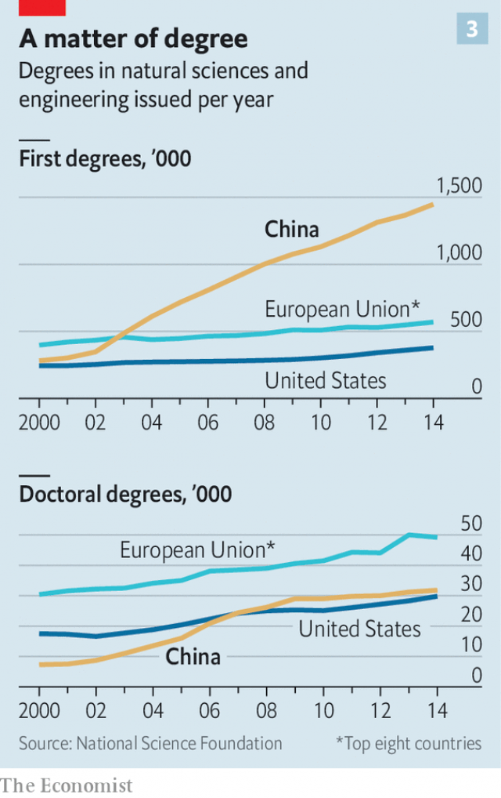
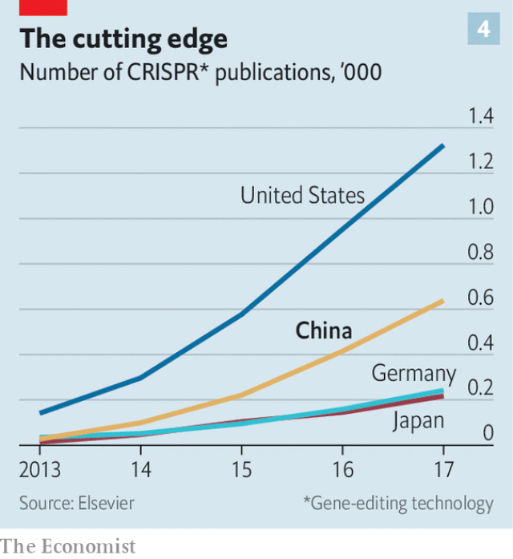
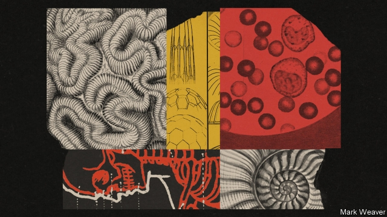
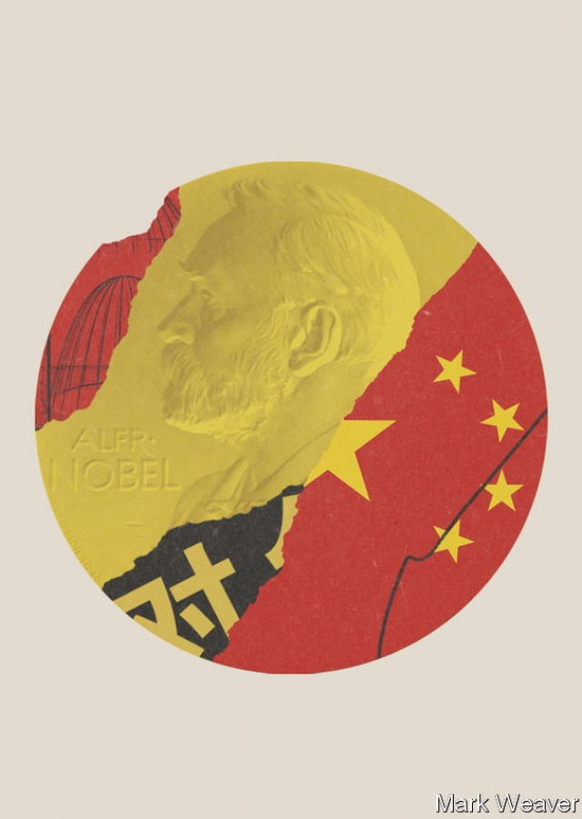
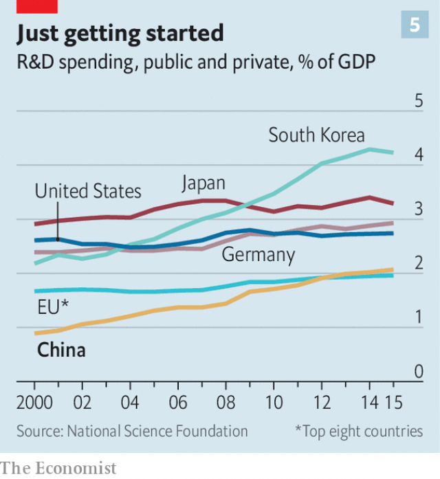

###### The great experiment

# Can China become a scientific superpower? 

##### The hypothesis that scientific greatness requires freedom of thought is about to be tested 

 

> Jan 12th 2019 

 

TO LAND ON the Moon, as China’s Chang’e -4 spacecraft did on January 3rd, is not quite the pinnacle of achievement it once was. Both the Indian government and a well-backed Israeli team of enthusiasts will attempt landings there this year; in 2020 various American companies intend to light out for the lunar provinces, too. But all these non-Chinese efforts will land on the Moon’s Earth-facing near side, and thus within the solicitous sight of Earthbound controllers—just as all previous lunar landings, whether American, Soviet or, since 2013, Chinese, have been. 

Chang’e-4’s landing site in Von Kármán crater, though, is on the far side of the Moon, where the spacecraft can no more easily be reached by radio than it can be seen through a telescope. Landing there and getting data back afterwards is possible only with the help of a cunningly pre-positioned relay satellite. Other countries have considered such missions, but none has ever mounted one. China has been carefully building up the capacity to go where they have not; now it has done so. 

China is keen on such signals of pre-eminence, and willing to put in the work they require. It wants the world, and its own people, to know that it is a global power—that it boasts not just a titanic economy, but the geopolitical sway and military might to match, soft power of all sorts, a storied past and a glorious future. Science is a big part of this. It is seen in China, as elsewhere, as an ennobling pursuit and a necessary foundation for technological advance. China’s leaders see such advances as crucial not just to their economy, but also to expanded military prowess and social progress. They want the sort of science that will help China project its power and respond to its people’s particular problems. They want new clean-energy sources and freedom from resource constraints. And the country’s ever greater scientific proficiency makes such ambitions look realisable. It is a long way from landing on the Moon to mining it. But it is not uncommon to hear speculation about such things. As one Weibo user put it after Chang’e-4’s landing, “China has made history! Half of the Moon will be ours.” 

The huge hopes China has for science have prompted huge expenditure. Chinese spending on R&D grew tenfold between 2000 and 2016 (see chart 1). This open chequebook has bought a lot of glitzy kit. Somewhere in the Haidian district of Beijing, which houses the Ministry of Science and Technology as well as Tsinghua and Peking Universities, it seems there is a civil servant quietly ticking things off a list of scientific status symbols. Human space flight? Tick. Vast genome-sequencing facilities? Tick. Fleet of research vessels? Tick. World’s largest radio telescope? Tick. Climate researchers drilling cores deep into the Antarctic icecap? Tick. World’s most powerful supercomputer? Tick (erased when America regained its lead, but watch this space). Underground neutrino and dark-matter detectors? Tick and tick. World’s largest particle accelerator? The pencil is hovering. 

 

The spree is tellingly reminiscent of the golden years of “big science” in post-war America. Between the International Geophysical Year of 1957 and the cancellation of the Superconducting Super Collider (SSC) in 1993, America’s government unfailingly invested ever more of the resources of an ever more powerful economy into the things which the leaders of its scientific community most wanted. From the creation of quarks to the cloning of genes to the netting of Nobel prizes, American science came to dominate the world. 

Over those 40 years America—and, to a lesser extent, Europe—were doing things that had never been done before. They opened up whole new fields of knowledge such as high-energy astrophysics and molecular biology. Benefiting from the biggest and best-educated native generations ever produced, they also welcomed in the brightest from around the world. And they did so in a culture dedicated to free inquiry, one keenly differentiated from the communist culture of the Soviet bloc. 

Measured against that boom—one of the most impressive periods of scientific achievement in human history—China’s new hardware, grand as it often is, falls a bit short. It has been catching up, not forging ahead. It has not been a beacon for scientists elsewhere. And far from benefiting from a culture of free inquiry, Chinese science takes place under the beady eye of a Communist Party and government which want the fruits of science but are not always comfortable about the untrammelled flow of information and the spirit of doubt and critical scepticism from which they normally grow. 

America’s science boom had a firm institutional and ideological foundation. It grew out of the great research universities that came into their own in the first half of the 20th century, and whose intellectual freedom had attracted extraordinary talents threatened by regimes elsewhere, including Albert Einstein, Enrico Fermi and indeed Theodore von Kármán, the Hungarian-born aeronautical engineer in whose honour Chang’e-4’s new home is named. China has imported ideas and approaches more than people and ideals. The resultant set-up has the ricketiness often seen in structures ordained from the top down rather than built from the bottom up. 

 

Top-down ambition can mean running before you walk. Take FAST, the Five-hundred-metre Aperture Spherical Telescope, which opened in 2016. Built in a natural basin in Guizhou province, it is more than twice the size of the world’s next-largest radio telescope, in America. But FAST does not have a director. Having leapt from nowhere to the top of the tree in terms of hardware, the country finds itself in the embarrassing position of having no radio-astronomer to hand who combines the scientific and administrative skills needed to run the thing. Nor, so far, has it been able to recruit a qualified foreigner willing to live in the telescope’s remote location. 

Self-defeating shortcuts, symbolic and otherwise, are not only the preserve of the government; Chinese scientists are prey to such temptations, too. China is not only recapitulating American science’s cold-war national-prestige boom. It is doing so in the context of the subsequent high-technology era in which no American university feels complete without a symbiotic microbiome of venture capitalists pullulating across its skin. The economic benefits of research have increasingly come to be seen as a possible boon to the researcher, as well as to society at large. 

For a particularly egregious example, consider the most notable Chinese scientific first of 2018. He Jiankui looked like the model of a modern Chinese scientist. He was educated at the University of Science and Technology of China (USTC) in Hefei. He went on to equally prestigious American universities, Rice and Stanford. He was brought back by the government’s “Thousand Talents” programme to a new position at the Southern University of Science and Technology in Shenzhen. Once established there, he took unpaid leave to start an entrepreneurial project. 

That project was editing the DNA of embryos that would then grow up into human beings. Its result was two baby girls. They do not, as yet, appear unhealthy. Nor, though, have they been provided with the questionable advantages Dr He says he was trying to provide through his tinkering—tinkering which was unsanctioned, illegal and which, since he went public, has seen opprobrium heaped upon him. 

The He affair could have taken place in many places, and it is hardly representative of the broad swathe of China’s researchers; 122 of them signed an open letter denouncing his actions. At the same time it is not at all surprising that the He affair took place in China. It was a perversion of what Chinese scientists are trying to achieve as they seek to establish themselves and their country in the world of elite science. But it was also an illustration of it. 

 

The staggering growth in the number of scientific papers by Chinese researchers needs to be seen in this context. In terms of pure numbers, China overtook America in 2016 (see chart 2). But the quality of some of these papers is very low. In April 2018 Han Xueying and Richard Appelbaum of the University of California, Santa Barbara, reported opinions gathered in a survey of 731 researchers at top-tier Chinese universities. As one from Fudan University put it: “People fabricate or plagiarise papers so that they can pass their annual performance evaluations.” 

The Chinese government is aware of the risks of a reputation for poor and even fraudulent research. It is one of the reasons that it is orchestrating the development of a scientific establishment. One of its pillars is a core group of elite universities known as the C9. Fudan is one of them, as are Tsinghua and Peking Universities and Dr He’s alma mater, USTC. The other is the Chinese Academy of Sciences (CAS), an official agency that runs laboratories of its own, which will adhere to prevailing international standards. The government is clamping down on shoddy journals, especially those in which researchers pay to be published. Raising standards in this way will not just improve science; it will also attract the best scientists. 

After Deng Xiaoping came to power in 1978 the top tier of Chinese students was encouraged to go abroad for their graduate studies. Many returned, as had been intended, filled with knowledge unavailable at home. Without them the current scientific boom would not have happened, however much the government had spent. But the best often chose to stay abroad. In 2008 the country started the Thousand Talents programme to draw these exiles back with promises of lucre and lab space. 

In theory, the programme is open to any top-notch researcher working in an overseas laboratory, regardless of nationality. In practice, few non-Chinese have availed themselves of it. But many Chinese have. Such returners are known as haigui, the Chinese for “sea turtle”, since they are thought of as having come back to their natal beach, as turtles do, to lay their eggs. 

Talent that has not been abroad is not, however, neglected. A coeval programme, Changjiang Scholars, is aimed at identifying potential top-flight researchers who are languishing in thousands of provincial institutions. Once identified, they, too, are brought into the charmed circle. 

This is yielding results at all but the very highest levels. Chinese scientists working in China have as yet earned only one Nobel prize. Other than that work—the discovery of artemisinin, a novel antimalarial drug, by Tu Youyou—there has not yet been any Chinese scientific advance that a fair-minded person would be likely to think Nobel-worthy. No fundamental particle has been discovered there, nor any new class of astronomical object. Chinese scientists have not yet done anything to compare with, say, the development of CRISPR-Cas9 gene editing (America) or the creation of pluripotent stem cells (Japan) or the invention of DNA sequencing itself (Britain). 

 

But a great deal of Chinese science is now very good indeed, particularly in relatively new fields with practical implications. The country has a very large and ever growing workforce (see chart 3) that is both enjoined and keen to tackle juicy topics. A study published by Elsevier, a scientific publisher, and Nikkei, a Japanese news business, on January 6th found that China published more high-impact research papers than America did in 23 out of 30 hot research fields with clear technological applications. Chinese science is a nimble giant, capable of piling in on any new field of promise with enormous, often centrally encouraged, force. 

Developments in fields such as double-layer capacitors and biochar, two of those 23, may be important but are unlikely to be much noticed, either by Nobel committees, the public or foreigners who need impressing. For visible signals of its national prowess, China is following the well-trodden path of big science in America, Europe and Japan: building large physics experiments and putting things—especially people—into space. 

The China National Space Administration has sent several “taikonauts” into orbit and provided them with some small space labs to hang around in while they are there. Its plans include, in the near term, a bigger space station, assembled in orbit from modules launched separately, and in the longer term crewed missions to the Moon enabled by a new booster more powerful than any of today’s, the Long March 9. 

The National Space Science Centre, part of CAS, is busy putting up scientific satellites; in April 2018 it announced six new ones that should be launched by 2020 or soon after. Most of China’s launches, though, are not scientific; they are for communications, Earth observation—and military intelligence. China’s space programme began in the bosom of the People’s Liberation Army (PLA), and though it is no longer directly run by the armed forces, they are still keenly involved with the development of the country’s orbital abilities. In 2007 China tested an anti-satellite weapon; its “Strategic Support Force” is thought to co-ordinate its military space-, electronic- and cyber-warfare capabilities. All China’s taikonauts are PLA officers. Other physics facilities have obvious military applications, too, such as wind tunnels designed for research into forms of hypersonic flight that are really relevant only to the armed forces. 

Beyond rocketry, China’s most ambitious big-science plan is to build the largest particle accelerator ever. Since their development in the 1930s, circular particle accelerators have grown from the size of a room to the size of the Large Hadron Collider (LHC), which occupies a 27km loop of tunnel beneath the Franco-Swiss border at CERN, Europe’s particle-physics laboratory. The bigger the accelerator, the more energy it can pump into its particles. The LHc packs its protons with more than a million times more energy than the original machines did in 1930s Berkeley. 

The Chinese plan foresees a loop of tunnel as much as 100km long. Even China will not be able to foot the bill for such a beast alone. In the 2000s the LHC cost CERN over SFr4bn ($5bn); contributions to its experiments from other countries, including China and America, significantly increased the total. Making use of it has cost billions more. Nor would China be able to supply all the physicists needed to make use of such a facility. Like the LHC, the next accelerator will be a single lab for the world, wherever it is: these toys are one-per-planet affairs. But the Chinese seem more serious than anyone else about hosting and building the thing. Just as it meant something beyond the world of particle physics when America cancelled its proposed giant SSC and CERN’s LHC became the biggest game in town, so it would mean something if China took CERN’s crown. 

Particle physics enjoys a particular prestige in part because of its early (and now dissolved) association with the development of nuclear weapons, in part because of the conceptual depths it plumbs, in part because of the sheer size and expense of its tools. But there are other parts of physics with more of the cutting edge about them. These include applications of the more abstruse aspects of quantum mechanics to computation and cryptography, an area where China is a world leader: it was the first country to send a quantum-encrypted message via a satellite. In computer science, too, it has few peers. Though it does not yet have a semiconductor industry that quite matches those elsewhere, it is world class in many applications, especially in artificial intelligence. 

 

The same applies in trendy bits of biology. Dr He was not the first person to edit the DNA of a human embryo. That honour belongs to Huang Junjiu, a researcher at Sun Yat-sen University, in Guangzhou, whose research was blameless and above-board. Like Dr He, Dr Huang was making use of the capabilities of CRISPR-Cas9. Since 2012 this form of gene editing has become one of the hottest fields in biology, and China is very well represented in it (see chart 4); according to the study by Elsevier and Nikkei, it is publishing 22.6% of the world’s most highly cited papers in gene editing, slightly more than half the amount that comes from America, and far more than from any other country. 

Dr Huang wants to apply CRISPR-Cas9 to the treatment of beta thalassemia, a hereditary blood disease. To this end, in 2015 he successfully edited the DNA of several fertilised human eggs left over from IVF treatment. He had no intention of implanting the results in anybody’s womb; he used embryos which, due to other abnormalities, were not able to develop. What he learned about gene editing in those experiments will, if all goes well, be used to edit stem-cells extracted from the bone marrow of people suffering from the disease, allowing them to make better red blood cells. 

 

Stem-cell research is another hot topic to which China is adding its heft. Zuo Wei of Tongji University in Shanghai is trying to use stem cells to repair lungs damaged by emphysema, a big problem in China, where smoking is still common and the air often dense with smog. Last year he conducted a trial in which four patients had some lung tissue removed. The most healthy-looking stem cells in that tissue were isolated and encouraged to multiply, and the revved-up results then sprayed back into the lung. The procedure apparently repaired the lungs of two of the patients; the other two showed neither benefits nor harm. Dr Zuo has since organised a second trial of 100 patients. He is working on a similar approach to kidney disease, but so far only in mice. 

Dr Zuo’s work demonstrates another feature of Chinese bioscience: keeping its application clearly in mind. In the West there has been an increasing concern over the past couple of decades that basic biology led by independent academic researchers has drifted too far from potential medical application. In America, in particular, biomedical-research prowess and the health of the population are increasingly poorly correlated. 

This concern has led to a new emphasis on building up “translational-medicine” research capacities to bridge the gap—an idea the Chinese are already integrating into their work. The government has opened a translational-medicine centre in Shanghai, where laboratory researchers, clinicians and patients will all be under the same roof and biotech companies encouraged to set up shop next door. Others may follow in Beijing, Chengdu and Xi’an. 

Genetic research is a field where China has both made big investments and sees a big future. In the BGI, as what was once the Beijing Genomics Institute is now known, China has by some measures the largest genome-sequencing centre in the world. Once an arm of CAS, it declared independence as a “citizen-managed, non-profit research institution” and has now become a semi-commercial chimera, with one of its divisions listed as a company on the Shenzhen stock exchange. 

The BGI’s corporate arm is also taking an interest in beta thalassemia; it has developed a DNA blood test for it, one of an increasing range it is making available across China. The tests use DNA-sequencing machines the BGI developed with technology which it acquired when it bought Complete Genomics, an American firm, in 2013. 

That battalion of machines has a lot of other work to do. Non-commercial bits of the BGI use them for pure research. The outfit is also home to the China National GeneBank, the intended repository for several hundred million samples taken from living creatures of all sorts, human and non-human. It already holds the genomes of 140,000 Chinese people, part of a wider desire by the government to be at the forefront of the field of precision medicine, in which diagnoses, and eventually treatments, are personalised with particular emphasis on understanding a patient’s genetic make-up. 

The BGI is one example of China’s ability to bring big-science approaches to new areas of research. For another you should look inside a low building in Zhuanghe, Liaoning province, where the world’s largest battery is taking shape. It is to have six times the storage capacity of the system supplied by Elon Musk, an American entrepreneur, to South Australia in 2017, which lashed together thousands of lithium-ion battery cells to make the world’s then-largest battery. It can do so because it uses a completely different approach based on a flow of vanadium-salt solutions. 

China’s near-insatiable demand for energy has led to investments in wind and solar power that dwarf those in other parts of the world, and is now leading to research into better ways of handling the energy they produce. Vanadium-flow batteries are of interest because, unlike most batteries, in which a single electrolyte is built into the cell, a flow battery has two electrolytes and an open cell through which they pass. This means its storage capacity is governed solely by the size of the tanks that store the electrolytes. That makes it possible, in theory, to build batteries big enough to store energy on a scale useful to large grids. The theory has been developed by Zhang Huamin, a researcher at the Dalian Institute of Chemical Physics, a local arm of CAS. The factory in Zhuanghe, owned by Dalian Rongke Power, a local electricity company, is trying to turn theory into practice. If it works, it could revolutionise grid-scale electricity storage. 

The Dalian Institute’s researchers are also looking into perovskites, materials with applications both in batteries and in solar cells. Their aim—also being pursued elsewhere in China and abroad—is to apply perovskite solutions to everyday solar cells so that the resultant layers will absorb wavelengths of light that the normal cells cannot absorb. This could produce much more efficient solar panels for relatively little extra cost. To the extent that academic publications are a good measure of technologies quite close to the market, perovskites are an area where China has a substantial lead over America, with 41.4% of the highest impact publications, compared with 21.5% from America. 

China’s energy research also extends to areas that the rest of the world is avoiding. China is building 13 new nuclear reactors to add to its fleet of 45; it has 43 more planned. If they are all built China will become the world’s biggest generator of nuclear electricity. Those reactors are of similar design to the plants already in operation around the world. But China is also exploring new reactor technologies—or rather, technologies abandoned elsewhere. These include reactors in which the core is filled not with fuel rods but with little ceramic pebbles—or, in the case of thorium reactors, with molten metal. 

The lack of progress such reactors have enjoyed in the West reflects a lack of appetite for new sorts of nuclear power much more than a lack of scientific plausibility. If China’s appetite is sharp and its researchers imaginative, progress may come swiftly. The development of mass-produced, compact, cheap and safe nuclear reactors would be a Chinese first that a world in the throes of climate change would have real cause to celelebrate—and start importing. 

 

That possibility, though, brings to the fore a shadow over the future of Chinese science. Making novel nuclear reactors extremely safe requires critical thinking and obstinate truth-telling; so does convincing others that you have done so. A culture that provides the results the boss wants, or does not investigate inconvenient anomalies, or withholds data from nosy outsiders is not good enough. 

Those requirements are very like the norms that are seen as basic to doing good science in the West. Testing hypotheses, finding the flaws in the work on which your teacher’s reputation rests, questioning your own assumptions, following the data wherever they lead, sharing data openly with your rivals-sorry-colleagues: this is how science is meant to work, even if in real life the ideal can be a bit tarnished. In some labs and institutions in China things doubtless do work that way. But the authoritarian system in which they are embedded makes it hard for Chinese science to speak truth to power, or escape challenges to its integrity. This gnaws at the scientific body politic, and saps resources, both financial and moral. 

In their survey of Chinese researchers Dr Han and Dr Appelbaum heard many complaints about excessive government interference. A respondent from Sun Yat-sen University told them “There is still not enough academic freedom in higher education. If the central government makes one statement, even if it is not fair, all of the universities have to follow suit.” 

In matters of promotion, job interviews and grant-giving, the question of who you know seems much more important in China than in the West (and even there, it is not negligible). For the past decade the National Natural Science Foundation of China (NNSFC), one of the country’s main funding bodies, has been running a campaign against such misconduct. Wei Yang, until recently the NNSFC’s boss, describes a situation in which, to stop interference from outside, the composition of interview panels is kept secret until the last minute. Panellists are not told in advance who candidates are, and both panellists and candidates have their mobile phones confiscated in order to avoid anyone being nobbled—which used to happen even while interviews were being conducted. 

 

Some Chinese scientists fear that the corruptions and silences endemic in authoritarian states will hold them back from the breakthrough-making Nobel-winning heights. Others may doubt this. China has been playing in science’s premier league for only a decade or so. Its investments are not at an end. China’s R&D was 2.07% of GDP in 2015, up from 0.89% in 2000 (see chart 5). That is higher than the average for European states, but lower than France, Germany or America. It is much lower than in the Asian catch-up states that might be the most natural comparators, Japan and South Korea. A China spending as much of its GDP on research as South Korea does would have an R&D budget twice today’s. With resources on that scale and a scientific workforce in the many millions, the hobbling effect of corrupt institutions might be overcome by brute force. 

Others might argue that big breakthroughs are not the only measure of good science. Incremental work that solves practical problems is not to be sniffed at. Scientific research directed from the top down can serve national goals, and a one-party system may give particularly consistent support to such programmes. China’s lunar programme has built up its capabilities steadily in a way no Western space-science programme has since Apollo, the achievements of which it may yet match. 

This is the sort of methodical science that typically appeals to engineers oriented towards results—and from Jiang Zemin onwards all China’s presidents, as well as almost all its other leading politicians, have had engineering degrees. Xi Jinping, today’s president, studied chemical engineering at Tsinghua. 

But the idea that you can get either truly reliable science or truly great science in a political system that depends on a culture of unappealable authority is, as yet, unproven. Perhaps you can. Perhaps you cannot. And perhaps, in trying to do so, you will discover new ways of thinking as well as fruitful knowledge. 

