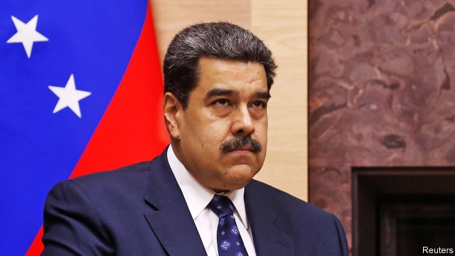
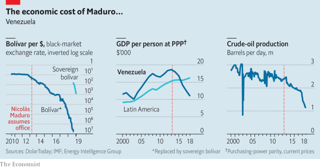
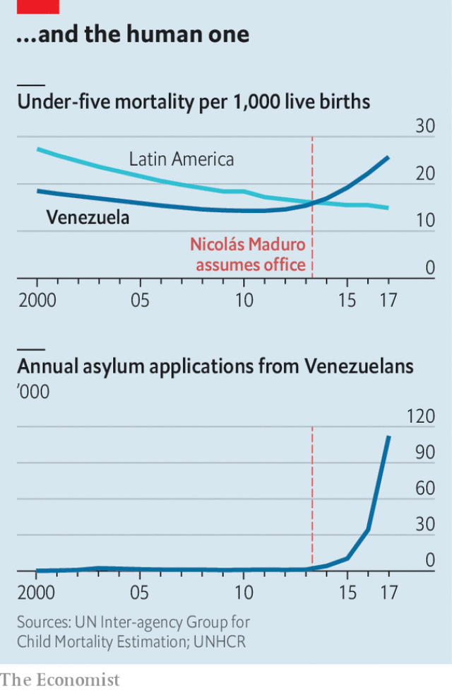

###### Failure in Venezuela

# Nicolás Maduro digs in for another six-year term 

##### Will he stay in office until the end of it? 

 

> Jan 10th 2019 

 

UNDER VENEZUELA’S constitution, presidents are supposed to be sworn in before the national assembly, the country’s legislature. But the ceremony that will begin Nicolás Maduro’s second six-year term, planned for January 10th, is to take place at the supreme court. That is because the opposition-controlled assembly regards Mr Maduro’s election last May as a farce and his second term as illegitimate. The nominally independent court, by contrast, remains an obedient servant of the regime. The change of venue is a characteristic manoeuvre by Mr Maduro, who is keeping power by increasingly dictatorial means. 

That is his one talent. After a catastrophic first term, Mr Maduro is arguably the world’s least successful president (see charts). But the seeds of disaster were planted by his predecessor, Hugo Chávez, who died in 2013. An eloquent populist, Chávez thought that the best way to help the poor was to ramp up government spending while throttling markets. He seized private businesses, imposed price controls, borrowed lavishly and sacked competent managers at PDVSA, the state-owned oil firm that is Venezuela’s main source of hard currency, for not supporting him politically. 

 

Chávez was lucky. Oil prices were high during most of his 14 years in office. That kept goods on the shelves and budget deficits under control. When he died, the economy was headed for a steep decline, but that was not yet apparent. Mr Maduro cast himself as the “son” of Chávez, who still inspired devotion among poor Venezuelans and gullible leftists abroad. He won a disputed presidential election against Henrique Capriles, a centre-left state governor. In 2014 oil prices began to slide. 

Mr Maduro doggedly adhered to chavismo even as conditions turned against it. To continue paying Venezuela’s international creditors he slashed imports, leading to shortages and hunger. He printed money to finance massive budget deficits. Both measures stoked inflation, which was probably more than one million per cent last year. He kept the official exchange rate of the bolívar artificially high, ostensibly to make essential imports affordable. In fact, the regime denied honest importers access to cheap dollars, giving them instead to loyalists, some of whom became billionaires. The black-market (ie, true) value of the bolívar collapsed. GDP has dropped by nearly half since Mr Maduro took office. 

He responded to the crisis either with half-measures, such as inadequate devaluations of the official bolívar, or policies that made things worse, such as new price controls. As reserves of foreign exchange plummeted, in 2017 he partially defaulted on bonds issued by PDVSA and the government. The government has avoided full default only by mortgaging oil, gas and gold fields, mainly to Chinese and Russian state-controlled firms. 

Last August Mr Maduro removed five zeros from the currency and relaunched it as the “sovereign bolívar”. But without any action by the government to rein in deficits or alleviate shortages, it has lost 95% of its value against the dollar. Banks are already refusing to accept two-bolívar notes, the lowest denomination, although they are brand new. 

Even if oil prices bounce back, Venezuela is unlikely to benefit much. That is because the government has looted PDVSA. Under Chávez, in addition to paying for popular social programmes it provided petrol to Venezuelans nearly free and oil to friendly governments, such as Cuba’s, on easy terms. Investment and exploration suffered. PDVSA’s decline sped up under Mr Maduro, who has appointed as its president a major-general with no experience in the oil industry. Scavengers, including employees made desperate by the collapse in their incomes, have begun to pilfer machinery. Now in partial default on its bonds, Venezuela produces less oil than it did in the 1950s. Output per citizen is where it was in the 1920s. 

The consequence is misery. Electricity and water supplies are faltering because of corruption, underinvestment and absenteeism by workers who cannot live on their salaries. Violence has soared and health care has all but collapsed. A tenth of the population, 3m people, have emigrated, largely to neighbouring countries such as Colombia. At least 2.5m have left since 2014. (A minority apply for asylum.) 

 

Depending on what happens to oil income and remittances, 5m more could leave, according to a study by the Brookings Institution, a think-tank in Washington. “My daughter is just 15 and she’s already hinting she wants to go,” says Carlos Valbuena, an office worker in Caracas. “What do I tell her?” he wonders. 

The answer hinges on how long Mr Maduro will remain in power. That, in turn, depends on how long the regime can remain united under pressure from its foes and from the stresses it has placed on itself. On January 4th the Lima group, which includes the biggest Latin American countries and Canada, said it would stop recognising Mr Maduro as president in his second term and urged him to cede power to the national assembly. That gesture was weakened by the refusal of Mexico, under its new left-wing president, Andrés Manuel López Obrador, to sign the statement. 

Peru has now joined the United States and the European Union in barring members of the regime from visiting and conducting financial transactions. Other members of the Lima group may follow. More painful are American sanctions that stop firms from dealing in newly issued debt. That is making it difficult for Venezuela to reach agreements with creditors. 

The Lima group’s endorsement of the national assembly is a fillip to the divided and ineffectual opposition. The alliance is in good-enough shape that on January 5th it carried out a redistribution of top jobs in the legislature under a pact reached after the parliamentary election in 2015, Venezuela’s last fair election. Juan Guaidó, a founder of Voluntad Popular (Popular Will), one of the most confrontational opposition parties, became the assembly’s president. The party’s leader, Leopoldo López, is under house arrest and its national co-ordinator, Freddy Guevara, has taken refuge in the Chilean embassy since 2017. 

In his acceptance speech, Mr Guaidó damned Mr Maduro’s presidency as illegitimate and called on the army to help “restore the constitutional order”. Mr Guaidó will be “the head of the struggle for change in Venezuela”, predicts Luis Vicente León, a pollster and political analyst in Caracas. 

But the main threat to Mr Maduro comes from “inside chavismo”, says Mr León. Until now, loot from oil production, smuggling and drug-trafficking, which the government tolerates, has held the regime together. A network of Cuban spies alerts Mr Maduro to plots against him. But cash is becoming scarce and plots may be proliferating. In August some people apparently tried to kill Mr Maduro with explosive-laden drones as he addressed a gathering of national guardsmen. The government has tortured dozens of soldiers accused of plotting against it, according to Human Rights Watch, an NGO. 

Defections from chavismo may pose a bigger danger. Subject to sanctions, some members of the regime may fear being trapped in Venezuela when power shifts suddenly. They may be tempted to strike a deal with the opposition, probably mediated by an outside group, leading to some sort of transitional government. Mr León says that tension between those prepared to negotiate and those who refuse could lead to the government’s “implosion”. 

The regime has already suffered several high-profile defections, especially by members of the judiciary. The latest came on January 6th, when Christian Zerpa, a judge on the supreme court, appeared in Miami to denounce Mr Maduro. His rule “has no other name than a dictatorship”, declared the once-loyal justice. That is an embarrassment, but not a serious threat. It is from his friends, rather than from his servants on the supreme court, that Mr Maduro has most to fear. 

