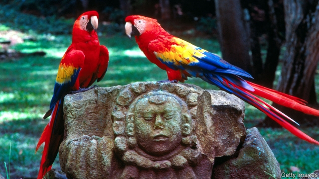

###### Guarding guaras

# Protecting Honduras’s national bird 

##### In cocaine country, smugglers are also going after scarlet macaws 

 

> Jan 10th 2019 

 

THE MOSQUITO COAST of eastern Honduras is not notably infested with mosquitoes, but swarms with cocaine traffickers. They use the sparsely populated region as a trans-shipment point for drugs headed for the United States. (The area gets its name from the Miskito people, descendants of a mix of shipwrecked slaves, English seafarers and indigenous people.) 

The region holds another treasure coveted by rich foreigners. To spot it, just look up. Splodges of red, blue and gold amidst the trees in Mabita, a Miskito hamlet four hours’ drive from the coast, are guaras—large, loud parrots known to English-speakers as scarlet macaws. The ancient Mayans thought they flew between Earth and the heavens and honoured them with statues. They are Honduras’s national bird. 

Once common across Central America, they are extinct in El Salvador and rare elsewhere in the region. The 500 or so on the Mosquito Coast are the last big population, says Marlene Arias of the Forest Conservation Institute, a Honduran government agency. They are under threat. 

Poachers, many from nearby Jamaica, climb the pine trees where the guaras nest and pinch the chicks before they learn to fly. Fanciers in China, Australia and the Middle East buy them online for up to $6,000. In 2014 not one newborn guara reached adulthood in its native habitat. 

Four years earlier, LoraKim Joyner of One Earth Conservation, an American parrot-conservation group, had enlisted the residents of Mabita, which consists of a score of wooden huts, to patrol the forest. At first little happened. That changed in 2015 when the group started paying villagers 200 lempiras ($8) a day. They began camping in the forest to chase poachers away. Last year 103 nests were left undisturbed in the area, says Ms Joyner. About 150 baby guaras survived. 

Once scarcely seen, now they are everywhere, says Anaide Pántin López, a resident of Mabita who manages the patrollers. This has disadvantages. The birds devour the wild mangoes and guavas that the villagers once enjoyed, says Ms Pántin, cradling a piglet on her porch. “In fruit season, the humans don’t taste anything,” she grumbles. 

But there are compensations. The money from patrolling has seeded a cash economy in Mabita. The inhabitants have used it to build a small stone church. Five other villages in the area have joined the scheme, which is financed by the United States Fish and Wildlife Service. And the folk of the Mosquito Coast seem to get as much pleasure from watching guaras as those who pay to have them stolen from their habitat. “It is so beautiful to see them flying in the morning,” says Ms Pántin López. 

