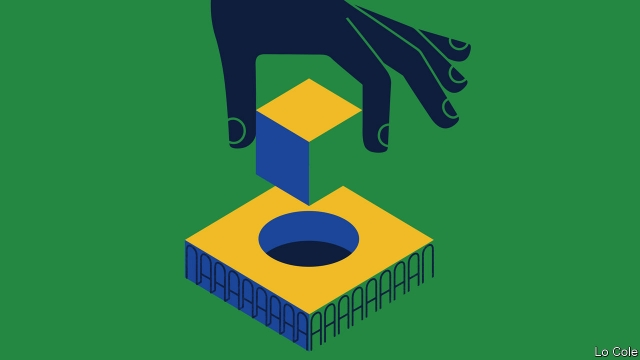

###### Bello

# The contradictions of Brazil’s foreign policy 

##### The new foreign minister is putting the country’s soft power at risk 

 

> Jan 10th 2019 

 

“IN BRAZIL PAST glory is more frequently associated with diplomacy than with military feats,” notes Rubens Ricupero, a former minister, in his monumental history of his country’s dealings with the world. This legacy is above all the achievement of the Baron of Rio Branco, the foreign minister from 1902 to 1912, who through peaceful negotiation settled the country’s borders with all ten of its neighbours (in some cases expanding its territory). 

The values Rio Branco espoused—peace, moderation, trust in international law, non-intervention and what would now be called the pursuit of soft power—became integral to Brazil’s idea of itself, Mr Ricupero argues. And Itamaraty, as the foreign ministry is known (from the palace in Rio de Janeiro it formerly occupied), came to be seen as the Rolls-Royce of Brazilian government, its prestige based on meritocracy and knowledge. 

So the appointment of Ernesto Araújo as foreign minister in the new government of Jair Bolsonaro has come as a shock to the Brazilian intelligentsia. Mr Araújo is a career diplomat, but a fairly junior one. Aged 51, he only recently achieved ambassadorial rank. His mission, he said, is “to liberate Brazilian foreign policy” and Itamaraty “through truth”. But this truth “cannot be taught by analytical deduction”, he added. Rather, it is religious in nature. “God is back and the nation is back,” he has written. 

Mr Araújo’s foreign policy will confront what he denounces as “globalism”, a sneering term for openness to the world. Diplomats should read the New York Times less and Brazilian authors more, he said. 

Mr Bolsonaro wants to pull Brazil out of the Paris climate accord. His government has aligned itself with populist-nationalists in other countries—above all Donald Trump, but also the leaders of Italy, Hungary and Poland. Mr Bolsonaro has seemed to entertain the idea of inviting the United States to set up a military base. Like Mr Trump, he has declared himself a foe of China. He visited Taiwan during last year’s election campaign. 

Certainly, Itamaraty has sometimes combined sophistication with do-nothing complacency. And in their critique of foreign policy under governments led by the Workers’ Party (PT) from 2003 to 2016, Mr Bolsonaro’s people have a point. The PT abandoned some of Rio Branco’s values. Its priority of “south-south” links was often a veil for anti-Americanism. It failed to stand up for democracy in Latin America, preferring to ally itself with left-wing dictatorships in Venezuela and Cuba. 

But Mr Araújo risks making the same mistake—of basing policy on ephemeral ideological affinity, rather than on underlying national interest. His assault on “globalism” also exposes a contradiction at the heart of Mr Bolsonaro’s project. The new president’s powerful economy minister, Paulo Guedes, promises liberal reforms, including privatisation and opening Brazil to trade and competition. The best way to do that is not to ally itself slavishly with the protectionist-in-chief in the White House. Mr Bolsonaro’s stance on climate change has already dented the chances of the European Union concluding a long-delayed trade agreement with Mercosur (to which Brazil belongs). 

Mr Bolsonaro heads a ramshackle alliance of populist-nationalists (notably two of his sons), religious zealots, business lobbies and the security forces. Mr Araújo owes his job to the first two groups. The armed forces—represented by seven retired generals in the cabinet—espouse a different kind of nationalism, grounded in hard-headed geopolitics. They are interested in co-operation with the United States against organised crime, but will resist automatic alignment with Mr Trump. Then there is Mr Guedes, who has seized control of trade policy from Itamaraty. The economic team has no interest in quarrelling either with China, a big investor with which Brazil has a trade surplus, or with Arab countries (by moving Brazil’s embassy in Israel to Jerusalem, as Mr Bolsonaro has promised). 

Faced with these more organised rivals, some think Mr Araújo may not last long. Yet even if he does not, he has made his mark. For the first time since the early 1970s during the cold war, Brazilians have been offered an extreme right-wing foreign policy, notes Matias Spektor, an international-relations specialist at Fundação Getulio Vargas, a university. Even if modulated, bits of it are likely to be applied by Mr Bolsonaro. It is a long way from Rio Branco, and is unlikely to do much for Brazil’s soft power. 

