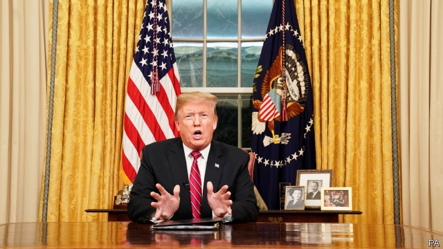

###### No clarity in Cairo

# Politics this week 

 

> Jan 10th 2019 

America’s federal government remained shut down, as Democrats refused to fund Donald Trump’s wall on the Mexican border (which he had previously said Mexico would pay for). In his first televised speech from the Oval Office, the president said that migrants trying to cross the border illegally represented a “humanitarian and security crisis”. Democrats offered to reopen the government by funding everything bar the Department of Homeland Security. Mr Trump walked out of a meeting with them. See article. 

John Bolton, Mr Trump’s national security adviser, assured allies that American troops would not be leaving Syria quickly, all but contradicting what Mr Trump had said a few days earlier. Mr Bolton said that, before any withdrawal, Islamic State had to be fully defeated and Turkey had to promise not to attack Syrian Kurds. Turkey’s president, Recep Tayyip Erdogan, rejected that idea, saying that his plans for an offensive against the Kurdish force, which Turkey regards as a terrorist group, were almost complete. See article. 

A Saudi teenager who had barricaded herself into a hotel room in Bangkok and live-tweeted her ordeal was declared a legitimate refugee by the UN. Rahaf Mohammed al-Qunun said she wanted asylum in Australia. She fears that her family will kill her if she is returned to Saudi Arabia, because she has renounced Islam. She also fears being forced into an unwanted marriage. 

The Saudi government struck a blow for feminism, decreeing that women whose husbands divorce them must be informed of this fact. Courts will notify them by text message. 

Félix Tshisekedi, an opposition candidate, was unexpectedly declared the winner of a presidential election in the Democratic Republic of Congo. Pre-election polls had put another opposition leader, Martin Fayulu, far ahead. Furious voters speculated about a possible stitch-up. Mr Fayulu had vowed to investigate corruption within the outgoing regime of President Joseph Kabila. See article. 

Protests spread across Sudan. What began as an isolated rally against high bread prices has become a broad movement against the dictatorship of Omar al-Bashir, who has run the country since 1989 and is accused of genocide in Darfur. At least 40 people have been killed in the protests. See article. 

The constitutional court in Madagascar confirmed the election of Andry Rajoelina as president after his opponent complained of electoral fraud. Mr Rajoelina took 55% of the vote in last month’s run-off against Marc Ravalomanana. 

Guatemala’s government ordered the shutdown of the International Commission against Impunity in Guatemala (CICIG) and the expulsion of its foreign workers within 24 hours. The foreign minister accused the UN-backed body of exceeding its authority and politicising its work. But the constitutional court suspended the order, setting the stage for a confrontation. CICIG has been investigating corruption, including allegations against the family of the president, Jimmy Morales. 

Only days before Nicolás Maduro was to be sworn in for a second term as president of Venezuela, a justice of the country’s supreme court fled the country. Christian Zerpa called Mr Maduro’s regime a “dictatorship” and said the court had become “an appendage of the executive branch”. This was an about-turn for Mr Zerpa, who in 2016 wrote the court’s opinion justifying the usurpation of the legislature’s powers by the government. See article. 

Brazil’s new populist government sent the national guard to the state of Ceará to curb an outbreak of violence. Criminals have staged attacks, including fire-bombings, on banks, buses and petrol stations. 

North Korea’s dictator, Kim Jong Un, paid a visit to Beijing where he met the Chinese president, Xi Jinping. It was his fourth to China in ten months. This latest trip has fuelled speculation that he may be preparing for another summit with Donald Trump. 

Officials allowed a handful of foreign reporters to visit three of the camps in the far western region of Xinjiang where human-rights groups say hundreds of thousands of Muslims, mostly ethnic Uighurs, have been detained and pressed to be less pious. The journalists heard residents singing “If you’re happy and you know it, clap your hands” in English. Xinjiang’s governor said the facilities had been “extremely effective” in reducing extremism. 

China’s anti-graft agency is investigating offences allegedly committed by a former vice-mayor of Beijing, Chen Gang. Mr Chen was responsible for urban planning in the build-up to the city’s Olympic games in 2008. 

Ethnic Rakhine militants attacked police posts in Myanmar’s Rakhine state, exacerbating tensions in the region in which pogroms by the army and Rakhines against Rohingyas, a Muslim minority, led to an exodus of 800,000 Rohingya refugees in 2017. 

The king of Malaysia, Sultan Muhammad V of Kelantan, abdicated abruptly for undisclosed reasons. The hereditary monarchs who rule over nine of Malaysia’s 13 states will meet soon to pick one of their number to serve a five-year term as king. See article. 

Jolovan Wham, a Singaporean activist, was found guilty of organising a public assembly without a permit. He had convened a seminar on civil disobedience. 

In Britain a cross-party amendment to the government’s finance bill designed to reduce the chances of crashing out of the EU without a deal passed by 303 to 296 votes, the first defeat on a budget measure since 1978. Although the measure cannot stop a no-deal Brexit, it would prevent the government from varying taxes if there were no deal by March 29th. And in a constitutionally suspect move, the speaker of the House of Commons, John Bercow, permitted an amendment requiring the government to outline a Plan B within three days if, as expected, it loses a crucial vote on its Brexit deal on January 15th. See article. 

Germany identified the alleged hacker of the personal details of 1,000 politicians, journalists and celebrities: not Russia, but a 20-year-old who lives with his parents. See article. 

Ukraine’s Orthodox church broke away from the patriarchate of Moscow. This was seen as a blow to Vladimir Putin, who prizes Russian primacy over its neighbours in matters spiritual as well as temporal. See article. 

